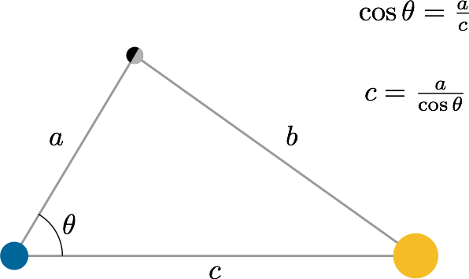
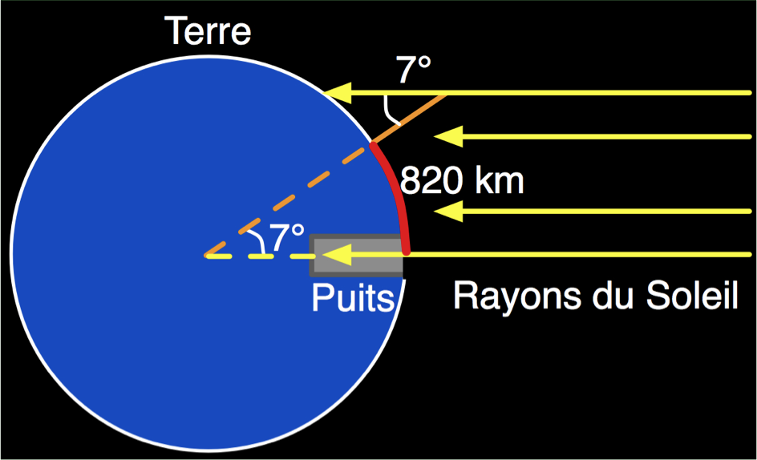
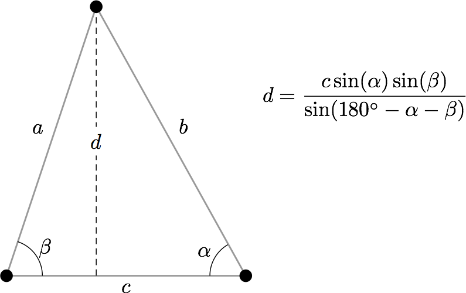
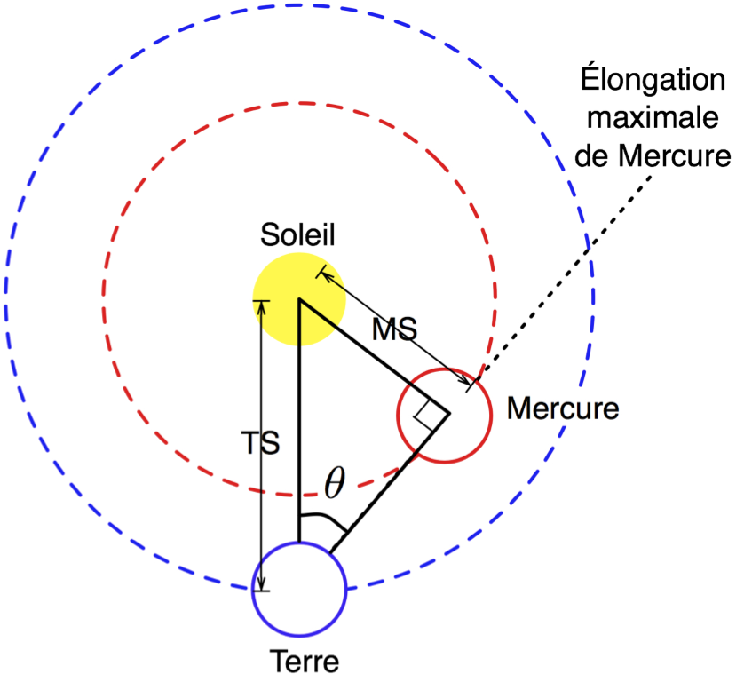
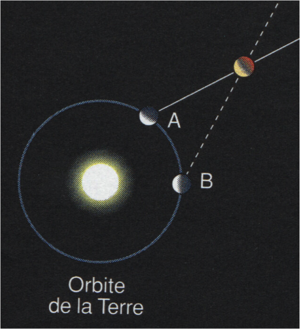

% La profondeur du ciel
% CEA Explorer et comprendre l'Univers
% 1 octobre 2014
---
theme: serif
transition: linear
---

## Comment fait-on pour déterminer la taille des astres et les distances entre la Terre et les astres?

---

## Rappels de géométrie

---

---

## Le Soleil est plus loin que la Lune

**Méthode d'Aristarque**

---

>- $\theta = 89.85°$
>- Le Soleil est 382 fois plus loin que la Lune

---

## Le rayon de la Terre

**Méthode d'Ératosthène**

---

>- Le rayon de la Terre est d'environ 6700 km
>- Valeur moderne : 6380 km

---

## Distance Terre-Lune

**Méthode moderne**

---

<iframe width="560" height="315" src="//www.youtube.com/embed/_v52LFgUq-8" frameborder="0" allowfullscreen></iframe>

---

**384 400 km**

---

## Distance Terre-Soleil

**Méthode parallaxe**

La distance entre la Terre et le Soleil est appelée une **unité astronomique
(UA)**

---

>- **1 UA = 1.50 $\times$ 1011 m = 150 000 000 km**

---

## Distance des planètes inférieures

**Méthode de l'élongation maximale**

---

---

## Distance des planètes supérieures

**Méthode de Kepler**

---

