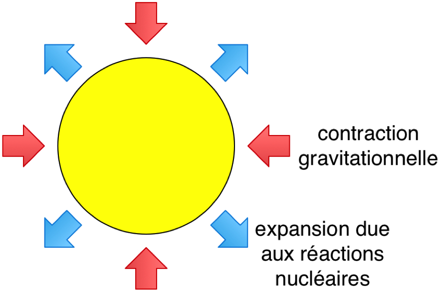
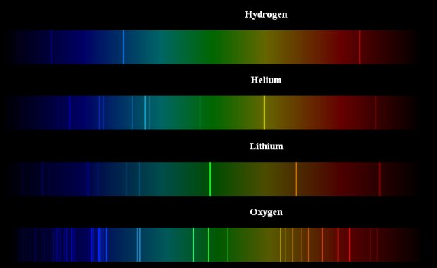
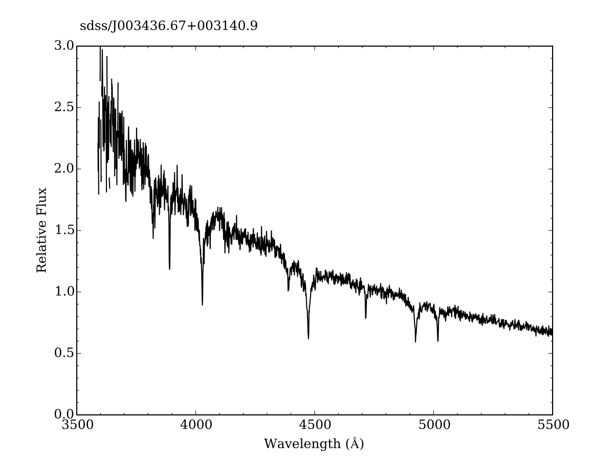

% Les Étoiles
% CEA Explorer et comprendre l'Univers
% 19 novembre 2014
---
theme: default
transition: fade
---

---

## Qu'est-ce qu'une étoile?

---

## Définition d'une étoile

*Objet massif qui a déjà été en mesure de produire de l'énergie par des
réactions nucléaires.*

---

## Définition d'une étoile

- Objet d'une masse supérieure à 75 fois la masse de Jupiter (0,072 fois la
  masse du Soleil)
- **Naine brune** : objet dont la masse est comprise entre 13 et 75 fois la
  masse de Jupiter

---

## Définition d'une étoile

- Les étoiles ne sont pas toutes le siège de réactions nucléaires
- Les naines brunes n'émettent pas toutes de la lumière visible

---

## Définition d'une étoile

- Toutes les étoiles sont sphériques
- Dans toutes les étoiles, il y a un équilibre entre l'attraction
  gravitationnelle et une source de *pression* interne

---

## Le Soleil

>- Le Soleil est une étoile
>- Le Soleil est une *étoile moyenne*
>- Pour étudier les étoiles, le plus simple est d'étudier la plus proche : le
   Soleil

---

## Âge du Soleil

- La masse du Soleil est de 1,99 $\times$ 1030 kg
- Le Soleil a une luminosité de 3,83 $\times$ 1026 J/s

---

## Un des plus gros burger du monde

Beer Barrel Belly Buster (Denny's Beer Barrel Pub)

100 000 J (105 J)

---

## Little Boy et Fat Man

67 TJ et 100 TJ (1014 J)

---

## Âge du Soleil

*Kelvin et von Helmholtz (1860)*

- Si le Soleil était en charbon : durée de vie de 5000 ans
- Contraction de Kelvin-von Helmholtz : 100 millions d'années

---

## Âge du Soleil

- E = mc2
- Transformation de 4 Mt chaque seconde (4 $\times$ 106 Mt)
- Le Soleil pourrait briller environ 10 Ga

---

## Énergie nucléaire

- Dans le Soleil : **fusion** grâce à la pression et la température très élevées

---

## Énergie nucléaire

4 H $\rightarrow$ He + énergie

6,17 $\times$ 1014 J / kg

---

## Énergie nucléaire

- 2 $\times$ 1030 kg d'hydrogène dans le bébé Soleil
- 10% (soit 2 $\times$ 1029 kg) peuvent être utilisé

---

## Nucléosynthèse stellaire

- Plus une étoile est grosse, plus des éléments lourds peuvent être créés
- H, He, O, C, Ne, N, Mg, Si, Fe
- Les éléments qui nous composent ont été formés dans le coeur des étoiles
- Éléments plus massifs : produits lors de supernova

---

## Nucléosynthèse stellaire

- Chaîne proton-proton (10 millions de degrés)

<object classid="clsid:D27CDB6E-AE6D-11cf-96B8-444553540000" width="550"
height="550"><param name="movie" value="fusion01.swf" /><!--[if !IE]>--><object
type="application/x-shockwave-flash" data="fusion01.swf" width="550"
height="550"><!--<![endif]-->
flash animation
<!--[if
!IE]>--></object><!--<![endif]--></object>

---

## Nucléosynthèse stellaire

- Cycle CNO (15 millions de degrés)
- Processus triple alpha (100 millions de degrés)
- ...

---

## Équilibre stellaire

- Compétition entre la pression et la gravité

---

## Équilibre stellaire

Plus de réactions nucléaires

$\rightarrow$ plus de pression vers l'extérieur

$\rightarrow$ augmentation du volume de l'étoile

$\rightarrow$ diminution de la densité

$\rightarrow$ moins de réactions nucléaires

$\rightarrow$ contraction gravitationnelle

---

## Structure stellaire

<small>NASA/Solar Dynamics Observatory</small>

---

## Structure stellaire

---

## Zone radiative

- Énergie produite dans le noyau
- Noyau à une température de 15 millions K
- Transport d'énergie vers la surface par radiation
- 200 000 ans pour qu'un photon atteigne la zone convective

---

## Zone convective

- 28% du rayon
- Mouvements macroscopique de matière

---

## Structure stellaire

- Les étoiles sont très simples
- Quatre équations seulement pour décrire la structure

---

## Héliosismologie

- Étude de la propagation des ondes sismiques sur le Soleil
- Étude des modes de vibration
- Permet de connaître la structure interne

---

## Étude des neutrinos solaires

- Produit par les réactions nucléaires dans le noyau
- Permettent de comprendre le genre de réactions qui s'y produise

---

## Les neutrinos manquants

- Jusqu'en 1998, il manquait des neutrinos
- Oscillations des neutrinos entre différentes saveurs
- Contribution importante à la physique des particules

---

## Photosphère

- Endroit où les photons peuvent se déplacer librement
- Région qu'on voit à l'oeil nu
- Température de 5 800 K
- Aspect granuleux
- Taches
    - Cycle de 11 ans
    - Activité magnétique intense

---

## Photosphère

 

---

## Chromosphère

- Température d'environ 10 000 K

<small>Hinode JAXA/NASA</small>

---

## Couronne

- Température d'environ 1 000 000 K

---

## Intermède : le corps noir

---

## Corps noir

- Sorte de céramique qui était utilisée autrefois pour faire des pots de
  cuisson
- Modèle idéal d'un objet chauffé qui émet du rayonnement électromagnétique
- L'explication du rayonnement du corps noir a été l'un des piliers du
  développement de la mécanique quantique

---

## Radiation du corps noir

<object classid="clsid:D27CDB6E-AE6D-11cf-96B8-444553540000" width="950" height="550">
<param name="movie" value="bbexplorer.swf" />
<!--[if !IE]>-->
    <object type="application/x-shockwave-flash" data="bbexplorer.swf" width="950" height="550">
<!--<![endif]-->

flash animation

<!--[if !IE]>-->
</object>
<!--<![endif]-->
</object>

---

## Radiation du corps noir

- Plus un objet est chaud, plus il est bleu
- Plus un objet est froid, plus il est rouge
- Plus un objet est chaud, plus il émet de rayonnement
- Plus un objet est froid, moins il émet de rayonnement

---

## Radiation du corps noir

 
$L = 4 \pi R^2 \sigma T^4_\mathrm{eff}$

 
<small>où $\,\sigma = 5,67\times10^{-8}$ W/m${}^2$ K${}^4$ est la constante
de Stefan-Boltzmann</small>

---

## Les étoiles comme des corps noirs

>- Les étoiles ne sont pas des corps noirs...
>- ... mais presque
>- On peut utiliser l'équation précédente pour déterminer la température
   effective d'une étoile

---

## Classification des étoiles

- On classe les étoiles dans un diagramme de la luminosité en fonction de la
  température effective
- C'est un **diagramme de Hertzsprung-Russell**

---

## Diagramme de Hertzsprung-Russell

---

## Diagramme de Hertzsprung-Russel

<iframe src="http://astro.unl.edu/mobile/HRdiagram/HRdiagramStable.html"
height="600" width="900">
Désolé, vous devez utiliser un navigateur qui supporte les iframes.
Vous pouvez consulter le diagramme HR interactif à l'adresse
http://astro.unl.edu/mobile/HRdiagram/HRdiagramStable.html
</iframe>

---

## Diagramme de Hertzsprung-Russel

- 80% des étoiles sur la séquence principale
- Étoiles au-dessus de la séquence principale : géante et supergéantes
- Étoiles en-dessous de la séquence principale : naines

---

## Diagramme de Hertzsprung-Russel

 

$L = 4 \pi R^2 \sigma T^4_\mathrm{eff}$

 

$R = \sqrt{\frac{L}{4\pi T^4_\mathrm{eff}}}$

---

## Types spectraux

---

## Types spectraux

---

## Types spectraux

>- OBAFGKMLT
>- Oh, Be A Fine Girl Kiss Me Like This
>- Oh, Be A Fine Guy Kiss Me Like This

---

## Types spectraux

---

## Lien entre le type spectral et la masse

Pour les étoiles de la séquence principale

Type spectral   Masse (en masses solaires)
-------------- ---------------------------
O                                     25
B                                     15
A                                      3
F                                      1,5
G                                      1
K                                      0,8
M                                      0,4
