% Cycle de vie des étoiles
% CEA Explorer et comprendre l'Univers
% 19 novembre 2014
---
theme: default
transition: fade
---

## Naissance d'une étoile

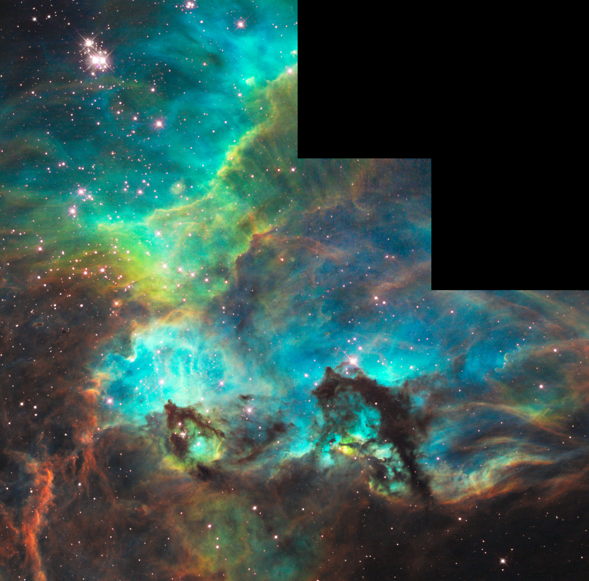

<small>Hippocampe dans la Grand Nuage magellanique (20 al de long) 
NASA/ESA/M. Livio (STScI)</small>

---

## Matière interstellaire

<small>Rho Ophiuchi par Spitzer (infrarouge) 
NASA/Spitzer/Caltech-JPL/Harvard University/U. Arizona</small>

---

## Matière interstellaire

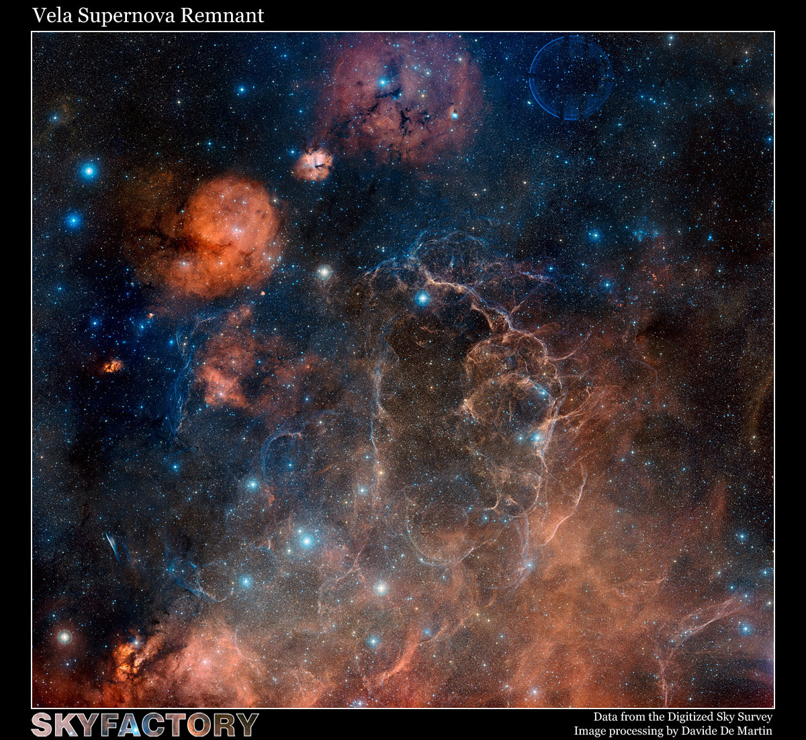

<small>100 al de diamètre</small>

---

## Matière interstellaire

- Environ 10% de la masse de la galaxie
- Grains de poussière
    - Graphite
    - Silicates
    - Hydrocarbures aromatiques
    - ~1 nm jusqu'à quelques µm

---

## Matière interstellaire

- Gaz
    - Hydrogène (~70% de la masse)
        - Atomique
        - Ionisé
        - Moléculaire
    - Hélium (~30% de la masse)

---

## Nuages moléculaires

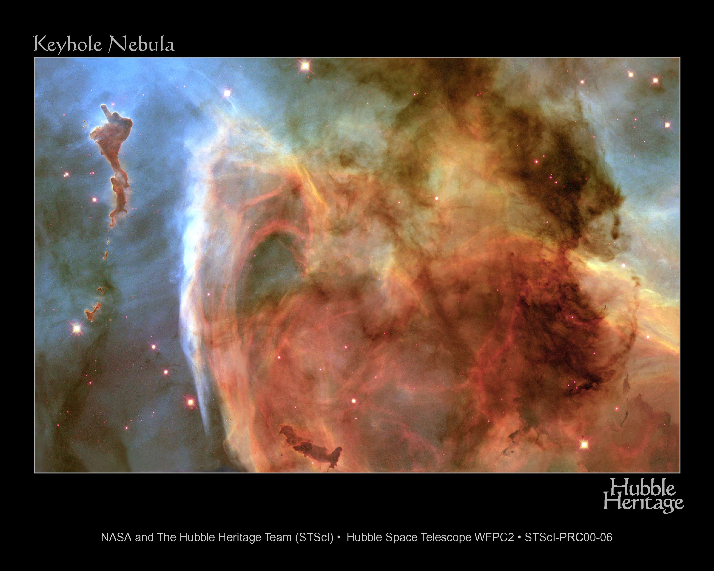

---

## Formation des protoétoiles

- Effondrement des nuages moléculaire
- Causé par supernova, radiation, etc?
- Effondrement gravitationnel génère beaucoup d'énergie
- La température au centre de l'étoile augment et la **fusion** nucléaire
  s'amorce

---

## Formation des protoétoiles

- Masse entre 1 et 7% de la masse du Soleil
    - Quelques réactions nucléaire
    - Pas suffisant pour que l'étoile atteigne la séquence principale
    - L'étoile devient une **naine brune**

---

## Formation des protoétoiles

- Masse supérieure à 8% de la masse du Soleil
    - Fusion nucléaire
    - Étoile de la séquence principale

---

## Relation entre la masse et le temps de contraction

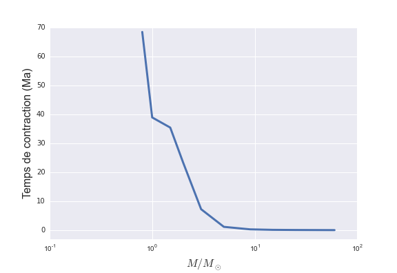

---

## Naissance d'une étoile

- Objet de Herbig-Haro

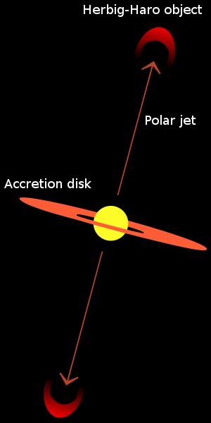

---

## Objet de Herbig-Haro

<small>Hubble Legacy Archive, NASA, ESA - Processing: Judy Schmidt</small>

---

## Évolution d'étoiles de la séquence principale

---

## Évolution d'étoiles de la séquence principale

---

## Évolution d'une étoile de masse solaire

- Séquence principale (9 Ga)
    - Fusion d'hydrogène dans le cœur (9 Ga)
    - Augmentation d'He dans le cœur
    - Contraction du cœur
- Phase **géante rouge** (1 Ga)
    - Fusion d'hydrogène en périphérie du cœur
    - Hélium inerte dans le cœur
    - Cœur se contracte
    - Luminosité augmente d'un facteur ~100

---

## Évolution d'une étoile de masse solaire

- Flash de l'hélium (quelques secondes)
    - Cœur atteint 100 MK
    - Hélium dans le cœur fusionne
    - Production de C et O dans le cœur
    - Éjection de matière
- Phase **sous-géante** (100 Ma)
    - Fusion de l'hélium dans le cœur
    - Fusion de l'hydrogène en périphérie
    - Accumulation de carbone dans le cœur

---

## Évolution d'une étoile de masse solaire

---

## Évolution d'une étoile de masse solaire

- Phase **supergéante rouge** (1 Ma)
    - Luminosité 10 000 fois plus grande que le Soleil
    - Fusion de l'hélium en périphérie du cœur
    - Fusion de l'hydrogène en périphérie de la zone de fusion d'hélium
    - Accumulation de carbone dans le cœur

---

## Évolution d'une étoile de masse solaire

- Nébuleuse planétaire
    - Fin de la fusion dans le cœur
    - Cœur se contracte pour former une naine blanche
    - Couches externes de l'étoile expulsées par les zones de fusion périphériques

---

## NGC 2818

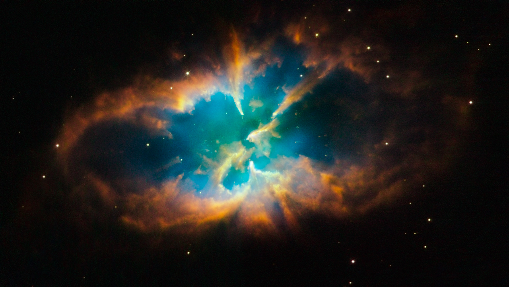

<small>NASA, ESA, Hubble Heritage Team (STScI / AURA)</small>

---

## Nébuleuse de l'Œil de chat

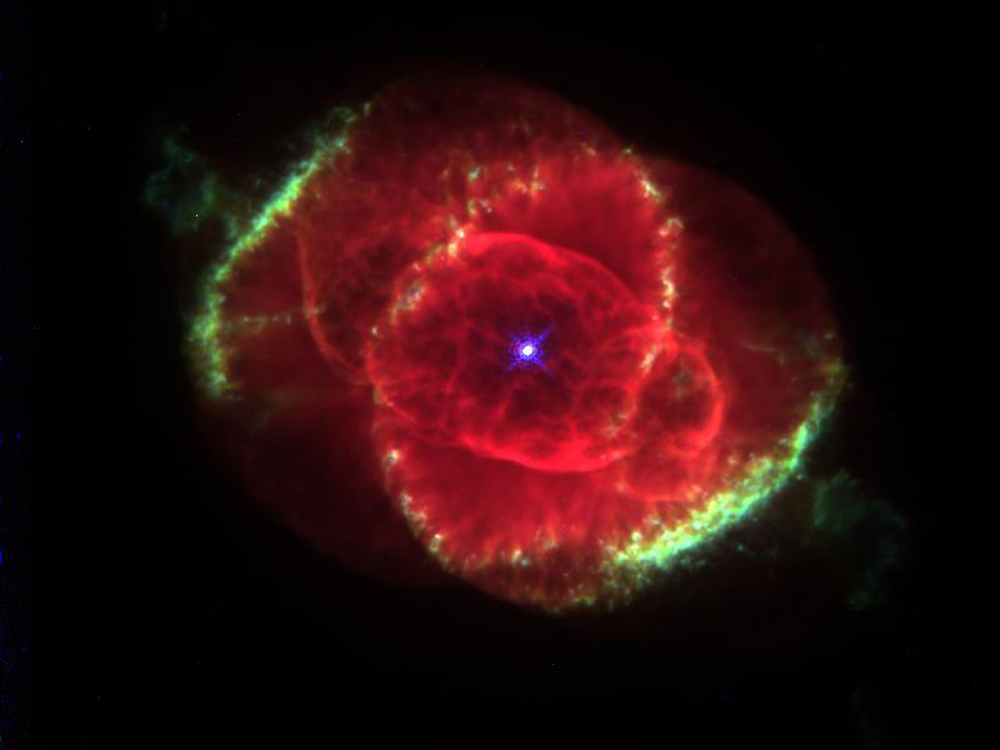

<small>NASA, J. P. Harrington (U. Maryland) and K. J. Borkowski (NCSU) </small>

---

## Nébuleuse de l'Oeil de chat

<small>NASA/CXC/SAO; Optical: NASA/STScI</small>

---

## Nébuleuse du Sablier

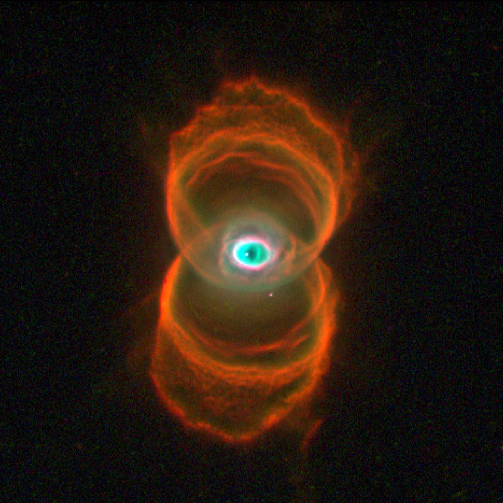

<small>R. Sahai and J. Trauger (JPL), WFPC2, HST, NASA</small>

---

## Nébuleuse de l'Hélice

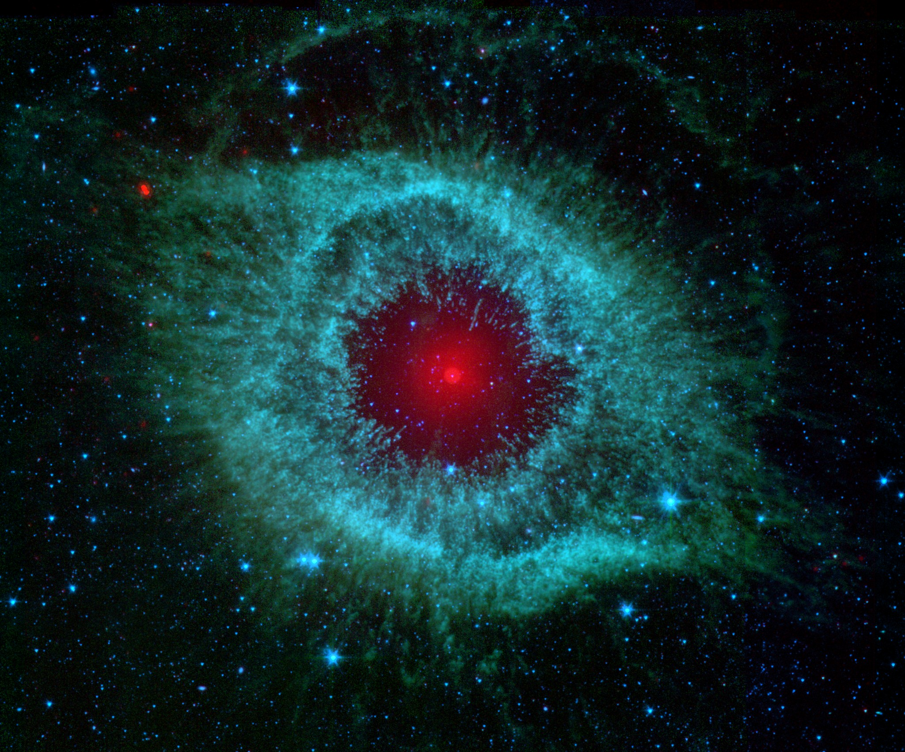

<small>NASA, JPL-Caltech, Kate Su (Steward Obs., U. Arizona), et al.</small>

---

## Naine blanche

- Cadavre d'une étoile dont la masse initiale est inférieure à 8 $M_\odot$
- Rayon de 5 000 km
- Masse : entre 0.5 et 1.4 masse solaire
- Densité : 109 kg/m3
- Température de surface entre 100 000 K et 5 000 K
- Température du cœur : 10 000 000 K
- Gravité de surface : 350 000 fois plus élevée que sur Terre

---

## Naines blanches

- Composées principalement de carbone et d'oxygène
- Carbone cristallin (diamant)

---

## Sirius B

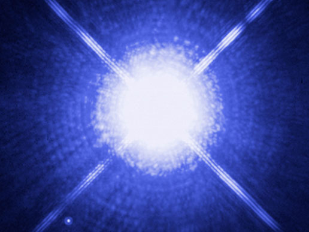

<small>NASA</small>

---

## Sirius B

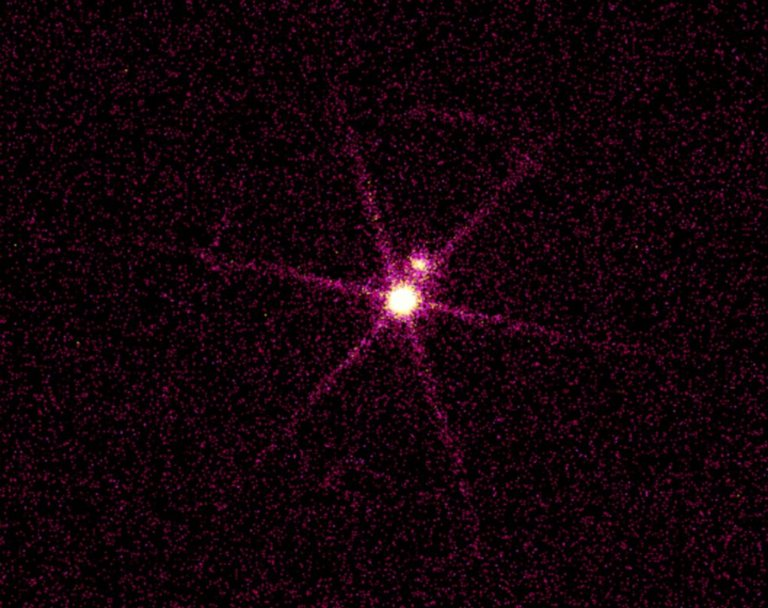

<small>NASA</small>

---

## NGC 2440

<small>NASA</small>

---

## Évolution des étoiles massives

- Étoiles de plus de 8 masses solaires
- Pas de flash de l'hélium
- Cœur assez chaud pour fusionner le carbone
- Fusion jusqu'au fer

---

## Évolution des étoiles massives

- Lorsque le cœur est composé uniquement de fer
    - Contraction rapide du cœur
    - Formation de matière neutronique
    - Couches supérieures tombent sur le cœur et rebondissent
    - Rebond génère une onde de choc qui se propage vers l'extérieur
    - **Supernova**
- Le processus prend quelques secondes
- Luminosité peu atteindre un million de milliards de fois la luminosité du Soleil

---

## Supernova SN1006

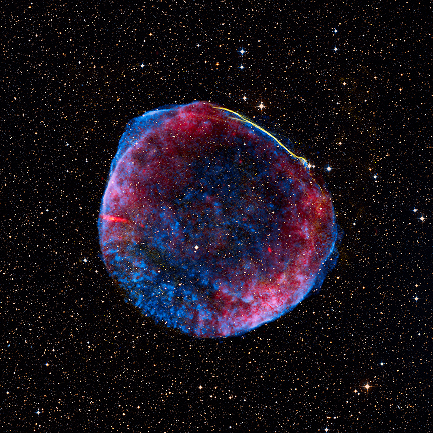

<small>NASA, ESA, Zolt Levay (STScI)</small>

---

## Supernova SNR 0540-69.3

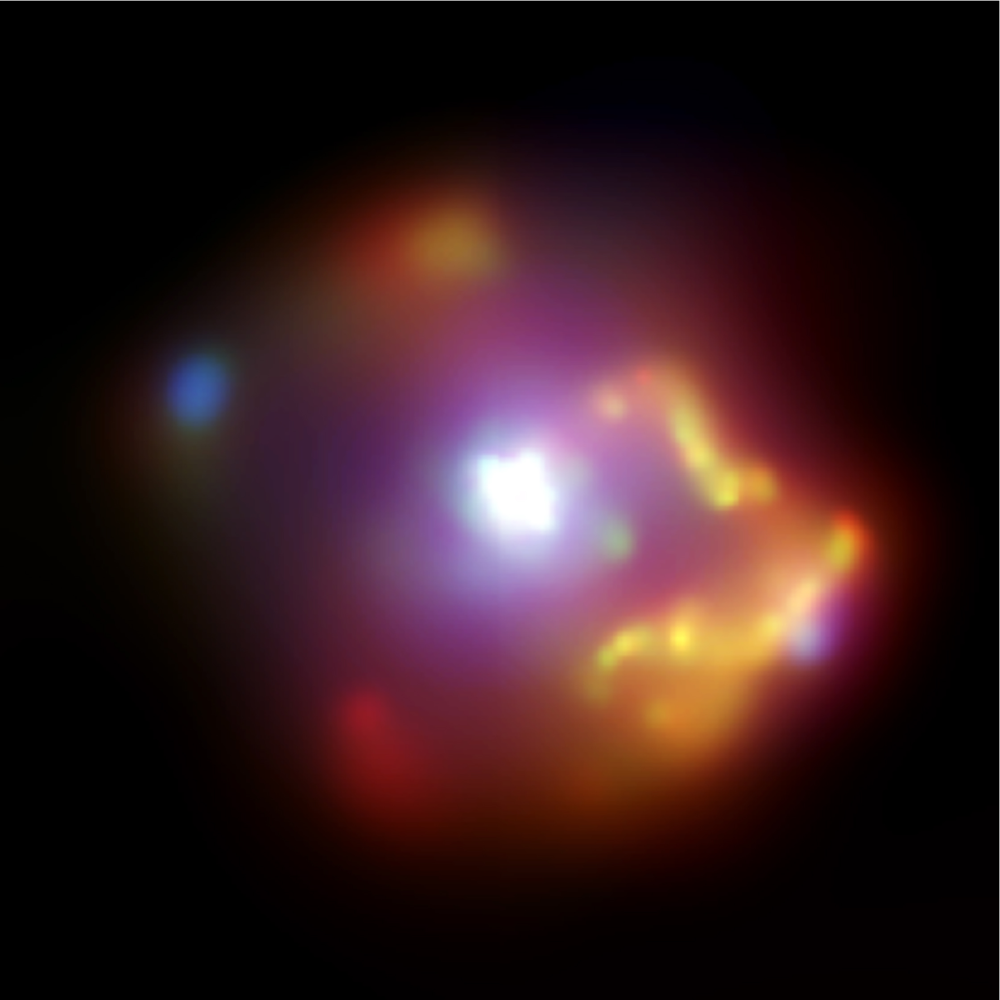

<small>NASA/CXC</small>

---

## Supernova Cassiopeia A

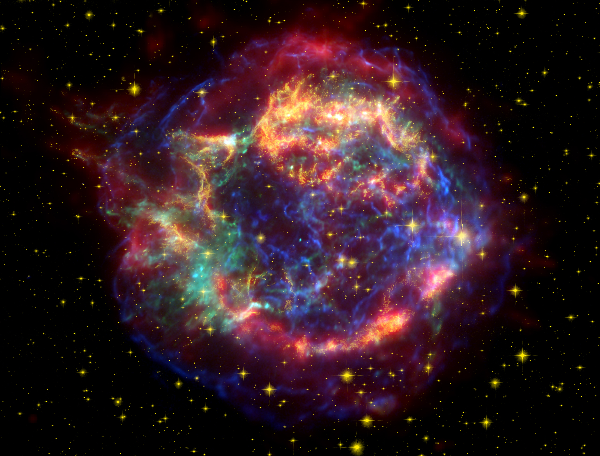

<small>NASA/JPL-Caltech/STScI/CXC/SAO</small>

---

## Supernova

<embed src="http://www.nasa.gov/centers/goddard/mov/97789main_GRBstar2.mov"
style="height: 350px; width: 600px" />

<small>NASA / SkyWorks Digital</small>

---

## Supernova

<embed src="http://www.nasa.gov/centers/goddard/mov/97788main_GRBsupernova2.mov"
style="height: 350px; width: 600px" />

<small>NASA / SkyWorks Digital</small>

---

## Supernova

Ce qui reste après la supernova est le cœur dégénéré de l'étoile.

---

## Étoiles à neutrons

- Cœur moins massif que trois masses solaires
- 20 kilomètre de diamètre
- 1.4 à 3 $M_\odot$
- Densité de 5 $\times$ 1017 kg/m3
- Composées presque uniquement de neutrons dégénérés

---

## Étoiles à neutrons

- Un centimètre cube a une masse équivalente à celle du mont Everest
- Croûte de fer
- Océan de neutrons superfluides

---

## Étoiles à neutrons

---

## Pulsar

- Étoile à neutrons en rotation très rapide
- Dizaines de milliers de rotations par minutes
- Émettent des rayons X et gamma

---

## Pulsar PSR J1023+0038

<iframe width="560" height="315" src="http://www.youtube.com/embed/Hn5RJ2PN718" frameborder="0" allowfullscreen></iframe>

---

## Trous noirs

- Cœur plus massif que trois masses solaires
- Aucun mécanisme dans le cœur capable de contrer l'attraction gravitationnelle
- Cœur se contracte indéfiniment jusqu'à former une **singularité**
- Formation d'un **horizon** autour de la singularité
- Vitesse d'échappement supérieure à la vitesse de la lumière

---

## Trou noir au centre de M81

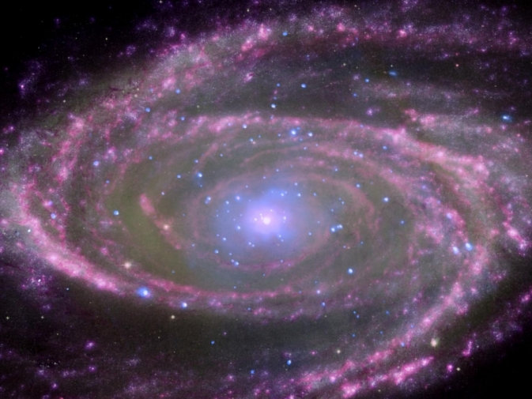

<small>Optical: NASA/ESA/CfA/A.Zezas; UV: NASA/JPL-Caltech/CfA/J.Huchra et al.; IR: NASA/JPL-Caltech/CfA</small>

---

## Trou noir

<small>NASA/CXC/M.Weiss</small>
