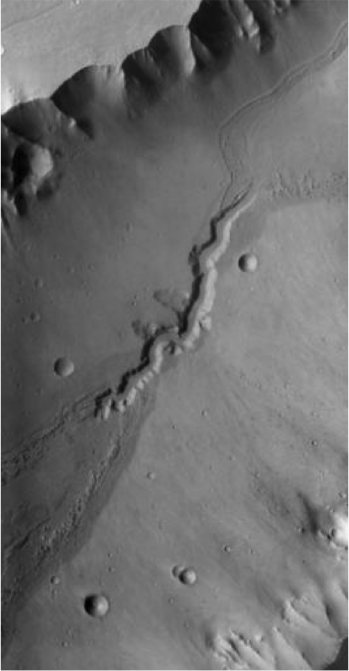
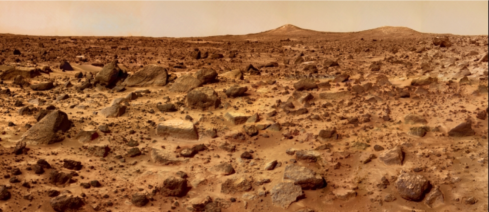

% Croisière interplanétaire (Partie I)
% CEA Explorer et comprendre l'Univers
% 28 octobre 2014
---
theme: beige
transition: linear
---

## Deux types de planètes

>- Planètes telluriques
    - **Similaires à la Terre**
    - Mercure, Vénus, Terre, Mars

>- Planètes joviennes
    - **Similaires à Jupiter**
    - Jupiter, Saturne, Uranus, Neptune 

---

## Système solaire

- Planètes
    - Corps sphérique
    - En orbite autour du Soleil
    - Qui a éliminé les autres corps de son entourage

- Astéroïde
    - Petit corps (pas nécessairement sphérique)
    - En orbite autour du Soleil

- Satellites
    - Corps en orbite autour d'une planète ou d'un astéroïde

---

## Système solaire

- Ceinture d'astéroïdes
    - Entre Mars et Jupiter
    - Grand nombre d'astéroïdes

- Ceinture de Kuiper
    - Au-delà de Pluton (jusqu'à 120 UA)
    - Grand nombre d'astéroïde

- Nuage de Oort
    - Petits astéroïdes

---

---

<small>@DoTryThisAtHome</small>

---

## Distribution de la masse

Objet                             Masse (%)
-------------------------------- ----------
Soleil                                99,80
Planètes principales                   0,14
Nuage de Oort                          0,05
Ceinture de Kuiper                    0,001
Astéroïdes, satellites, anneaux    < 0,0001

---

## Distribution de la masse

Planète   Masse (%)
-------- ----------
Mercure        0,01
Vénus          0,18
Terre          0,22
Mars           0,02
Jupiter       71,14
Saturne       21,30
Uranus         3,26
Neptune        3,86
Pluton         0,00

---

## Température des planètes

---

## Densité des planètes

---

## Les planètes telluriques

---

## Mercure

---

## Mercure

---------------------- -----------------------------------
Distance au Soleil                                0,387 UA
Excentricité                                         0,206
Période de révolution                             88 jours
Période de rotation                               59 jours
Diamètre                                           4878 km
Masse                      3,31$\times$ 1023 kg
Champ gravitationnel                             3,72 N/kg
Densité                                               5,44
Albédo                                                0,10
Température                           430°C, -100°C, 167°C
---------------------- -----------------------------------

---

## Mercure

- Planète la plus rapprochée du Soleil
- Vitesse orbitale moyenne la plus élevée : 48km/s
- Survolée par Mariner 10 et 1974 et 1975
- Messenger en orbite

---

## Messenger

<small>NASA/Johns Hopkins University Applied Physics Laboratory/Carnegie Institution of Washington</small>

---

## Messenger

<small>NASA/Johns Hopkins University Applied Physics Laboratory/Carnegie Institution of Washington</small>

---

## Vénus

<small>ESA/MPS/DLR/IDA</small>

---

## Vénus

---------------------- -----------------------------------
Distance au Soleil                                0,723 UA
Excentricité                                         0,007
Période de révolution                          224,7 jours
Période de rotation                           243,01 jours
Diamètre                                         12 104 km
Masse                      4,87$\times$ 1024 kg
Champ gravitationnel                             8,85 N/kg
Densité                                               5,24
Albédo                                                0,65
Température                                          477°C
---------------------- -----------------------------------

---

## Vénus

- Astre le plus brillant dans le ciel après le Soleil et la Lune
- Nuages empêchent de voir sa surface
- Constitution interne très semblable à la Terre

---

## Vénus

- Atmosphère
    - 96% CO2
    - 3.5% azote
- Nuages d'acide sulfurique
- Effet de serre

---

## Venera-13

---

## Venera-13

---

## Magellan

---

## Vénus

- Semble avoir une activité tectonique
- Monts Maxwell
- Rotation rétrograde très lente

--- 

## Vénus

- Présente toujours le même hémisphère vers la Terre
    - Résonance gravitationnelle?

---

## Transit de Vénus

<iframe src="https://www.flickr.com/photos/gsfc/7344062712/in/photostream/player/" width="640" height="360" frameborder="0" allowfullscreen webkitallowfullscreen mozallowfullscreen oallowfullscreen msallowfullscreen></iframe>

<small>NASA/SDO, AIA</small>

---

## Mars

 "<a
href="http://commons.wikimedia.org/wiki/File:Mars.jpg#mediaviewer/File:Mars.jpg">Mars</a>".
Licensed under Public domain via <a
href="//commons.wikimedia.org/wiki/">Wikimedia Commons</a>

---

## Mars

---

## Mars

---------------------- -----------------------------------
Distance au Soleil                                1,524 UA
Excentricité                                         0,093
Période de révolution                           1,88 année
Période de rotation                          24h 37min 23s
Diamètre                                           6794 km
Masse                      6,42$\times$ 1023 kg
Champ gravitationnel                             3,72 N/kg
Densité                                               3,94
Albédo                                                0,16
Température                            20°C, -140°C, -40°C
---------------------- -----------------------------------

---

## Mission d'exploration de Mars

---

### Mars Global Surveyor

**Cartographie** (*1997*)

 "<a
href="http://commons.wikimedia.org/wiki/File:Mars_gullies.800px.jpg#mediaviewer/File:Mars_gullies.800px.jpg">Mars
gullies.800px</a>". Licensed under Public domain via <a
href="//commons.wikimedia.org/wiki/">Wikimedia Commons</a>

---

### Mars Odyssey

**Composition du sol** (*2001*)

---

### Spirit

**Preuve qu'il y a eu de l'eau sur Mars** (*2004*)

<small>NASA/JPL-Caltech/Cornell Univ./Arizona State Univ.</small>

---

### Spirit

- Coincé dans le sable depuis 2009
- Fin de la mission en 2011

---

### Opportunity

**Preuve qu'il y a eu de l'eau sur Mars** (*2004*)

<small>NASA/JPL-Caltech/Cornell Univ./Arizona State Univ.</small>

---

### Mars Reconnaissance Orbiter

**Images détaillées de la surface** (*2006*)

<small>NASA/JPL-Caltech/Univ. of Arizona</small>

---

### Pheonix

**Étude du climat et de la présence d'eau** (*2008*)

<small>NASA/JPL-Caltech/University Arizona/Texas A&M University</small>

---

### Curiosity

<small>NASA/JPL-Caltech/Malin Space Science Systems</small>

---

### Curiosity

**À la recherche de molécules organiques** (*2012*)

<small>NASA/JPL-Caltech/MSSS</small>

---

### MAVEN

**Pourquoi Mars a perdu son atmosphère** (*2014*)

<small>NASA/Kim Shiflett</small>

---

### MOM

---

## Mars

- Atmosphère ténue (0,01 bar)
    - Composée principalement de CO2 (95%)
- Glace sèche (CO2) et eau glacée
- Couleur orangée : rouille (oxyde de fer)
- Orbite incliné de 25°

---

## Mars

- Composition semblable à la Terre
- Croûte
    - Hautes terres criblées de cratères
    - Plaines volcaniques plus récentes
- Manteau
- Noyau métallique

---

## Mars

- Pas d'activité tectonique
- Pas de chaînes de montagne
- Points chauds crachent toujours leur lave au même endroit
- Volcans gigantesques

---

## Mont Olympus

- Plus haut volcan du système solaire
- Hauteur de 23 km (3 fois l'Éverest)
- Large de 600 km

---

## Mont Olympus

<small>NASA/JPL</small>

---

## Présence d'eau sur Mars

---

## Présence d'eau sur Mars

Causé par un écoulement d'eau liquide ou solide

---

## Sol martien

<small>Robot Pathfinder || NASA/JPL/Caltech</small>

---

## Satellites de Mars

- Phobos (27 km)

<small>MRO || NASA/JPL-Caltech/University of Arizona</small>

---

## Satellites de Mars

- Deimos (15 km)

<small>MRO || NASA/JPL-Caltech/University of Arizona</small>

---

## Comète 67P/Churyumov-Gerasimenko

<small>ESA/Rosetta/MPS for OSIRIS Team MPS/UPD/LAM/IAA/SSO/INTA/UPM/DASP/IDA</small>

---

