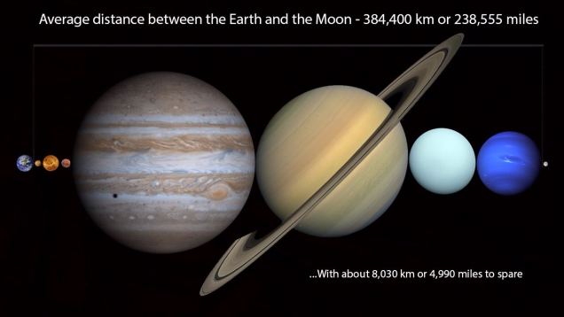
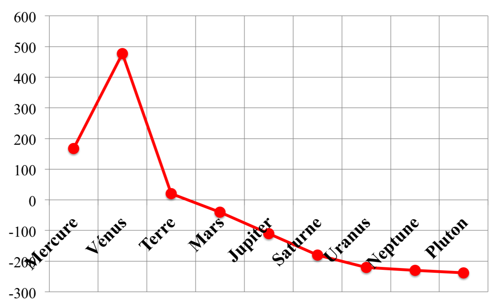

% Croisière interplanétaire (Partie I)
% CEA Explorer et comprendre l'Univers
% 28 octobre 2014
---
theme: beige
transition: linear
---

## Deux types de planètes

>- Planètes telluriques
    - **Similaires à la Terre**
    - Mercure, Vénus, Terre, Mars

>- Planètes joviennes
    - **Similaires à Jupiter**
    - Jupiter, Saturne, Uranus, Neptune 

---

## Système solaire

- Planètes
    - Corps sphérique
    - En orbite autour du Soleil
    - Qui a éliminé les autres corps de son entourage

- Astéroïde
    - Petit corps (pas nécessairement sphérique)
    - En orbite autour du Soleil

- Satellites
    - Corps en orbite autour d'une planète ou d'un astéroïde

---

## Système solaire

- Ceinture d'astéroïdes
    - Entre Mars et Jupiter
    - Grand nombre d'astéroïdes

- Ceinture de Kuiper
    - Au-delà de Pluton (jusqu'à 120 UA)
    - Grand nombre d'astéroïde

- Nuage de Oort
    - Petits astéroïdes

---

---

<small>@DoTryThisAtHome</small>

---

## Distribution de la masse

Objet                             Masse (%)
-------------------------------- ----------
Soleil                                99,80
Planètes principales                   0,14
Nuage de Oort                          0,05
Ceinture de Kuiper                    0,001
Astéroïdes, satellites, anneaux    < 0,0001

---

## Distribution de la masse

Planète   Masse (%)
-------- ----------
Mercure        0,01
Vénus          0,18
Terre          0,22
Mars           0,02
Jupiter       71,14
Saturne       21,30
Uranus         3,26
Neptune        3,86
Pluton         0,00

---

## Température des planètes

---

## Densité des planètes

---

## Les planètes telluriques

---

## Mercure

---

## Mercure

---------------------- -----------------------------------
Distance au Soleil                                0,387 UA
Excentricité                                         0,206
Période de révolution                             88 jours
Période de rotation                               59 jours
Diamètre                                           4878 km
Masse                      3,31$\times$ 1023 kg
Champ gravitationnel                             3,72 N/kg
Densité                                               5,44
Albédo                                                0,10
Température                           430°C, -100°C, 167°C
---------------------- -----------------------------------

---

## Mercure

- Planète la plus rapprochée du Soleil
- Vitesse orbitale moyenne la plus élevée : 48km/s
- Survolée par Mariner 10 et 1974 et 1975
- Messenger en orbite

---

## Messenger

<small>NASA/Johns Hopkins University Applied Physics Laboratory/Carnegie Institution of Washington</small>

---

## Messenger

<small>NASA/Johns Hopkins University Applied Physics Laboratory/Carnegie Institution of Washington</small>

---

## Vénus

<small>ESA/MPS/DLR/IDA</small>

---

## Vénus

---------------------- -----------------------------------
Distance au Soleil                                0,723 UA
Excentricité                                         0,007
Période de révolution                          224,7 jours
Période de rotation                           243,01 jours
Diamètre                                         12 104 km
Masse                      4,87$\times$ 1024 kg
Champ gravitationnel                             8,85 N/kg
Densité                                               5,24
Albédo                                                0,65
Température                                          477°C
---------------------- -----------------------------------

---

## Vénus

- Astre le plus brillant dans le ciel après le Soleil et la Lune
- Nuages empêchent de voir sa surface
- Constitution interne très semblable à la Terre

---

## Vénus

- Atmosphère
    - 96% CO2
    - 3.5% azote
- Nuages d'acide sulfurique
- Effet de serre

---

## Venera-13

---

## Venera-13

---

## Magellan

---

## Vénus

- Semble avoir une activité tectonique
- Monts Maxwell
- Rotation rétrograde très lente

--- 

## Vénus

- Présente toujours le même hémisphère vers la Terre
    - Résonance gravitationnelle?

---

## Transit de Vénus

<iframe src="https://www.flickr.com/photos/gsfc/7344062712/in/photostream/player/" width="640" height="360" frameborder="0" allowfullscreen webkitallowfullscreen mozallowfullscreen oallowfullscreen msallowfullscreen></iframe>

<small>NASA/SDO, AIA</small>

---

## Mars

