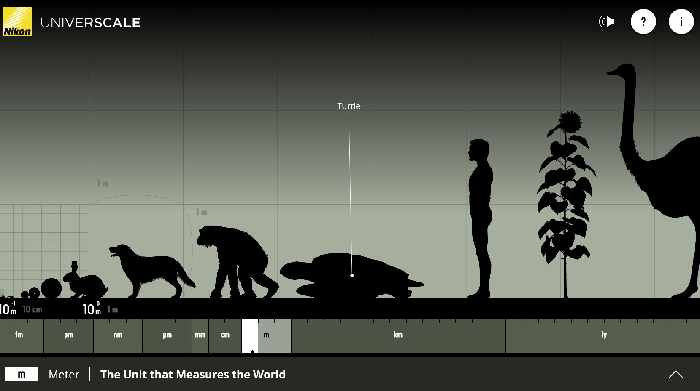

% Préambule
% CEA Explorer et comprendre l'Univers
% 23 janvier 2020
---
theme: black
transition: linear
---

## Le grand tour

<iframe width="640" height="360"
src="https://www.youtube.com/embed/0fKBhvDjuy0?feature=player_detailpage"
frameborder="0" allowfullscreen></iframe>

---

## L'échelle de l'Univers

---

## Taille de différentes étoiles

<iframe width="640" height="360"
src="https://www.youtube.com/embed/XE0aAZE0kp4?rel=0" frameborder="0"
allowfullscreen></iframe>

---

## La chose la plus extraordinaire

<iframe width="640" height="360"
src="https://www.youtube.com/embed/9D05ej8u-gU?feature=player_embedded"
frameborder="0" allowfullscreen></iframe>
