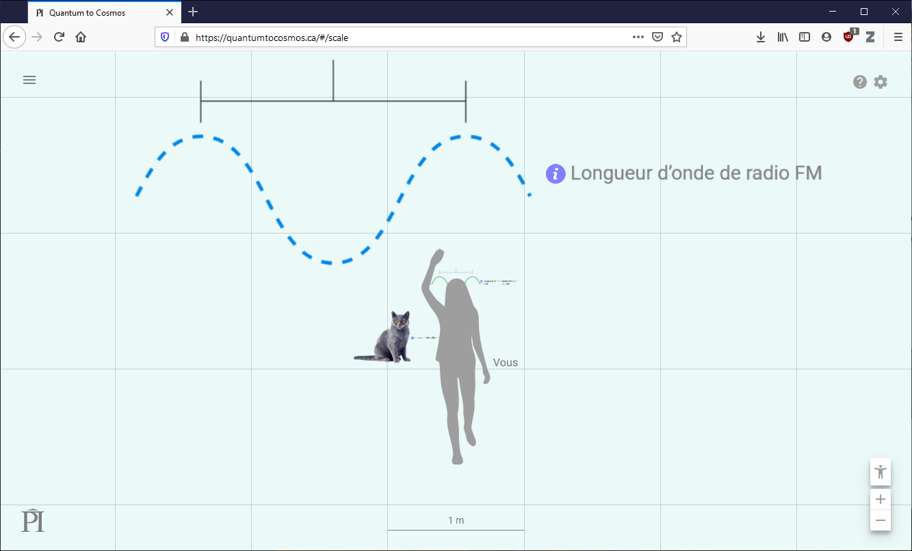

% Préambule
% Explorer et comprendre l'Univers
% 25 janvier 2024
---
theme: night
title-slide-attributes:
    data-background-image: ../../images/52565304936_fc8852f1e9_k.jpg
    data-background-size: contain
---

## Le grand tour

<iframe width="720" height="405"
  src="https://www.youtube-nocookie.com/embed/8Are9dDbW24" frameborder="0"
  allow="accelerometer; autoplay; encrypted-media; gyroscope; picture-in-picture"
  allowfullscreen>
</iframe>

---

## L'échelle de l'Univers

---

## Taille de différentes étoiles

<iframe width="720" height="405"
  src="https://www.youtube-nocookie.com/embed/7gDicJ02OZ4" frameborder="0"
  allow="accelerometer; autoplay; encrypted-media; gyroscope; picture-in-picture"
  allowfullscreen>
</iframe>

---

## La chose la plus extraordinaire

<iframe width="720" height="405"
  src="https://www.youtube-nocookie.com/embed/9D05ej8u-gU" frameborder="0"
  allow="accelerometer; autoplay; encrypted-media; gyroscope; picture-in-picture"
  allowfullscreen>
</iframe>

---

## {background-image="../../images/52565304936_fc8852f1e9_k.jpg"}
