% Astronomie à l'œil nu
% CEA Explorer et comprendre l'Univers
% 31 août 2020
---
theme: night
transition: linear
---

<figure>
  
  <figcaption style="font-size: 0.4em; color: #666;">
    Un ciel rempli d'étoiles et une vue de la Voie Lactée
    (ESO/B. Tafreshi (twanight.org))
  </figcaption>
</figure>

---

## Quels objets observe-t-on dans le ciel ?

---

### Constellation

ensemble d’étoiles brillantes dont les projections sur la sphère céleste
sont assez près les unes des autres pour qu’un observateur soit tenté de
les regrouper

---

### 88 constellations

<small>
Andromeda Antlia Apus Aquarius Aquila Ara Aries Auriga Boötes Caelum
Camelopardalis Cancer Canes Venatici Canis Major Canis Minor Capricornus Carina
Cassiopeia Centaurus Cepheus Cetus Chamaeleon Circinus Columba Coma Berenices
Corona Australis Corona Borealis Corvus Crater Crux Cygnus Delphinus Dorado
Draco Equuleus Eridanus Fornax Gemini Grus Hercules Horologium Hydra Hydrus
Indus Lacerta Leo Leo Minor Lepus Libra Lupus Lynx Lyra Mensa Microscopium
Monoceros Musca Norma Octans Ophiuchus Orion Pavo Pegasus Perseus Phoenix
Pictor Pisces Piscis Austrinus Puppis Pyxis Reticulum Sagitta Sagittarius
Scorpius Sculptor Scutum Serpens Sextans Taurus Telescopium Triangulum
Triangulum Australe Tucana Ursa Major Ursa Minor Vela Virgo Volans Vulpecula
</small>

---

### Ursa Major

<figure>
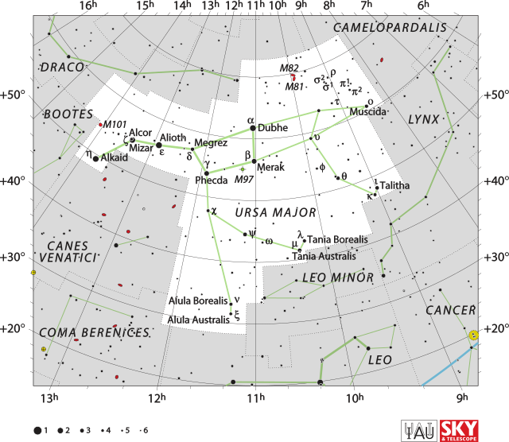
</figure>

---

### Ursa Minor

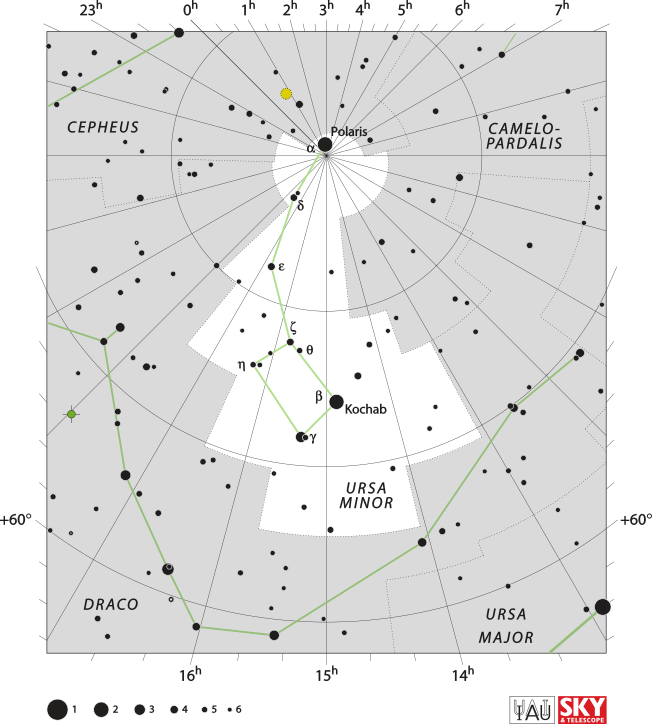

---

Quels énoncés à propos des constellations sont vrais?

[https://b.socrative.com/login/student/](https://b.socrative.com/login/student/) \ \ DCRDEWY

<ol style="list-style-type: upper-alpha">
  <li>Elles sont formées d'étoiles qui paraissent proches dans le ciel.</li>
  <li>Elles forment des dessins imaginaires qui aident à se repérer sur la sphère
      céleste.</li>
  <li>Elles sont formées d'étoiles qui sont physiquement proches les unes des
      autres.</li>
  <li>Un grand nombre d'entre elles ont été définies par les grec anciens.</li>
</ol>

---

### Nom des étoiles

>- Noms anciens (Bételgeuse, Rigel)
>- Lettre grecque + constellation ($\alpha$ du Centaure)
>- Séries de lettres et chiffres (HR 2061 = Bételgeuse)
>- [Base de données astronomique SIMBAD](http://simbad.u-strasbg.fr/simbad/)

---

### Brillance des étoiles

- Échelle des **magnitudes** mise au point par Hipparque (IIe siècle
avant J.-C.)

- Multiples modifications au fil des siècles

- Aujourd'hui : de -27 à 25 environ

*Magnitude élevé : brillance faible*

*Magnitude faible : brillance élevée*

---

### Magnitude d'étoiles connues

Étoile                          Magnitude
------------------------------ ----------
Soleil                                -27
Lune                                  -12
Étoile Polaire                          2
Sirius A                             -1,6
Bételgeuse ($\alpha$ Orionis)         0,6

---

Certaines étoiles naines blanches ont des magnitudes d'environ 20.

Ceci signifie que ces étoiles sont très brillantes.

Vrai ou faux?

[https://b.socrative.com/login/student/](https://b.socrative.com/login/student/) \ \ DCRDEWY

---

### Nébuleuses

<figure>
  <a href="https://www.flickr.com/photos/kharak/46689068132/">
    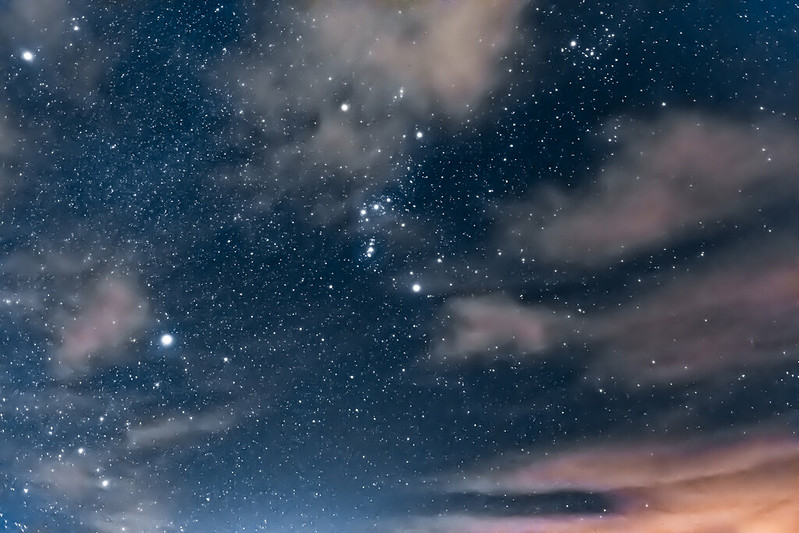
  </a>
</figure>
<figcaption style="font-size: 0.4em; color: #666;">
  Uroš Novina [CC BY 2.0]
</figcaption>

---
    
Nébuleuse d'Orion

<figure>
  
</figure>
<figcaption style="font-size: 0.4em; color: #666;">
  NASA, ESA, M. Robberto (STScI/ESA) and the Hubble Space Telescope Orion
  Treasury Project Team
</figcaption>

---

### Comètes

<a href="http://commons.wikimedia.org/wiki/File%3AComet_P1_McNaught02_-_23-01-07-edited.jpg">
  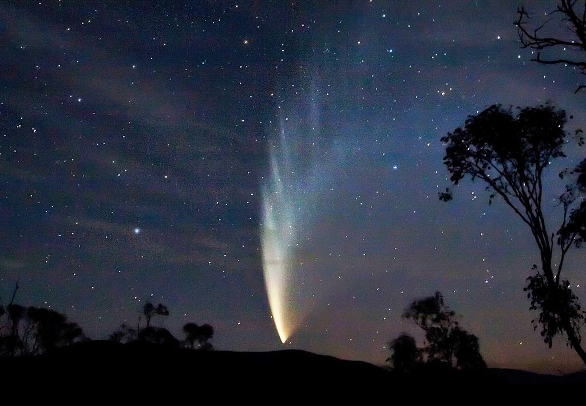
</a>
<figcaption style="font-size: 0.4em; color: #666;">
  Comète C/2006 P1 (McNaught) photographiée de Victoria, Australie en 2007 (Soerfm [CC-BY-SA-3.0])
</figcaption>

---

#### Comètes

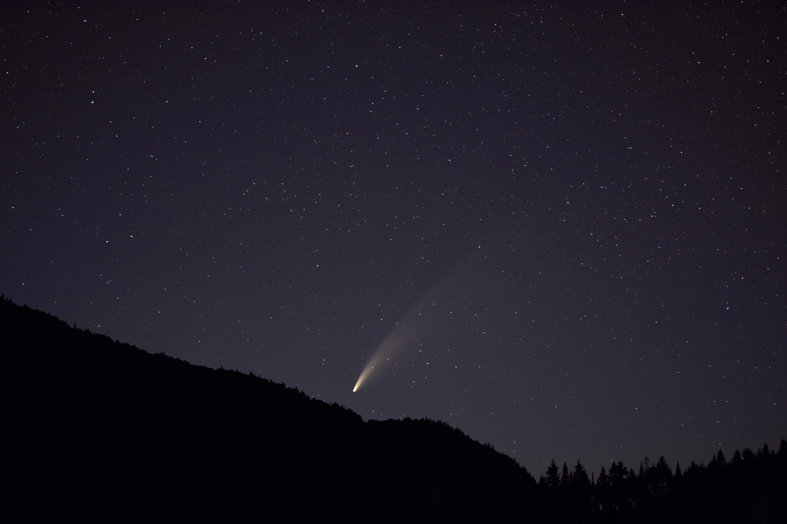
<figcaption style="font-size: 0.4em; color: #666;">
  Comète C/2020 F3 (NEOWISE) photographiée de Saint-Raymond-de-Portneuf, le 14 juillet 2020 (Olivier Langevin)
</figcaption>

---

### Astres errants

En plus du Soleil et de la Lune, cinq planètes visibles à l'œil nu :

- Mercure
- Vénus
- Mars
- Jupiter
- Saturne

---

## Quels phénomènes observe-t-on dans le ciel ?

---

#### Rotation diurne de la sphère céleste

<a href="http://commons.wikimedia.org/wiki/File%3ANight_Photography.jpg">
  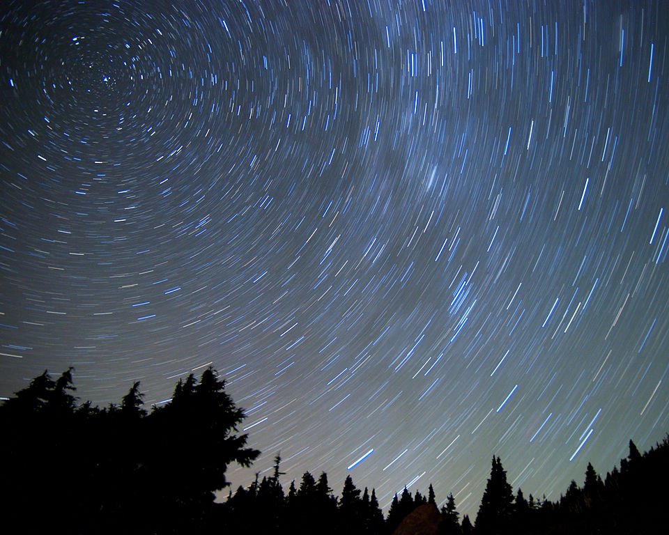
</a>
<figcaption style="font-size: 0.4em; color: #666;">
Robert Knapp (www.modernartphotograph.com, CC-BY-SA-3.0)
</figcaption>

- Les étoiles semblent tourner autour de Polaris au cours d'une nuit
- Polaris située au Pôle Nord Céleste
- Sphère céleste : sphère creuse centrée sur la Terre
- Équateur céleste : projection de l'équateur terrestre sur la sphère céleste

---

#### Rotation diurne de la sphère céleste

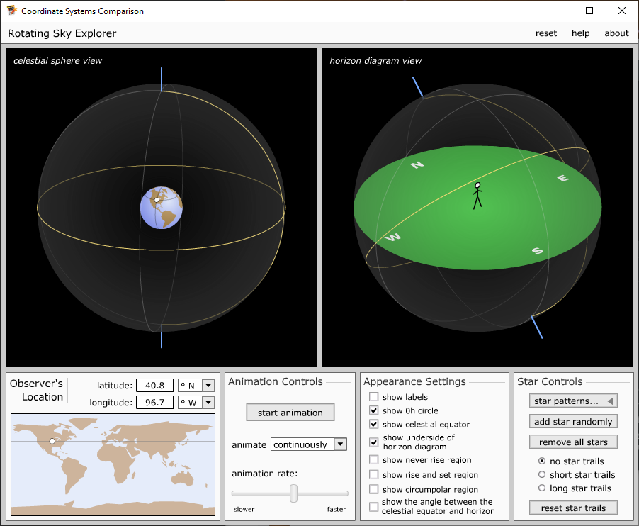
<figcaption style="font-size: 0.4em; color: #666;">
  Astronomy Education at the University of Nebraska-Lincoln Web Site
  ([http://astro.unl.edu](http://astro.unl.edu))
</figcaption>

- ClassAction -> Animations -> Coordinate Systems Comparison
- Cégep Édouard-Montpetit : 45.5N, 73.5W
- C'est la Terre qui tourne O vers E.
- Obs terrestre: la sphère céleste tourne E vers O.
- Montrer Ursa Major : Étoiles ne bougent pas les unes p/r aux autres
- Montrer les 2 autres constellations : région circumpolaire, région de
    lever-coucher, région invisible (effet de la latitude)
- Montrer une étoile : déclinaison/ascension droite vs altitude/azimuth

---

### Rotation diurne de la sphère céleste

- La Terre tourne d'ouest en est
- La sphère céleste tourne d'est en ouest
- Les étoiles ne bougent pas les unes par rapport aux autres
- **Région circumpolaire**
- **Région invisible**

---

### Rotation diurne de la sphère céleste

- L'**équateur céleste** est perpendiculaire à la droite qui joint le pôle Nord
    céleste et le pôle Sud céleste
- **Déclinaison** : angle par rapport à l'équateur céleste (analogue à la
    latitude)
- **Ascension droite** : angle par rapport à la ligne 0h (analogue à la
    longitude)

---

Si vous voulez trouver une étoile rapidement dans le ciel, vous préférez avoir

<ol style="list-style-type: upper-alpha">
  <li>Constellation</li>
  <li>Coordonnées altitude-azimuth</li>
  <li>Coordonnées équatoriales</li>
</ol>

---

Si vous voulez dire à votre amie qui se trouve en France où trouver une étoile
vous lui donnez

<ol style="list-style-type: upper-alpha">
  <li>Constellation</li>
  <li>Coordonnées altitude-azimuth</li>
  <li>Coordonnées équatoriales</li>
</ol>

---

Ce soir, Jupiter sera plein sud à environ 21° d'altitude à 21h30. À 20h30 elle
sera

<ol style="list-style-type: upper-alpha">
  <li>Plein sud</li>
  <li>Plus à l'est</li>
  <li>Plus à l'ouest</li>
</ol>

---

Ce soir, Jupiter sera plein sud à environ 21° d'altitude à 21h30. À 20h30 elle
sera

<ol style="list-style-type: upper-alpha">
  <li>À une altitude de 21°</li>
  <li>À une altitude inférieure à 21°</li>
  <li>À une altitude supérieure à 21°</li>
</ol>

---

### Mouvement annuel du Soleil

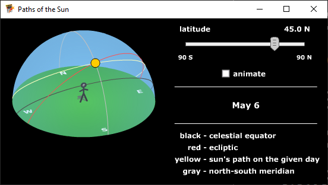
<figcaption style="font-size: 0.4em; color: #666;">
  Astronomy Education at the University of Nebraska-Lincoln Web Site
  ([http://astro.unl.edu](http://astro.unl.edu))
</figcaption>

- ClassAction -> Animations -> Paths of the Sun

---

### Le zodiaque et l'écliptique

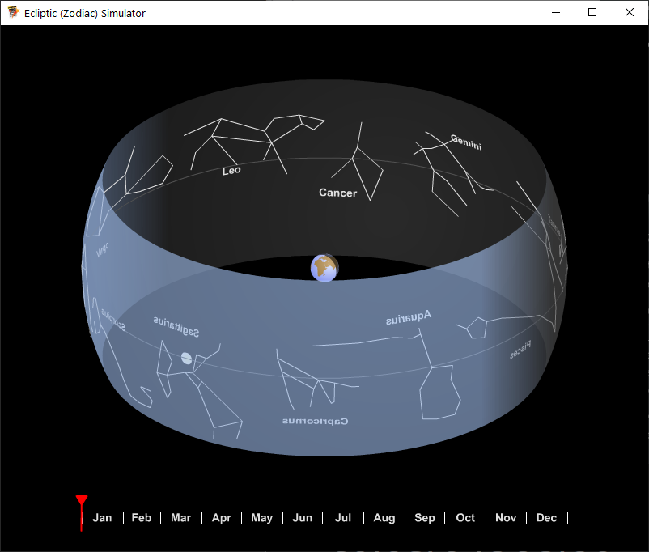
<figcaption style="font-size: 0.4em; color: #666;">
  Astronomy Education at the University of Nebraska-Lincoln Web Site
  ([http://astro.unl.edu](http://astro.unl.edu))
</figcaption>

- ClassAction -> Animations -> Ecliptic (Zodiac) Simulator

---

## Les saisons

Qu'est-ce qui cause les saisons?

---

## Les saisons

#### Été

- Le Soleil est plus haut dans le ciel (23° de déclinaison au solstice)
- L'angle d'incidence des rayons du Soleil est plus près de 90°
- Le jour est plus long
 
 
**Le Soleil transmet plus d'énergie au sol**

---

## Les saisons

#### Hiver

- Le Soleil est plus bas dans le ciel (-23° de déclinaison au solstice)
- L'angle d'incidence des rayons du Soleil est plus éloigné de 90°
- Le jour est plus court
 
 
**Le Soleil transmet moins d'énergie au sol**

---

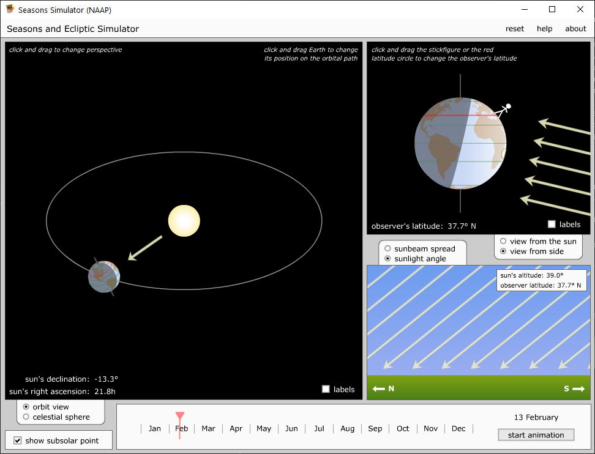
<figcaption style="font-size: 0.4em; color: #666;">
  Astronomy Education at the University of Nebraska-Lincoln Web Site
  ([http://astro.unl.edu](http://astro.unl.edu))
</figcaption>

- ClassAction -> Animations -> Seasons Simulator (NAAP)

---

### Phases de la lune

<figure>
  
  <figcaption style="font-size: 0.4em; color: #666;">
    Phases de la Lune (Eric GABA, Looxix)
  </figcaption>
</figure>

---

<figure>
  <a href="https://astro.unl.edu/smartphone/asset3/">
    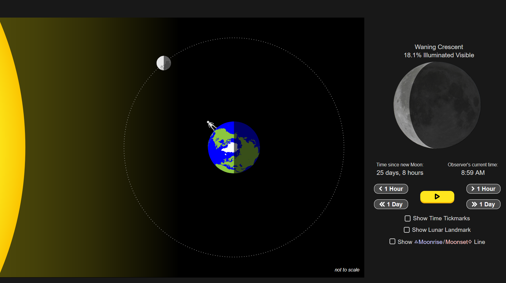
  </a>
  <figcaption style="font-size: 0.4em; color: #666;">
    Astronomy Education at the University of Nebraska-Lincoln Web Site
    ([http://astro.unl.edu](http://astro.unl.edu))
  </figcaption>
</figure>

---

### Éclipse de Soleil

<a href="https://www.nasa.gov/image-feature/2017-total-solar-eclipse-composite">
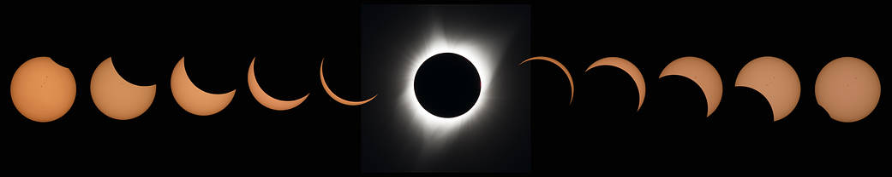
</a>
<figcaption style="font-size: 0.4em; color: #666;">
NASA/Aubrey Gemignani
</figcaption>

---

### Éclipse de Lune

<figcaption style="font-size: 0.4em; color: #666;">
NASA Goddard Media Studios
</figcaption>

---

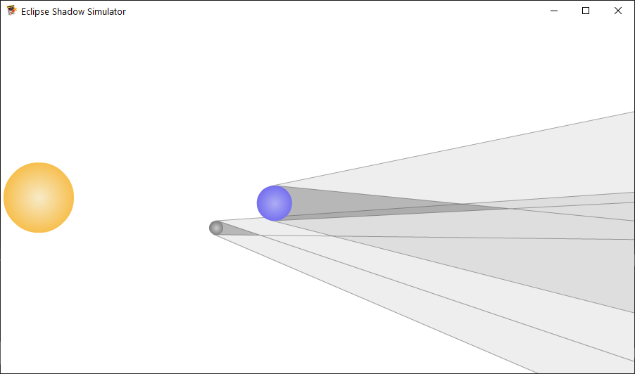
<figcaption style="font-size: 0.4em; color: #666;">
  Astronomy Education at the University of Nebraska-Lincoln Web Site
  ([http://astro.unl.edu](http://astro.unl.edu))
</figcaption>

- ClassAction -> Animations -> Lunar Cycles -> Eclipse Shadow Simulator

---

## Éclipse de Lune à chaque pleine Lune?

>- Non! Orbite de la Lune inclinée d'environ 5° par rapport à celle de la Terre

---

## Visibilité des éclipses

Est-ce qu'une éclipse de Lune est visible partout où la Lune est visible?

>- Oui! L'ombre de la Terre cache la Lune entièrement.

 

Est-ce qu'une éclipse de Soleil est visible partout où le Soleil est visible?

>- Non! L'ombre de la Lune ne cache le Soleil que dans une petite région.

---

### Précession des équinoxes

<iframe width="560" height="315"
src="https://www.youtube.com/embed/uf-UFu-lACY?start=9" frameborder="0"
allow="accelerometer; autoplay; encrypted-media; gyroscope; picture-in-picture"
allowfullscreen></iframe>

---

### Précession des équinoxes

<a title="By Tfr000 (talk) 14:59, 14 May 2012 (UTC) (Own work) [CC-BY-SA-3.0
(http://creativecommons.org/licenses/by-sa/3.0) or GFDL
(http://www.gnu.org/copyleft/fdl.html)], via Wikimedia Commons"
href="http://commons.wikimedia.org/wiki/File%3APrecession_animation_small_new.gif">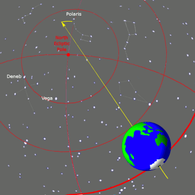</a>

<figcaption style="font-size: 0.4em; color: #666;">
  Tfr000 (CC BY-SA 3.0)
</figcaption>

 
Période de **26000 ans**

---

### Précession des équinoxes

- Le pôle Nord céleste ne coïncide pas toujours avec Polaris
- Signe astrologique pas toujours le même que le signe « astronomique »

