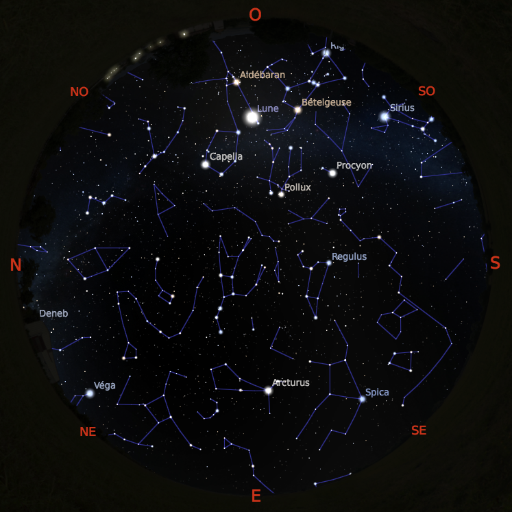
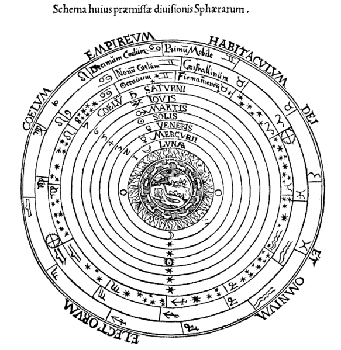

% Astronomie antique
% CEA Explorer et comprendre l'Univers
% 6 février 2020
---
theme: night
transition: none
---

## Les Mésopotamiens

<figure>
  
  <figcaption style="font-size: 0.4em; color: #666;">
    Goran tek-en [CC-BY-SA-3.0](http://creativecommons.org/licenses/by-sa/3.0)
  </figcaption>
</figure>

---

<figure>
  <a href="https://ccp.yale.edu/P240180">
    e siècle avant J.C. (Trustees of the British Museum)"
    style="max-height: 600px">
  </a>
  <figcaption style="font-size: 0.4em; color: #666;">
    Trustees of the British Museum
  </figcaption>
</figure>

---

### Mésopotamiens et astrologie

>- Développement des mathématiques
>- Observations astronomiques détaillées
>- Motivation pour l'étude des astres?

---

### Certains astres ont une influence sur la Terre

<table>
  <tr>
  <td>
    
  </td>
  <td>
    
  </td>
  </tr>
</table>

---

#### Les astres ont une influence sur la destiné des rois

---

### Observations mésopotamiennes

- Observations systématiques de la Lune et du Soleil
- Position des planètes par rapport aux constellations
- Mesure des positions des planètes par rapport au Soleil

---

### Rappels

- Les étoiles ne se déplacent pas les unes par rapport aux autres
- 7 **astres errants** : Soleil, Lune, Mercure, Vénus, Mars, Jupiter, Saturne
- Les astres errants se déplacent dans les 12 constellations du zodiaque (le
  long de l'**écliptique**)

---

## Deux sortes d'astres errants

### Planètes inférieures

### Planètes supérieures

---

### Planètes inférieures

- Mercure et Vénus
- Se déplacent avec le Soleil
- Position par rapport au Soleil varie entre deux élongations maximales

---

#### Planètes inférieures

---

### Planètes supérieures

- Mars, Jupiter, Saturne
- Planètes qui sont parfois en opposition avec le Soleil
- Peuvent occuper toutes les positions par rapport au Soleil

---

#### Planètes supérieures

---

------------------------------------------------------
 Astre errant    Période zodiacale
--------------  --------------------------------------
 Lune            27,3 jours

 Mercure         1 an

 Vénus           1 an

 Soleil          1 an

 Mars            2 ans

 Jupiter         12 ans

 Saturne         30 ans
------------------------------------------------------

---

## Les Grecs

<figure>
  
  <figcaption style="font-size: 0.4em; color: #666;">
    Marsyas [CC BY-SA](http://creativecommons.org/licenses/by-sa/3.0/)
  </figcaption>
</figure>

---

**En première approximation**, les astres errants

- se déplacent tous d'ouest en est par rapport aux
  constellations du zodiaque
- ont une vitesse constante

---

### Observations plus raffinées

- Les planètes ont parfois un **mouvement rétrograde**
- La vitesse de chaque planète n'est pas constante&nbsp;: **préférence zodiacale**

---

### Mouvement rétrograde

<figure>
  
  <figcaption style="font-size: 0.4em; color: #666;">
    Stellarium
  </figcaption>
</figure>

---

## Comment expliquer ces observations?

---

### La Terre est une sphère

- Fait connu à partir de 400 av. J.-C. (*puis oublié pendant le Moyen-Âge*)
- Observations&nbsp;:
    * Mat d'un voilier disparaît après la coque
    * Ombre circulaire de la Terre sur la Lune lors d'éclipses de Lune
    * Changement de l'apparence du ciel selon la latitude

**Tout cela est correct**

---

<figure>
  <a href="https://commons.wikimedia.org/wiki/File:Horizon,_Valencia_(Spain).JPG">
  
  <figcaption style="font-size: 0.4em; color: #666;">
    Santifc [CC BY-SA](https://creativecommons.org/licenses/by-sa/4.0)
  </figcaption>
</figure>

---

<figcaption style="font-size: 0.4em; color: #666;">
NASA Goddard Media Studios
</figcaption>

---

<figure>
  
  
  <figcaption style="font-size: 0.4em; color: #666;">
    Stellarium
  </figcaption>
</figure>

---

## Conclusion (incorrecte) des grecs :

### L'Univers est une série de sphères centrées sur la Terre

>- C'est le **modèle géocentrique**

---

## Aristote

*350 av. J.-C.*

---

## Aristote

- Le cercle est la figure parfaite! (*Platonique*)
- Sphères en mouvement **circulaire uniforme**

>- Centre : **Terre**, **Eau**
>- Ciel : **Air**, **Feu**
>- Éther : **Étoiles**

---

## Aristote

---

## Hipparque

*150 av. J.-C.*

---

## Hipparque

- Propose une explication du mouvement rétrograde des planètes supérieures
- Planète se déplace sur un **épicycle** qui lui-même se déplace sur un
    **déférent**

---

## Hipparque

---

## Claude Ptolémée

*IIe siècle*

---

## Ptolémée

- Reprend l'idée des épicycles
- Ajoute : **équant**, Terre décentrée

---

## Ptolémée

---

### Ptolémée explique

* le mouvement rétrograde
* la préférence zodiacale
* les positions des astres errants avec une précision de l'ordre de 5°

---

### Ptolémée n'explique pas

* les contraintes bizarres sur le segment *centre de l'épicycle - planète*
* centre de l'épicycle des planètes inférieures sur l'axe Terre-Soleil
* axe centre de l'épicycle-planète supérieure parallèle à l'axe
  Terre-Soleil
