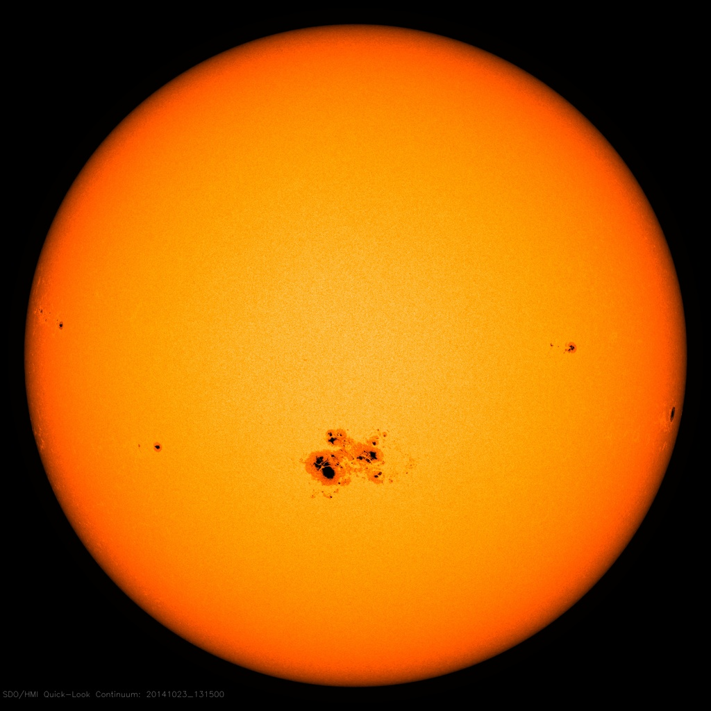

% Astronomie à la Renaissance
% CEA Explorer et comprendre l'Univers
% 14 février 2024
---
theme: night
title-slide-attributes:
    data-background-image: ../../images/52565304936_fc8852f1e9_k.jpg
    data-background-size: contain
    data-background-opacity: 0.7

---

## Signe astrologique

Est-ce que votre signe astrologique correspondait bien à la position du Soleil
le jour de votre naissance?

---

## Rappels

### Observations mésopotamiennes

- Observations systématiques de la Lune et du Soleil
- Position des planètes par rapport aux constellations
- Mesure des positions des planètes par rapport au Soleil

---

## Rappels

### Modèle de Ptolémée

---

## Moyen-Âge

---

## Moyen-Âge

---

## Copernic

*1473-1543*

---

## Copernic

- Introduit un **modèle héliocentrique**
- Basé sur des arguments d'*élégance* et de *simplicité*

---

## Copernic

---

## Copernic

- Soleil est au centre
- Planètes inférieures sont plus près du Soleil
- Planètes supérieures plus loin du Soleil

---

## Copernic

Explique

- Période de révolution des planètes
- Mouvement rétrograde
- Taille relative des rétrogradations

---

Dans le modèle de Copernic, pourquoi est-ce que les planètes inférieures
apparaissent toujours proches du Soleil dans le ciel?

<ol style="list-style-type: upper-alpha">
  <li>Elles sont plus petites que les autres planètes</li>
  <li>Elles sont sur des orbites autour du Soleil plus petites que
  celle de la Terre</li>
  <li>Elles sont sur des orbites autour du Soleil plus grandes que
  celle de la Terre</li>
  <li>Elles sont sur un épicycle qui est toujours centré sur l'axe Terre-Soleil</li>
</ol>

---

## Période de révolution des planètes

Planète     Période sidérale (année)
--------   -------------------------
Mercure                0,24
Vénus                  0,62
Terre                  1,00
Mars                   1,88
Jupiter               11,86
Saturne               29,46

---

## Copernic

Pour expliquer la préférence zodiacale, il introduit...

...des épicycles.

---

## Copernic

Permet de prédire les positions des astres errants avec une précision de
l'ordre de 5°

---

Quels éléments parmi les suivants sont communs aux modèle de Ptolémée et de
Copernic?

<ol style="list-style-type: upper-alpha">
  <li>Orbites circulaires</li>
  <li>Équants</li>
  <li>Terre au centre</li>
  <li>Soleil au centre</li>
  <li>Épicycles</li>
</ol>

---

## Galilée

*1564-1642*

---

## Galilée

- Pionnier de l'utilisation d'instrument optique pour l'observation
  astronomique
- **Lunette de Galilée**

---

## Lunette de Galilée

---

## Observation de Galilée

- Lunes de Jupiter
- Phases de Vénus
- Taches solaires
- Montagnes sur la Lune

---

### Lunes de Jupiter

<figure>
  
  <figcaption style="font-size: 0.4em; color: #666;">
  Lunes de Jupiter vues dans un télescope moderne (Jan Sandberg)
  </figcaption>
</figure>

---

### Phases de Vénus

<figure>
  
  <figcaption style="font-size: 0.4em; color: #666;">
  Rachel Knott
  [CC BY-SA 3.0](https://creativecommons.org/licenses/by-sa/3.0/deed.en)
  </figcaption>
</figure>

---

### Phases de Vénus

  <figcaption style="font-size: 0.4em; color: #666;">
  [UNL Astronomy](https://astro.unl.edu/classaction/animations/renaissance/venusphases.html)
  </figcaption>

---

### Montagnes sur la Lune

<figure>
  
</figure>

---

### Taches solaires

<figure>
  
</figure>

---

## Toutes les observations de Galilée valident le modèle héliocentrique de Copernic

---

<figure>
  
  <figcaption style="font-size: 0.4em; color: #666;">
    Peinture de Cristiano Banti qui montre Galilée faisant face à
    l'Inquisition.
  </figcaption>
</figure>

---

## Tycho Brahé

*(1546 — 1601)*

---

## Tycho Brahé
- Château-observatoire, Uraniborg, sur l'île de Hveen
- Observations à l'**œil nu**
- Position des planètes à 1/60 de degré

---

<iframe src="https://www.google.com/maps/embed?pb=!1m14!1m8!1m3!1d6960672.152790297!2d6.55505173829551!3d55.12126368273628!3m2!1i1024!2i768!4f13.1!3m3!1m2!1s0x465235606b16f931%3A0x7c2b7a040a52432d!2sUranienbourg!5e0!3m2!1sfr!2sus!4v1707755217317!5m2!1sfr!2sus" width="800" height="600" style="border:0;" allowfullscreen="" loading="lazy" referrerpolicy="no-referrer-when-downgrade"></iframe>

---

## Tycho Brahé

- Élabore un modèle complexe et incorrect à partir de ses observations
- Lègue ses données à Johannes Kepler

---

## Johannes Kepler

*(1571 — 1630)*

---

## Johannes Kepler

- Féru de mathématiques
- Élabore un modèle mathématique du mouvement des planètes
- Découvre **trois** lois qui régissent leur mouvement

---

## Première loi de Kepler

*Les planètes décrivent des orbites en forme d'ellipse autour du Soleil. Ce
dernier se trouve sur un des foyers de l'ellipse.*

---

---

## L'ellipse

- Possède deux **foyers**
- Caractérisée par son **excentricité**

$$e = \frac{c}{a}$$

---

## L'ellipse

- Aphélie : point le plus loin du Soleil
- Périhélie : point le plus près du Soleil

---

Planète   Excentricité
-------   ------------
Mercure   0,206
Vénus     0,007
Terre     0,017
Mars      0,093
Jupiter   0,048
Saturne   0,056
Uranus    0,047
Neptune   0,009
Pluton    0,248

---

## Deuxième loi de Kepler

*La ligne qui relie la planète au Soleil balaie des aires égales en des temps
égaux.*

---

---

## Deuxième loi de Kepler

- Vitesse varie le long de l'orbite
- Près du Soleil : plus vite
- Loin du Soleil : plus lentement

>- C'est la préférence zodiacale

---

## Troisième loi de Kepler

$$T^2 = a^3$$

- $T$ : **période sidérale** en années
- $a$ : **demi-grand axe** en unités astronomiques

---

## {background-image="../../images/52565304936_fc8852f1e9_k.jpg"}

