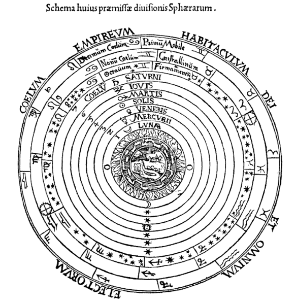
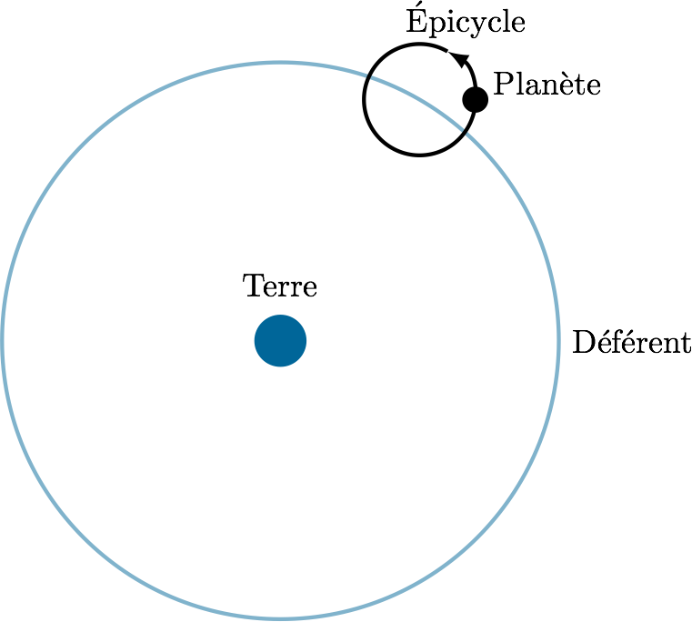
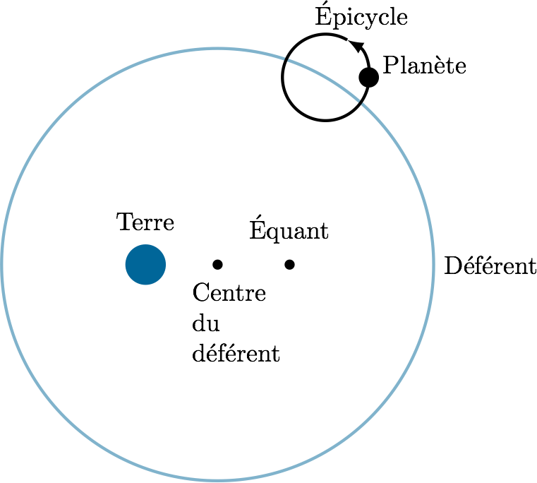

% Le système du monde
% CEA Explorer et comprendre l'Univers
% 3 septembre 2014
---
theme: beige
transition: linear
---

## Rappels

### Observations mésopotamiennes

- Observations systématiques de la Lune et du Soleil
- Position des planètes par rapport aux constellations
- Mesure des positions des planètes par rapport au Soleil

 

### Observations plus raffinées des grecs

- Les planètes supérieures ont parfois un **mouvement rétrograde**
- La vitesse de chaque planète n'est pas constante : **préférence zodiacale**

---

# Comment expliquer ces observations?

---

## La Terre est une sphère

- Fait connu à partir de 400 av. J.-C. (*puis oublié pendant le Moyen-Âge*)
- Observations:
    * Mat d'un voilier disparaît après la coque
    * Ombre circulaire de la Terre sur la Lune lors d'éclipses de Lune
    * Changement de l'apparence du ciel selon la latitude

**Tout cela est correct**

---

## Conclusion (incorrecte) des grecs :

### L'Univers est une série de sphères centrées sur la Terre

>- C'est le **modèle géocentrique**

---

## Aristote

*350 av. J.-C.*

--- 

## Aristote

- Le cercle est la figure parfaite! (*Platonique*)
- Sphères en mouvement **circulaire uniforme**

>- Centre : **Terre**, **Eau**
>- Ciel : **Air**, **Feu**
>- Éther : **Étoiles**

---

## Aristote

---

## Hipparque

*150 av. J.-C.*

---

## Hipparque

- Propose une explication du mouvement rétrograde des planètes supérieures
- Planète se déplace sur un **épicycle** qui lui-même se déplace sur un
    **déférent**

---

## Hipparque

---

## Ptolémée

*IIe siècle*

---

## Ptolémée

- Reprend l'idée des épicycles
- Ajoute : **équant**, Terre décentrée

---

## Ptolémée

---

## Ptolémée

- Explique
    * le mouvement rétrograde
    * la préférence zodiacale
    * les positions des astres errants avec une précision de l'ordre de 5°

- N'explique pas
    * les contraintes bizarres sur le segment *centre de l'épicycle - planète*
    * centre de l'épicycle des planètes inférieures sur l'axe Terre-Soleil
    * axe centre de l'épicycle-planète supérieure parallèle à l'axe
        Terre-Soleil

---

## Copernic

*XVIe siècle*

---

## Copernic

- Introduit un **modèle héliocentrique**
- Basé sur des arguments d'*élégance* et de *simplicité*

---

## Copernic

---

## Copernic

- Soleil est au centre
- Planètes inférieures sont plus près du Soleil
- Planètes supérieures plus loin du Soleil

---

## Copernic

Explique

- Période de révolution des planètes
- Mouvement rétrograde
- Taille relative des rétrogradations

---

## Période de révolution des planètes

Planète     Période de révolution (année)
--------   -----------------------------
Mercure                      0,24
Vénus                        0,62
Terre                        1,00
Mars                         1,88
Jupiter                     11,86
Saturne                     29,46

---

## Copernic

Pour expliquer la préférence zodiacale, il introduit...

...des épicycles.

---

## Copernic

Permet de prédire les positions des astres errants avec une précision de
l'ordre de 5°

---

## Galilée

*XVIIe siècle*

---

## Galilée

- Pionnier de l'utilisation d'instrument optique pour l'observation
    astronomique
- **Lunette de Galilée**

---

## Lunette de Galilée

---

## Observation de Galilée

- Phases de Vénus
- Taches solaires
- Montagnes sur la Lune
- Lunes de Jupiter
- Anneaux de Jupiter

---

## Toutes les observations de Galilée valident le modèle héliocentrique de Copernic
