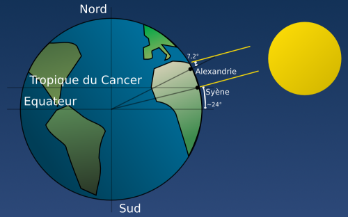
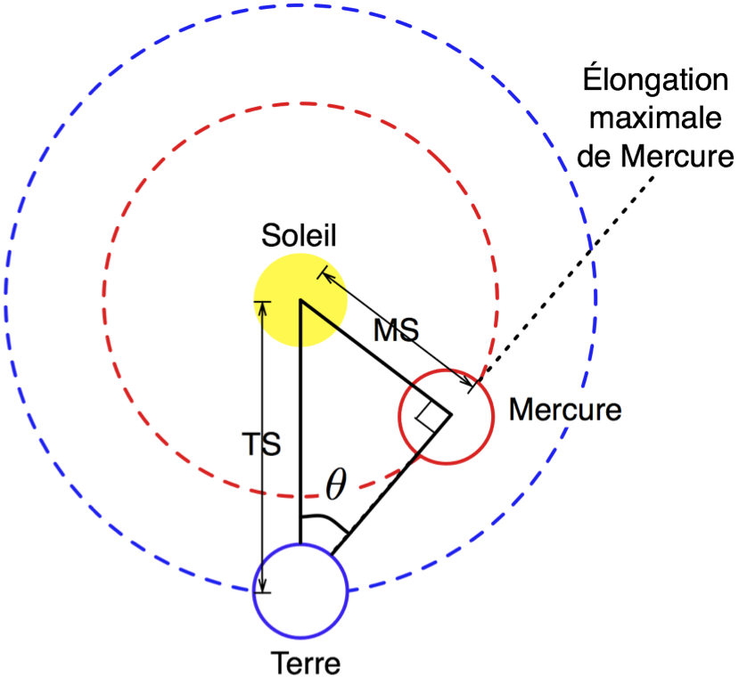

% Distances dans le système solaire
% CEA Explorer et comprendre l'Univers
% 22 février 2024
---
theme: night
title-slide-attributes:
    data-background-image: ../../images/52565304936_fc8852f1e9_k.jpg
    data-background-size: contain
    data-background-opacity: 0.7
header-includes: |
    

---

Comment fait-on pour déterminer la taille des astres et les distances entre la Terre et les astres?

---

<figure>
  
  <figcaption style="font-size: 0.4em; color: #666;">
  (NASA)
  </figcaption>
</figure>

---

## Rappels de géométrie

---

## Le Soleil est plus loin que la Lune

**Méthode d'Aristarque**

---

>- $\theta = 89.85°$
>- Le Soleil est 382 fois plus loin que la Lune

---

## Le rayon de la Terre

**Méthode d'Ératosthène**

---

<figcaption style="font-size: 0.4em; color: #666;">
  Raphael Javaux [CC BY-SA 3.0](https://creativecommons.org/licenses/by-sa/3.0/deed.fr)
</figcaption>

>- Le rayon de la Terre est d'environ 6700 km
>- Valeur moderne : 6380 km

---

## Distance Terre-Lune

**Méthode d'Hipparque**

>- Observations durant une éclipse de Lune
>- La Lune est à une distance de 32 diamètres terrestres

---

## Distance Terre-Lune

**Méthode moderne**

---

<iframe width="560" height="315" src="//www.youtube.com/embed/_v52LFgUq-8" frameborder="0" allowfullscreen></iframe>

---

**384 400 km**

---

## Distance des planètes inférieures

**Méthode de l'élongation maximale**

---

---

## Distance des planètes supérieures

**Méthode de Kepler**

---

---

---

## Distance Terre-Soleil

**Méthode parallaxe**

La distance entre la Terre et le Soleil est appelée une **unité astronomique
(UA)**

>- **1 UA = 1.50 $\times$ 1011 m = 150 000 000 km**

---

## {background-image="../../images/52565304936_fc8852f1e9_k.jpg"}

