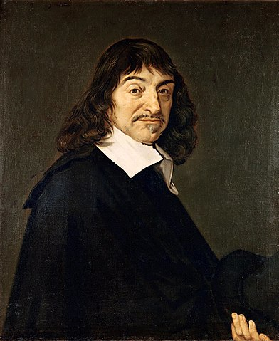
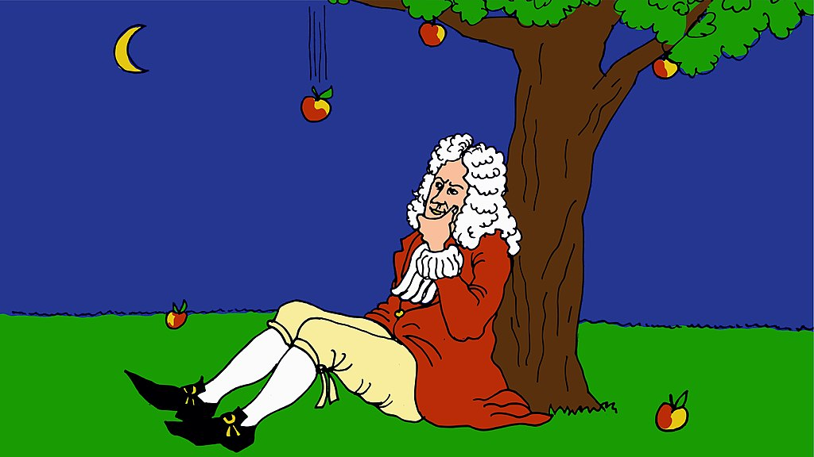
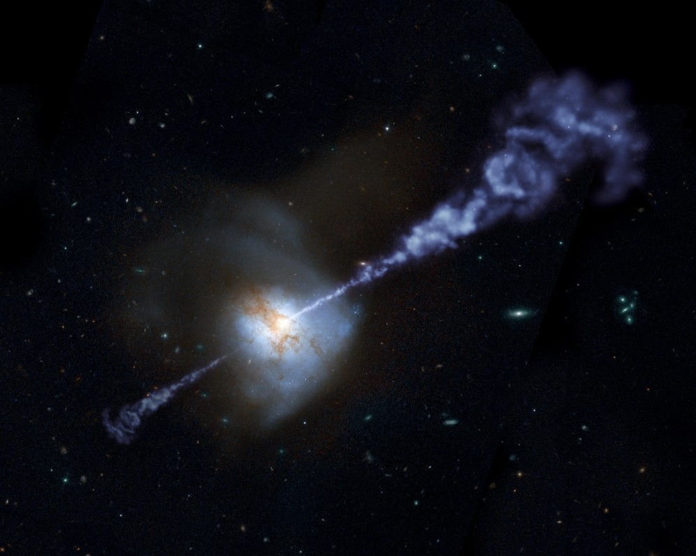

% Gravitation
% CEA Explorer et comprendre l'Univers
% 5 mars 2020
---
theme: beige
transition: linear
---

## Pourquoi les planètes du système solaire bougent-elles sur des orbites elliptiques?

---

### Galilée
*(1564 — 1642)*

La gravité agit de la même façon sur tous les corps à la surface de la Terre.

---

<figure>
  
  <figcaption style="font-size: 0.4em; color: #666;">
    (Dudva [CC BY-SA 3.0](https://creativecommons.org/licenses/by-sa/3.0/deed.en))
  </figcaption>
</figure>

---

<iframe
  src="//commons.wikimedia.org/wiki/File:Apollo_15_feather_and_hammer_drop.ogv?embedplayer=yes"
  width="654" height="480" frameborder="0" webkitAllowFullScreen
  mozallowfullscreen allowFullScreen>
</iframe>
<figcaption style="font-size: 0.4em; color: #666;">
  Dave Scott, Apollo 15 (NASA)
</figcaption>

---

<iframe width="560" height="315"
    src="https://www.youtube.com/embed/E43-CfukEgs" frameborder="0"
    allow="accelerometer; autoplay; encrypted-media; gyroscope; picture-in-picture"
    allowfullscreen>
</iframe>

---

### Galilée (encore)

**Principe d'inertie** (v. 1.0)

*En l'absence de toute contrainte et de toute force, un objet en mouvement
continuera sur sa lancée horizontale pour toujours.*

Les planètes continuent a parcourir leur orbite pour toujours.

---

### René Descartes

*(1596 — 1650)*

<figure>

</figure>

---

### René Descartes

**Principe d'inertie** (v. 2.0)

*Les objets se déplacent en ligne droite à vitesse constante tant et aussi
longtemps qu'aucune force n'agit sur eux.*

---

### Il doit donc y avoir une force qui tire les planètes vers le Soleil

---

### Isaac Newton

*(1642 — 1727)*

<figure>

</figure>

---

### Isaac Newton

#### Quelle est la force qui tire continuellement les planètes vers le Soleil et les maintient sur leur orbite?

---

### Première loi de la mécanique

**Principe d'inertie** (v. 2.0)

*Les objets se déplacent en ligne droite à vitesse constante tant et aussi
longtemps qu'aucune force n'agit sur eux.*

---

### Deuxième loi de la mécanique

L'accélération subit par un corps est proportionnelle à la force nette
appliquée à ce corps et inversement proportionnelle à la masse du corps.

---

### Troisième loi de la mécanique

Toute force exercée par un objet A sur un objet B est accompagnée d'une force
exercée par l'objet B sur l'objet A qui a la même grandeur et est dans la
direction opposée.

---

### La force qui maintient les planètes en orbite autour du Soleil est la même qui fait tomber les objets à la surface de la Terre

---

### Interlude : Newton et la pomme

<figure>
  
  <figcaption style="font-size: 0.4em; color: #666;">
    (Alexander Borek [CC BY-SA 4.0](https://creativecommons.org/licenses/by-sa/4.0/deed.fr))
  </figcaption>
</figure>

---

### Loi de la gravitation universelle de Newton

$$F = \frac{G m_1 m_2}{r^2}$$

---

<iframe width="800px" height="600px"
src="https://lab.loicseguin.com/schroeder/index.html"></iframe>

---

### Isaac Newton

Publication de ses résultats dans les *Philosophiae Naturalis Principia
Mathematica*

---

### Succès de la théorie newtonienne

Permet d'expliquer tous les phénomènes célestes observés

Prédit de nouveaux phénomènes

---

### Prédiction de la trajectoire d'une comète par Edmund Halley

---

### Étude des systèmes binaires par Caroline et William Herschel

<figure>
  
  <figcaption style="font-size: 0.4em; color: #666;">
    Wellcome Collection ([CC BY 4.0](https://creativecommons.org/licenses/by/4.0/))
  </figcaption>
</figure>

---

### Découverte de nouvelles planètes

>- Découverte d'Uranus en 1781 par William Herschel
>- L'orbite d'Uranus est bizarre...
>- J. C. Adams et Urbain Le Verrier prédisent l'existence d'une autre planète :
   Neptune
>- Neptune est découverte en 1846 par J. G. Galle

---

## Problème avec la théorie newtonienne

Perturbation dans l'orbite de Mercure qui ne s'explique d'aucune façon...

---

### Albert Einstein

*(1879 — 1955)*

---

### Albert Einstein

- Essaie de réconcilier le principe de relativité galiléenne et
  l'électrodynamisme
- Essaie d'expliquer pourquoi toutes les mesures de la vitesse de la lumière
  donnent la même valeur

 

>- Il ne tente pas d'expliquer l'orbite de Mercure

---

### Relativité restreinte

*(1905)*

Deux postulats

- Le principe de relativité
- La constance de la vitesse de la lumière

---

### Relativité restreinte

- Espace et temps ne sont plus absolus
- Dilatation du temps et contraction des longueurs
- Facteur de ralentissement du temps
$$\gamma = \frac{1}{\sqrt{1 - \frac{v^2}{c^2}}}$$

---

### Relativité restreinte

- Dilatation du temps et contraction des longueurs deviennent plus importante
  lorsqu'on s'approche de la vitesse de la lumière
- Les objets massifs ne peuvent jamais atteindre la vitesse de la lumière

---

### Relativité restreinte

Équivalence masse-énergie

$$E = \gamma m c^2$$

---

### Albert Einstein

La même année (1905), il publie 4 découvertes fondamentales :

- L'effet photoélectrique
- Le mouvement brownien
- La relativité restreinte
- L'équivalence masse-énergie

 

C'est l'*Annus Mirabilis*.

---

### Relativité générale

*(1916)*

- Extension de la relativité restreinte à des référentiels accélérés
- En plus des deux postulats de la relativité restreinte, Einstein ajoute le
  **principe d'équivalence**

*Il n'y a pas de différence entre la gravité et un référentiel accéléré.*

---

### Principe d'équivalence

<figure>
  
</figure>

---

### Relativité générale

- La masse déforme l'**espace-temps**
- Ces déformations sont la cause de la gravitation

---

### Relativité générale

- Près du Soleil, la courbure de l'espace est très importante
- Mercure est près du Soleil!
- Einstein prédit les perturbations de l'orbite de Mercure

---

## Autres succès de la relativité générale

---

### Lentilles gravitationnelles

---

<figure>
  
  <figcaption style="font-size: 0.4em; color: #666;">
    LRG 3-757 photographiée par Hubble. (ESA/Hubble & NASA)
  </figcaption>
</figure>

---

<figure>
  
  <figcaption style="font-size: 0.4em; color: #666;">
    (NASA/ESA).
  </figcaption>
</figure>

---

### Trous noirs

- La relativité générale ajoute un ralentissement du temps dû à la gravité.
- Ce ralentissement dépend de la vitesse de libération
- Si la vitesse de libération est celle de la lumière, ralentissement infini

---

### Trous noirs

Les objets pour lesquels la vitesse de libération est celle de la lumière sont
appelés des **trous noirs**.

---

### Trous noirs supermassifs

<figcaption style="font-size: 0.4em; color: #666;">
  NASA/JPL-Caltech
</figcaption>

---

<figure>
  
  <figcaption style="font-size: 0.4em; color: #666;">
    NASA’s Goddard Space Flight Center/Jeremy Schnittman
  </figcaption>
</figure>

---

<figure>
  
  <figcaption style="font-size: 0.4em; color: #666;">
    EHT Collaboration
  </figcaption>
</figure>

---

## Le futur...

>- Pour expliquer la vitesse de rotation des galaxies, il manque de la masse!
   C'est la **matière sombre** qui compose environ 25% de la masse dans
   l'Univers.
>- L'expansion de l'Univers est trop rapide! Il faut de l'**énergie sombre**
   pour l'expliquer. L'énergie sombre représente 70% de la masse dans
   l'Univers.

---

## Le futur...

On ne sait pas de quoi est composé 95% de l'Univers...

Il reste beaucoup à faire!
