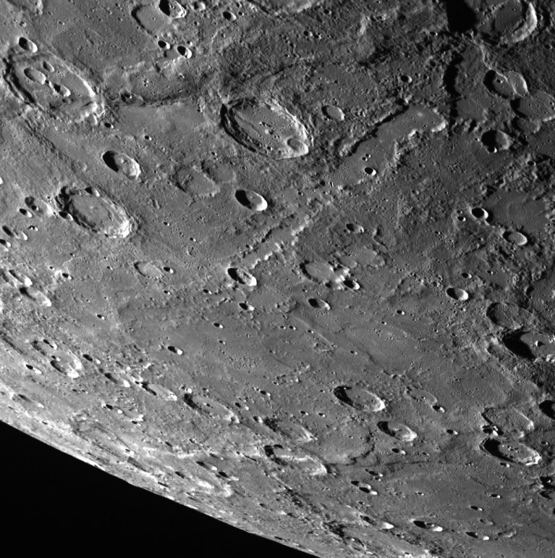
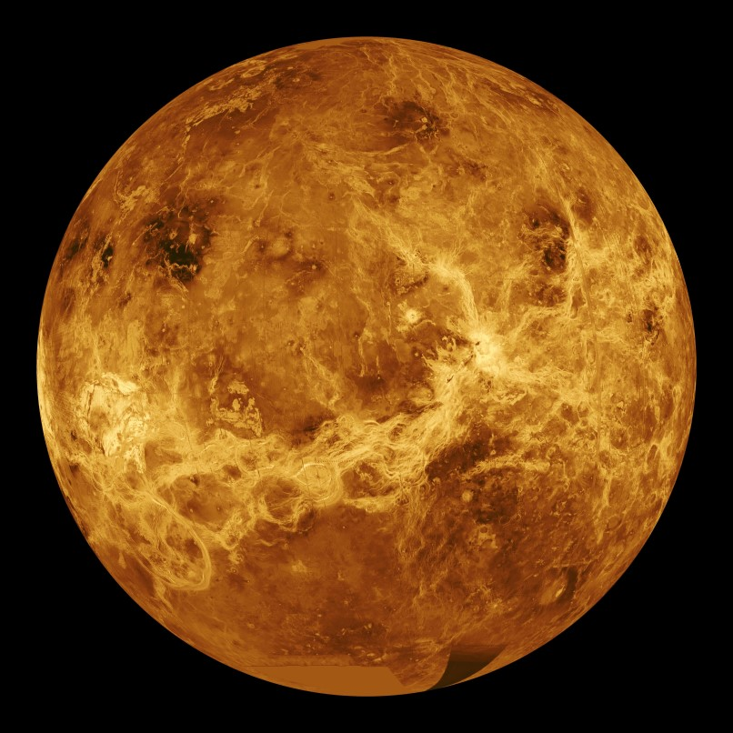

% Exploration du système solaire
% CEA Explorer et comprendre l'Univers
% 12 mars 2020
---
theme: beige
transition: none
---

## Système solaire

- Planètes
    - Corps sphérique
    - En orbite autour du Soleil
    - Qui a éliminé les autres corps de son entourage

- Astéroïde
    - Petit corps (pas nécessairement sphérique)
    - En orbite autour du Soleil

- Satellites
    - Corps en orbite autour d'une planète ou d'un astéroïde

---

## Système solaire

- Ceinture d'astéroïdes
    - Entre Mars et Jupiter
    - Grand nombre d'astéroïdes

- Ceinture de Kuiper
    - Au-delà de Pluton (jusqu'à 120 UA)
    - Grand nombre d'astéroïde

- Nuage de Oort
    - Petits astéroïdes

---

<figure>
  
  <figcaption style="font-size: 0.4em; color: #666;">
  (NASA)
  </figcaption>
</figure>

---

<figcaption style="font-size: 0.4em; color: #666;">
  @DoTryThisAtHome
</figcaption>

---

### Distribution de la masse

Objet                             Masse (%)
-------------------------------- ----------
Soleil                                99,80
Planètes principales                   0,14
Nuage de Oort                          0,05
Ceinture de Kuiper                    0,001
Astéroïdes, satellites, anneaux    < 0,0001

---

Planète   Masse (%)
-------- ----------
Mercure        0,01
Vénus          0,18
Terre          0,22
Mars           0,02
Jupiter       71,14
Saturne       21,30
Uranus         3,26
Neptune        3,86

---

## Température des planètes

---

## Deux types de planètes

---

### Planètes telluriques

- **Similaires à la Terre**
- Densité : environ 5 g/cm3
- Mercure, Vénus, Terre, Mars

---

### Planètes joviennes

- **Similaires à Jupiter**
- Densité : environ 1,4 g/cm3
- Jupiter, Saturne, Uranus, Neptune 

---

### Soleil

<figure>
  
  <figcaption style="font-size: 0.4em; color: #666;">
  (NASA/GSFC/SOHO)
  </figcaption>
</figure>

---

### Soleil

- Naine jaune de type G2
- 100 fois plus gros que la Terre
- 333 000 plus massif que la Terre

---

### Soleil

- Température du coeur : 15,7 millions °C
- Fusion d'hydrogène

---

### Éjections de masse coronale

<video controls width="500">
<source src="../../images/Outburst304_sm.webm" type="video/webm">
</video>
  <figcaption style="font-size: 0.4em; color: #666;">
  (Solar Dynamics Observatory, NASA)
  </figcaption>
</figure>

---

### Missions d'exploration

<figure>
  
  
  <figcaption style="font-size: 0.4em; color: #666;">
  (SOHO (ESA & NASA); NASA/SDO and the AIA, EVE and HMI science teams)
  </figcaption>
</figure>

---

## Les planètes telluriques

---

### Mercure

<figcaption style="font-size: 0.4em; color: #666;">
NASA/Johns Hopkins University Applied Physics Laboratory/Carnegie Institution of Washington
</figcaption>

---

### Mercure

---------------------- -----------------------------------
Distance au Soleil                                0,387 UA
Excentricité                                         0,206
Période de révolution                             88 jours
Période de rotation                               59 jours
Diamètre                                           4878 km
Densité                                               5,44
Température                           430°C, -100°C, 167°C
---------------------- -----------------------------------

---

### Mercure

- Planète la plus rapprochée du Soleil
- Vitesse orbitale moyenne la plus élevée : 48km/s
- Survolée par Mariner 10 et 1974 et 1975
- Messenger en orbite

---

### Messenger

<figure>
  
  <figcaption style="font-size: 0.4em; color: #666;">
    NASA/Johns Hopkins University Applied Physics Laboratory/Carnegie
    Institution of Washington
  </figcaption>
</figure>

---

### Vénus

<figure>
  
  <figcaption style="font-size: 0.4em; color: #666;">
  NASA/Jet Propulsion Laboratory-Caltech
  </figcaption>
</figure>

---

### Vénus

---------------------- -----------------------------------
Distance au Soleil                                0,723 UA
Excentricité                                         0,007
Période de révolution                          224,7 jours
Période de rotation                           243,01 jours
Diamètre                                         12 104 km
Densité                                               5,24
Température                                          477°C
---------------------- -----------------------------------

---

### Vénus

- Astre le plus brillant dans le ciel après le Soleil et la Lune
- Nuages empêchent de voir sa surface
- Constitution interne très semblable à la Terre

---

### Vénus

- Atmosphère
    - 96% CO2
    - 3.5% azote
- Nuages d'acide sulfurique
- Effet de serre

---

### Venera-13

<figure>
  
  <figcaption style="font-size: 0.4em; color: #666;">
  URSS
  </figcaption>
</figure>

---

## Vénus

- Semble avoir une activité tectonique
- Rotation rétrograde très lente

--- 

### Terre

<small>NASA/NSSDC</small>

*Lever de Terre tel que vu par les astronautes d'Apollo 8*

---

<small>NASA/NSSDC</small>

*Mosaïque prise par NEAR en 1998*

---

### Constitution interne de la Terre

------------------------- -------------------------------------
Diamètre équatorial                    12\ 756\ km
Diamètre entre les pôles               12\ 713\ km
Masse                      5,58\ &times;\ 1024\ kg
Densité moyenne                               5,5
------------------------- -------------------------------------

---

### Constitution interne de la Terre

>- Matériaux accessibles : densité d'environ 3
>- Terre : densité moyenne de 5.5

 

>- **Les matériaux situés au centre de la Terre doivent être plus denses**

---

### Constitution interne de la Terre

- Centre de la Terre composé de **fer** et **nickel**
- Densité : 7.87 pour le fer, 8.91 pour le nickel
- Parmi les métaux les plus abondants dans l'Univers

<table>
  <tr>
  <td>
  
  </td>
  <td>
  
  </td>
  </tr>
</table>

---

## Âge de la Terre

#### 4,6 Ga

Même âge que le reste du système solaire

---

## Magnétisme terrestre

- Champ magnétique qui protège du vent solaire
- Cause du champ magnétique : courant dans le noyau liquide (peut-être...)

---

## Magnétisme terrestre

<iframe src="https://www.flickr.com/photos/gsfc/4445502419/player/" width="640"
height="500" frameborder="0" allowfullscreen webkitallowfullscreen
mozallowfullscreen oallowfullscreen msallowfullscreen></iframe>

<small>NASA/GSFC/SOHO/ESA</small>

---

## Magnétisme terrestre

- Particules chargées capturées par le champ magnétique
    - Forment les **ceintures de Van Allen**
- Ceinture inférieure : protons et ions
- Ceinture supérieure : électrons

---

## Aurores polaires

---

## Aurores polaires

---

## Aurores polaires

---

## Atmosphère terrestre

- Mince couche autour du globe
- 75% de la masse à moins de 10 km d'altitude

---

## Atmosphère terrestre

Gaz                                Abondance
--------------------------------- ----------
Azote ($\mathrm{N}_2$)                   78%
Oxygène ($\mathrm{O}_2$)                 21%
Argon (Ar)                             0,93%
Eau ($\mathrm{H}_2O$)                 0 - 4%
Gaz carbonique ($C\mathrm{O}_2$)      0,037%

---

## La Lune

- Mers formées il y a 3,3 à 3,8 Ga
    - Il y avait une activité volcanique
- Hautes terres formées entre 4,2 et 4,4 Ga
- Pas de noyaux de fer
    - Pas de champ magnétique
- Pas d'atmosphère

---

## Naissance de la Lune

*Hypothèse la plus plausible*

- Collision entre Terre et objet de la taille de Mars
- Noyau de l'objet s'est intégré à celui de la Terre
- Restes de l'objet ont formé la Lune

---

## Rotation de la Lune

- Période de rotation correspond à la période de révolution
- C'est un exemple de **résonance gravitationnelle**

---

### Mars

<figure>
  
  <figcaption style="font-size: 0.4em; color: #666;">
  NASA and The Hubble Heritage Team (STScI/AURA)
  </figcaption>
</figure>

---

### Mars

---

### Mars

---------------------- -----------------------------------
Distance au Soleil                                1,524 UA
Excentricité                                         0,093
Période de révolution                           1,88 année
Période de rotation                          24h 37min 23s
Diamètre                                           6794 km
Densité                                               3,94
Température                            20°C, -140°C, -40°C
---------------------- -----------------------------------

---

### Missions d'exploration de Mars

---

### Mars Global Surveyor

**Cartographie** (*1997*)

---

### Spirit

**Preuve qu'il y a eu de l'eau sur Mars** (*2004*)

<figure>
  
  <figcaption style="font-size: 0.4em; color: #666;">
  NASA/JPL/Cornell
  </figcaption>
</figure>

---

### Spirit

- Coincé dans le sable depuis 2009
- Fin de la mission en 2011

---

### Opportunity

**Preuve qu'il y a eu de l'eau sur Mars** (*2004*)

<small>NASA/JPL-Caltech/Cornell Univ./Arizona State Univ.</small>

---

### Curiosity

<figure>
  
  <figcaption style="font-size: 0.4em; color: #666;">
    NASA/JPL-Caltech/Malin Space Science Systems
  </figcaption>
</figure>

---

### Curiosity

**À la recherche de molécules organiques** (*2012*)

<figure>
  
  <figcaption style="font-size: 0.4em; color: #666;">
  NASA
  </figcaption>
</figure>

---

### MAVEN

**Pourquoi Mars a perdu son atmosphère** (*2014*)

<figcaption style="font-size: 0.4em; color: #666;">
NASA/Kim Shiflett
</figcaption>

---

## Mars

- Atmosphère ténue (0,01 bar)
    - Composée principalement de CO2 (95%)
- Glace sèche (CO2) et eau glacée
- Couleur orangée : rouille (oxyde de fer)

---

## Mars

- Composition semblable à la Terre
- Croûte
    - Hautes terres criblées de cratères
    - Plaines volcaniques plus récentes
- Manteau
- Noyau métallique

---

## Mars

- Pas d'activité tectonique
- Pas de chaînes de montagne
- Points chauds crachent toujours leur lave au même endroit
- Volcans gigantesques

---

## Mont Olympus

- Plus haut volcan du système solaire
- Hauteur de 23 km (3 fois l'Éverest)
- Large de 600 km

---

## Mont Olympus

<figcaption style="font-size: 0.4em; color: #666;">
NASA/JPL
</figcaption>

---

### Satellites de Mars

Phobos (27 km)

<figcaption style="font-size: 0.4em; color: #666;">
MRO || NASA/JPL-Caltech/University of Arizona
</figcaption>

---

### Satellites de Mars

Deimos (15 km)

<figcaption style="font-size: 0.4em; color: #666;">
MRO || NASA/JPL-Caltech/University of Arizona
</figcaption>

---

## Les planètes joviennes

<figcaption style="font-size: 0.4em; color: #666;">
NASA
</figcaption>

---

## Jupiter

<figcaption style="font-size: 0.4em; color: #666;">
Cassini (2011) | NASA/JPL/University of Arizona
</figcaption>

---

## Jupiter

---------------------- -----------------------------------
Distance au Soleil                                5,203 UA
Excentricité                                         0,048
Période de révolution                         11,86 années
Période de rotation                           9h 50min 30s
Diamètre                                        142 800 km
Densité                                               1,31
Température                                         -110°C
---------------------- -----------------------------------

---

## Jupiter

- 70% de toute la masse des planètes
- 1400 fois plus volumineuse que la Terre
- 318 fois plus massive que la Terre
- À peine plus dense que l'eau
- Champ magnétique 17 000 fois plus grand que celui de la Terre
- Aplatissement de 6%

---

## Jupiter

- Composition de la planète
    - Hydrogène (78%)
    - Hélium (20%)
    - Ammoniac
    - Hydrosulfide d'ammonium
    - Eau

---

## Jupiter

- Rotation différentielle
    - Période de rotation équatoriale plus courte que la période de rotation des
      pôles
    - Période de rotation de la surface plus courte que la période de rotation
      interne

---

### Grande tache rouge

<figure>
  
  <figcaption style="font-size: 0.4em; color: #666;">
  Voyager 2 (1979) | NASA
  </figcaption>
</figure>

---

<figure>
  
  <figcaption style="font-size: 0.4em; color: #666;">
  Juno (2017) |  NASA/JPL-Caltech/SwRI/MSSS/Bjorn Jonsson
  </figcaption>
</figure>

---

### Grande tache rouge

- Grosse tempête
- Dure depuis au moins 350 ans

---

<figure>
  
  <figcaption style="font-size: 0.4em; color: #666;">
  Juno (2018) |  Gerald Eichstädt and Sean Doran (CC BY-NC-SA) based on images provided courtesy of NASA/JPL-Caltech/SwRI/MSSS
  </figcaption>
</figure>

---

## Composition interne de Jupiter

---

## Io

<figure>
  
  <figcaption style="font-size: 0.4em; color: #666;">
  Cassini (2001) | NASA/JPL/University of Arizona
  </figcaption>
</figure>

---

## Satellites de Jupiter

- Io
- Ganymède
- Europe
- Callisto
- 75 autres petits satellites

---

## Saturne

<figure>
  
  <figcaption style="font-size: 0.4em; color: #666;">
    Cassini | NASA
  </figcaption>
</figure>

---

## Saturne

<figure>
  
  <figcaption style="font-size: 0.4em; color: #666;">
    Cassini | NASA
  </figcaption>
</figure>

---

## Saturne

<figure>
  
  <figcaption style="font-size: 0.4em; color: #666;">
    Cassini | NASA/JPL/Space Science Institute
  </figcaption>
</figure>

---

## Saturne

---------------------- -----------------------------------
Distance au Soleil                                 9,54 UA
Excentricité                                         0,056
Période de révolution                         29,46 années
Période de rotation                          10h 13min 59s
Diamètre                                        120 000 km
Densité                                                0,7
Température                                         -180°C
---------------------- -----------------------------------

---

## Saturne

- Composée d'hydrogène et d'hélium
- Champ magnétique 500 fois plus grand que celui de la Terre
- Axe de rotation incliné (saisons)
- Aplatissement de 10%

---

## Anneaux de Saturne

- Composés principalement de glace
- 1 km d'épaisseur

---

### Uranus

<figure>
  
  <figcaption style="font-size: 0.4em; color: #666;">
    Voyager 2 (1986) | NASA
  </figcaption>
</figure>

---

## Uranus

---------------------- -----------------------------------
Distance au Soleil                                19,19 UA
Excentricité                                         0,046
Période de révolution                         84,04 années
Période de rotation                                  16,5h
Diamètre                                         51 120 km
Densité                                                1,3
Température                                         -221°C
---------------------- -----------------------------------

---

### Uranus

<figure>
  
  <figcaption style="font-size: 0.4em; color: #666;">
  </figcaption>
</figure>

---

### Uranus

- Planète couchée
- Atmosphère contient du méthane qui absorbe le rouge
- Possède des anneaux
- 27 satellites

---

### Neptune

<figure>
  
  <figcaption style="font-size: 0.4em; color: #666;">
  </figcaption>
</figure>

---

### Neptune

---------------------- -----------------------------------
Distance au Soleil                                30,06 UA
Excentricité                                         0,010
Période de révolution                         164,8 années
Période de rotation                                   18 h
Diamètre                                         49 528 km
Densité                                               1,66
Température                                         -230°C
---------------------- -----------------------------------

---

### Neptune

- Composition interne très semblable à Uranus
- Inclinaison de l'axe de rotation de 30°
- Phénomènes atmosphériques probablement dus à la production d'énergie par
  contraction gravitationnelle

---

### Pluton

<figure>
  
  <figcaption style="font-size: 0.4em; color: #666;">
NASA/Johns Hopkins University Applied Physics Laboratory/Southwest Research Institute/Alex Parker
  </figcaption>
</figure>

