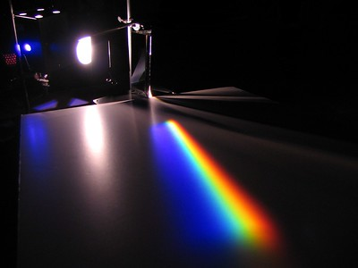
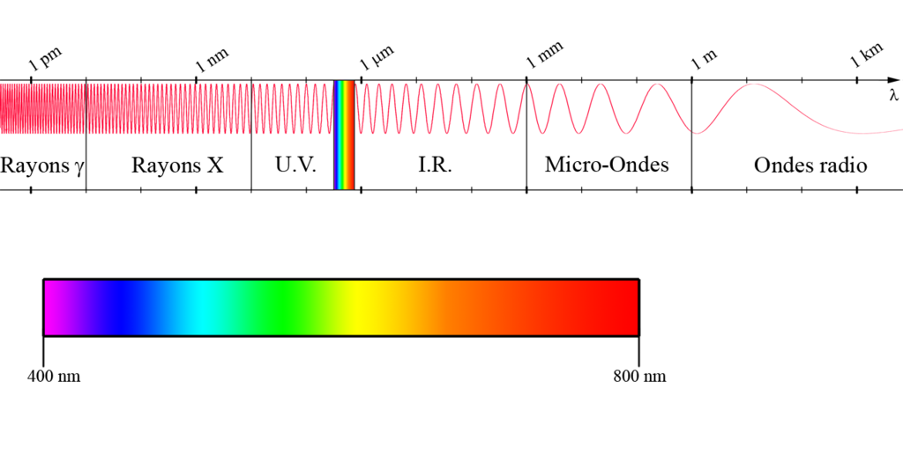

% Lumière et télescopes
% CEA Explorer et comprendre l'Univers
% 28 mars 2024
---
theme: night
title-slide-attributes:
    data-background-image: ../../images/52565304936_fc8852f1e9_k.jpg
    data-background-size: contain
    data-background-opacity: 0.6
header-includes: |
    

---

<figure>
  
  <figcaption style="font-size: 0.4em; color: #666;">
    (NASA/JPL-Caltech)
  </figcaption>
</figure>

---

## Phénomènes lumineux

---

## Réflexion

---

## Réfraction

---

---

## Dispersion

<figcaption style="font-size: 0.4em; color: #666;">
  (Alfredo Louro [CC BY-NC-SA 2.0](https://creativecommons.org/licenses/by-nc-sa/2.0/))
</figcaption>

---

---

## Diffraction

---

## Interférence (expérience de Young)

---

---

## Onde ou particule?

---

:::::::::::::: {.columns}
::: {.column width="40%"}
### Particule

:::
::: {.column width="60%"}
### Onde

Robert Hooke

:::
::::::::::::::

---

<iframe width="800" height="450"
        src="https://www.youtube.com/embed/8yis7GzlXNM?start=10"
        frameborder="0"
        allow="accelerometer; autoplay; encrypted-media; gyroscope; picture-in-picture"
        allowfullscreen>
</iframe>
<figcaption style="font-size: 0.4em; color: #666;">
  [Epic Rap Battle of History](https://www.youtube.com/watch?v=8yis7GzlXNM)
</figcaption>

---

### Théorie corpusculaire

- Explique la réflexion
- Explique la réfraction
- Explique la dispersion
- Est supportée par une grosse pointure (Newton)

---

### Théorie ondulatoire

- Explique la réflexion
- Explique la réfraction (correctement)
- Explique la dispersion
- Explique la diffraction
- Explique l'interférence

---

#### Théorie ondulatoire éventuellement acceptée comme correcte jusqu'au début du XXe siècle

---

## Effet photoélectrique

<figure>
  
  <figcaption style="font-size: 0.4em; color: #666;">
    (Jfmelero [CC BY-SA 3.0](https://creativecommons.org/licenses/by-sa/3.0/deed.en))
  </figcaption>
</figure>

---

### Dualité onde-particule

Lumière est une onde

qui se comporte parfois comme une particule

nommée **photon**

---

## Nature de la lumière

---

### Onde

---

### Onde électromagnétique

---

### Anatomie d'une onde

---

### Spectre électromagnétique

<figure>
  
  <figcaption style="font-size: 0.4em; color: #666;">
    (Ploufandsplash [CC BY-SA 3.0](https://creativecommons.org/licenses/by-sa/3.0/deed.en))
  </figcaption>
</figure>

---

## Vitesse de la lumière

---

### 299 792 458 m/s

### 1 079 252 850 km/h

---

## C'est vite?

>- Voiture la plus rapide (Hennessey Venom GT) : 435 km/h
 
<figcaption style="font-size: 0.4em; color: #666;">
  (TheSuperCars.org)
</figcaption>
>- Vitesse du son : 1 236 km/h

---

## C'est vite?

>- Jet le plus rapide (SR-71 Blackbird) : 3 530 km/h
 

---

## C'est vite?

>- Navette spatiale à l'entrée de l'atmosphère : 28\ 000\ km/h
 

---

## C'est vite?

### 40 000 fois plus vite que la navette spatiale

---

## Année-lumière

- Dans un intervalle de temps donné, la lumière parcourt une certaine distance
- Exemple :
    - Une voiture se déplace à 60 km/h
    - Quelle distance parcourt-elle en 30 minutes ?
    - Quelle distance parcourt-elle en 3 heures ?

---

## Année-lumière

----------------------- ---------------------
Seconde-lumière                299 792,458 km
Minute-lumière               17 987 547,48 km
Semaine-lumière            181 314 478 598 km
Année-lumière            9 454 254 955 488 km
----------------------- ---------------------

---

## Année-lumière

Distance                              \*-lumière
------------------------  ----------------------
Terre-Soleil                8,32 minutes-lumière
Pluton-Soleil                 5,5 heures-lumière
Soleil-Proxima Centauri      4,22 années-lumière

---

## Télescopes

---

Un télescope est un instrument qui collecte la lumière provenant d'une source
lointaine

---

## Réfracteur

<figure>
  
</figure>

---

<figure>
  
  <figcaption style="font-size: 0.4em; color: #666;">
    (Pethrus [CC BY-SA 3.0](https://creativecommons.org/licenses/by-sa/3.0/deed.en))
  </figcaption>
</figure>

---

### Problèmes des télescopes réfracteurs

- Difficile de produire lentilles parfaitement transparentes
- Grosses lentilles se déforment
- Coût de production élevé
- Aberration chromatique

---

<figure>
  
<figcaption style="font-size: 0.4em; color: #666;">
  (LSST Camera Project [CC BY 4.0](https://creativecommons.org/licenses/by/4.0/))
</figcaption>
</figure>

---

### Aberration chromatique

<figure>
  
  <figcaption style="font-size: 0.4em; color: #666;">
    (Wilder Kaiser [CC BY-SA 3.0](https://creativecommons.org/licenses/by-sa/3.0/deed.en))
  </figcaption>
</figure>

---

## Réflecteur

<figure>
  
  <figcaption style="font-size: 0.4em; color: #666;">
    (Krishnavedala [CC BY-SA 4.0](https://creativecommons.org/licenses/by-sa/4.0/deed.en))
  </figcaption>
</figure>

---

### Avantages des télescopes réflecteurs

- Pas d'aberration chromatique
- Peuvent être supporté par l'arrière
- Plus facile à construire

---

<figure>
    
  <figcaption style="font-size: 0.4em; color: #666;">
  (LSST Project/NSF/AURA [CC BY 4.0](https://creativecommons.org/licenses/by/4.0/))
  </figcaption>
</figure>

---

<figure>
  
  <figcaption style="font-size: 0.4em; color: #666;">
  (NASA/Goddard/Chris Gunn)
  </figcaption>
</figure>

---

Observation astronomique moderne

---

Observation astronomique moderne

---

Observation astronomique moderne

---

## Montures

---

### Fonctions de la monture

- Supporter l'objectif et les instruments
- Pointage
- Entraînement sidéral

---

### Monture équatoriale

- Alignée sur les pôles célestes
- Entraînement sidéral simple
- Très grosse, très massive
- Difficile à construire

---

### Monture azimutale

- Un axe horizontal, un axe vertical
- Nécessite des calculs complexes pour l'entraînement sidéral
- Souvent combinée avec un ordinateur
- Plus petite
- Plus facile à construire

---

<figure>
  
  <figcaption style="font-size: 0.4em; color: #666;">
  Cmglee [CC BY-SA 3.0](https://creativecommons.org/licenses/by-sa/3.0/deed.en)
  </figcaption>
</figure>

---

## {background-image="../../images/52565304936_fc8852f1e9_k.jpg"}
