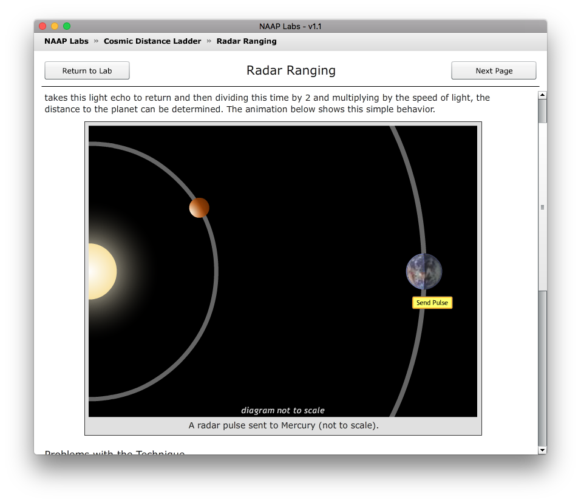
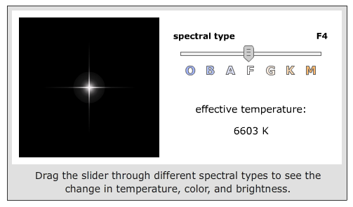

% Distances au-delà du système solaire
% CEA Explorer et comprendre l'Univers
% 9 novembre 2020
---
theme: black
transition: linear
---

# {data-background-image="../../images/milky_way_schmidt.jpg"}

. . .

<h3 style="background-color: rgba(100, 100, 100, 0.4); padding: 20px;">
Comment fait-on pour déterminer la taille des astres et les distances entre la Terre et les astres? 
</h3>

     
<figcaption style="font-size: 0.4em; color: #666;">
  [Judy Schmidt](https://www.flickr.com/photos/geckzilla/30386605114/) [CC BY 2.0](https://creativecommons.org/licenses/by/2.0/)
</figcaption>

---

## Rappels

Dans le système solaire, on peut utiliser les méthodes suivantes pour
déterminer des distances :

- Radar
- Méthode par parallaxe

---

### Radar

<figure>
  
</figure>
<figcaption style="font-size: 0.4em; color: #666;">
  Astronomy Education at the University of Nebraska-Lincoln Web Site
  ([http://astro.unl.edu](http://astro.unl.edu))
</figcaption>

---

### Parallaxe

<figure>
  
</figure>

---

## Voir plus loin!

- Parallaxe annuelle
- Luminosité-intensité-distance (parallaxe spectroscopique)
- Céphéides

---

# {data-background-image="../../images/potw2014a.jpg"}

<h1 style="background-color: rgba(100, 100, 100, 0.4); padding: 20px;">
Parallaxe annuelle
</h1>

    
<figcaption style="font-size: 0.4em; color: #aaa;">
ESA/Hubble & NASA, J. Greene
</figcaption>

---

### Parallaxe annuelle

- Distance des étoiles proches
- On mesure le changement de position apparente d'une étoile à 6 mois
  d'intervalle

---

### Parallaxe annuelle

<figure>
  
  <figcaption style="font-size: 0.4em; color: #666;">
  (WikiStefan [CC BY 3.0](https://creativecommons.org/licenses/by/3.0/deed.en))
  </figcaption>
</figure>

---

### Friedrich Bessel (1838)

:::::::::::::: {.columns}
::: {.column width="50%"}

  - 61 du Cygne\ : (1\ /\ 10\ 000)°
  - 11,2 al

:::
::: {.column width="50%"}

<figure>
  
</figure>

:::
::::::::::::::

---

## Hipparcos

:::::::::::::: {.columns}
::: {.column width="50%"}

- Lancé par l'agence spatiale européenne en 1989
- Mesure la parallaxe d'étoiles jusqu'à 1000 al
- (1\ /\ 10\ 000\ 000)°

:::
::: {.column width="50%"}

<figure>
  
  <figcaption style="font-size: 0.4em; color: #666;">
  (Michael Perryman [CC BY-SA 3.0](https://creativecommons.org/licenses/by-sa/3.0/deed.en))
  </figcaption>
</figure>

:::
::::::::::::::

---

## GAIA

:::::::::::::: {.columns}
::: {.column width="50%"}

- Lancé par l'agence spatiale européenne en 2013
- Mesure la parallaxe d'étoiles jusqu'à 30\ 000 al
- (1\ /\ 1\ 000\ 000\ 000)°

:::
::: {.column width="50%"}

<figure>
  
  <figcaption style="font-size: 0.4em; color: #666;">
  ESA/ATG medialab
  </figcaption>
</figure>

:::
::::::::::::::

---

# {data-background-image="../../images/potw2014a.jpg"}

<h1 style="background-color: rgba(100, 100, 100, 0.4); padding: 20px;">
Parallaxe spectroscopique
</h1>

    
<figcaption style="font-size: 0.4em; color: #aaa;">
ESA/Hubble & NASA, J. Greene
</figcaption>

---

Deux sources lumineuses identiques placées à des distances différentes
paraîtront différentes

---

# {data-background-image="../../images/lampadaires-distance.jpg"}

---

## Intensité, luminosité, distance

- **Intensité lumineuse** : énergie par unité de temps par unité de surface
- Dépend de la **luminosité** de la source et de sa **distance**

$$I = \frac{L}{4\pi d^2}$$

---

## Intensité, luminosité, distance

<figure>
  
  <figcaption style="font-size: 0.4em; color: #aaa;">
  (Borb [CC BY-SA 3.0](https://creativecommons.org/licenses/by-sa/3.0/deed.en))
  </figcaption>
</figure>

---

## Intensité, luminosité, distance

On observe une ampoule de 100 W. Un capteur permet de déterminer que
l'intensité de la lumière qui provient de l'ampoule est de
0,08\ W/m2. À quelle distance est l'ampoule?

. . .

$$d = \sqrt{\frac{L}{4\pi I}} = 10\,\mathrm{m}$$

---

### Terminologie

Intensité : reliée à la **magnitude apparente**

Luminosité : reliée à la **magnitude absolue**

---

La galaxie M87 a une magnitude absolue d'environ -22. On voit donc cette
galaxie briller très clairement dans le ciel nocturne.

Vrai ou faux?

https://b.socrative.com/login/student/

DCRDEWY

---

Deneb a une magnitude apparente d'environ 1.25. Le Soleil a une magnitude
apparente d'environ -26. Sélectionnez les énoncés vrais.

<small>
<ol style="list-style-type: upper-alpha">
<li>Si on les mettait côte-à-côte, Deneb paraîtrait moins brillante que le Soleil.</li>
<li>Deneb paraît moins brillante que le Soleil dans le ciel.</li>
<li>Sachant que Deneb est à 1400 années-lumière, il est raisonnable de croire
qu'elle est en fait plus brillante que le Soleil.</li>
<li>Le Soleil parait beaucoup plus brillant que Deneb parce qu'il est beaucoup
plus proche.</li>
</ol>
</small>

---

## Méthode des étoiles jumelles

On veut mesurer la distance de l'étoile A

1. On mesure l'intensité de l'étoile A
2. On trouve une étoile «jumelle» B dont on connait la distance et donc la
   luminosité
3. En supposant que l'étoile A a la même luminosité que B, on calcule la
   distance de A

---

## Méthode des étoiles jumelles, exemple

>- Étoile Smurf est jumelle de Spectl

>- Spectl est à une distance de 100 al

>- Smurf parait 16 fois moins intense que Spectl

>- Smurf est donc 4 fois plus loin que Spectl

>- Smurf est à 400 al

---

Les étoiles Malm et Vikhammer sont jumelles. On sait que Vikhammer est à une
distance de 1000 années-lumière. Malm parait 25 fois plus brillante que
Vikhammer dans le ciel. À quelle distance se trouve Malm?

<ol style="list-style-type: upper-alpha">
<li>40 al</li>
<li>200 al</li>
<li>1000 al</li>
<li>5000 al</li>
<li>25 000 al</li>
</ol>

---

Trysil et Nesna sont des étoiles jumelles. Trysil a une magnitude apparente
de 4. On sait qu'elle est au moins deux fois plus loin que Mesna. Laquelle des
valeurs suivantes est une magnitude apparente possible pour Mesna?

<ol style="list-style-type: upper-alpha">
<li>-20</li>
<li>3</li>
<li>6</li>
<li>16</li>
<li>25</li>
</ol>

---

### Comment connaît-on la luminosité d'une étoile?

---

## Spectroscopie

<figure>
  
</figure>

---

:::::::::::::: {.columns}
::: {.column width="50%"}

On disperse la lumière d'une étoile pour obtenir son **spectre**

. . .

OBAFGKMLT

. . .

Oh Be A Fine Girl/Guy Kiss Me Like This

:::
::: {.column width="50%"}

<figure>
  
  <figcaption>
  </figcaption>
</figure>

:::
::::::::::::::

---

## Type spectral

:::::::::::::: {.columns}
::: {.column width="50%"}

Renseigne sur la température et la composition chimique

Deux étoiles avec le même spectre et la même taille ont la même luminosité

:::
::: {.column width="50%"}

<figure>
  
  <figcaption>
  </figcaption>
</figure>

:::
::::::::::::::

---

## Type spectral

<figure>
  
<figcaption style="font-size: 0.4em; color: #666;">
  Astronomy Education at the University of Nebraska-Lincoln Web Site
  ([http://astro.unl.edu](http://astro.unl.edu))
</figcaption>

---

# {data-background-image="../../images/potw2014a.jpg"}

<h1 style="background-color: rgba(100, 100, 100, 0.4); padding: 20px;">
Céphéides
</h1>

    
<figcaption style="font-size: 0.4em; color: #aaa;">
ESA/Hubble & NASA, J. Greene
</figcaption>

---

## Analyse des céphéides

- **Céphéides** : étoiles géantes rouges pulsantes
- Période des pulsations : 1 à 100 jours

[Photos de céphéides dans M15](https://vanderbei.princeton.edu/images/NJP/m15_RRlyrae3.gif)

---

<figure>
  
  <figcaption style="font-size: 0.4em; color: #666;">
  Merikanto ([CC BY-SA 4.0](https://creativecommons.org/licenses/by-sa/4.0/deed.en))
  </figcaption>
</figure>

---

## Analyse des céphéides

<figure>
  
  <figcaption style="font-size: 0.4em; color: #666;">
  NASA/JPL-Caltech/Carnegie
  </figcaption>
</figure>

---

## Analyse des céphéides

- Lien entre la période de pulsation et la luminosité
- Permet de mesurer des distances jusqu'à des millions d'années-lumière

---

L'étoile céphéide Bob a une période de 3 jours et elle est distante de 100 000
al. L'étoile céphéide Alice a une période de 12 jours et elle parait aussi
brillante dans le ciel. À quelle distance est-elle située?

<ol style="list-style-type: upper-alpha">
<li>25 000 al</li>
<li>50 000 al</li>
<li>100 000 al</li>
<li>200 000 al</li>
<li>400 000 al</li>
</ol>

---

# {data-background-image="../../images/rspuppis_bryne_3938.jpg"}

             
<figcaption style="font-size: 0.4em; color: #bbb;">
  (Hubble Legacy Archive, NASA, ESA - Traitement: Stephen Byrne)
</figcaption>

---

## Encore plus haut, encore plus loin!

- Galaxies spirales de type ScI : 2,5 milliards de fois plus lumineuses que le
  Soleil
- Supernovæ de type Ia : 10 milliards de fois plus lumineuses que le Soleil
    - Jusqu'à des Gal

