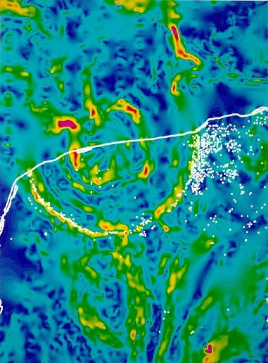

% Les Étoiles
% CEA Explorer et comprendre l'Univers
% 19 novembre 2020
---
theme: night
transition: fade
---

<figure>
  
  <figcaption style="font-size: 0.4em; color: #666;">
    (NASA, JPL-Caltech, Spitzer Space Telescope)
  </figcaption>
</figure>

---

1. Âge du Soleil
2. Structure interne des étoiles
3. Diagrammes de Hertzsprung-Russell
4. Évolution stellaire

---

# {data-background-image="../../images/STSCI-H-p2016a-m-2000x1374.jpg"}

<h2 style="background-color: rgba(100, 100, 100, 0.5); padding: 20px;">
Âge du Soleil
</h2>

     
<figcaption style="font-size: 0.4em; color: #666;">
   NASA, ESA, STScI
</figcaption>

---

### Soleil

- Masse\ : 1,99 $\times$ 1030 kg
- Luminosité\ : 3,83 $\times$ 1026 J/s

---

### Un des plus gros burger du monde

Beer Barrel Belly Buster (Denny's Beer Barrel Pub)

<figure>
  
</figure>

156 000 000 J (1,56\ &times;\ 108 J)

---

### Little Boy et Fat Man

<figure>
  
</figure>

67 TJ et 100 TJ (1014 J)

---

### Impact du Chicxulub

<figure>
  
</figure>

1025 J

---

Combien de temps le Soleil pourra-t-il générer autant d'énergie?

---

### Isaac Newton

*(1642 — 1727)*

<figure>

</figure>

. . .

4000 ans, selon la Bible

---

### Lord Kelvin et von Helmholtz

*1860*

<figure>
  
  
</figure>

. . .

Soleil en charbon : 5000 ans

. . .

Contraction gravitationnelle : 100 millions d'années

---

### Arthur Stanley Eddington

*(1882 - 1944)*

<figure>
  
</figure>

. . .

- E = mc2
- 4 Mt chaque seconde (4 $\times$ 106 t)
- Le Soleil pourrait briller environ 10 Ga

---

# {data-background-image="../../images/STSCI-H-p2016a-m-2000x1374.jpg"}

<h2 style="background-color: rgba(100, 100, 100, 0.5); padding: 20px;">
Structure interne des étoiles
</h2>

     
<figcaption style="font-size: 0.4em; color: #666;">
   NASA, ESA, STScI
</figcaption>

---

### Composition

- Sphère de gaz
- Surtout hydrogène et hélium
- Jusqu'à des millions de fois plus massive que la Terre

---

### Équilibre hydrostatique

- Équilibre entre l'attraction gravitationnelle et gradient de pression interne

<figure>
  
</figure>

---

### Énergie nucléaire

**Fusion** grâce à la pression et la température très élevées

<figure>
  
  <figcaption style="font-size: 0.4em; color: #666;">
    Borb [CC BY-SA 3.0](https://creativecommons.org/licenses/by-sa/3.0/deed.en)
  </figcaption>
</figure>

---

### Fusion nucléaire

4 H $\rightarrow$ He + énergie

6,17 $\times$ 1014 J / kg

---

### Fusion nucléaire

- 2 $\times$ 1030 kg d'hydrogène dans le bébé Soleil
- 10% (soit 2 $\times$ 1029 kg) peuvent être utilisé

---

## Nucléosynthèse stellaire

- Plus une étoile est grosse, plus des éléments lourds peuvent être créés
- H, He, O, C, Ne, N, Mg, Si, Fe
- Les éléments qui nous composent ont été formés dans le coeur des étoiles
- Éléments plus massifs : produits lors de supernova

---

## Équilibre stellaire

Plus de réactions nucléaires

$\rightarrow$ plus de pression vers l'extérieur

$\rightarrow$ augmentation du volume de l'étoile

$\rightarrow$ diminution de la densité

$\rightarrow$ moins de réactions nucléaires

$\rightarrow$ contraction gravitationnelle

---

### Structure interne

<figure>
  
  <figcaption style="font-size: 0.4em; color: #666;">
    (Adapté de Kelvinsong [CC BY-SA 3.0](https://creativecommons.org/licenses/by-sa/3.0/deed.en))
  </figcaption>
</figure>

---

### Zone radiative

- Énergie produite dans le noyau
- Noyau à une température de 15 millions K
- Transport d'énergie vers la surface par radiation
- 200 000 ans pour qu'un photon atteigne la zone convective

---

### Zone convective

- 28% du rayon
- Mouvements macroscopique de matière

---

# {data-background-image="../../images/STSCI-H-p2016a-m-2000x1374.jpg"}

<h2 style="background-color: rgba(100, 100, 100, 0.5); padding: 20px;">
Diagramme de Hertzsprung-Russell
</h2>

     
<figcaption style="font-size: 0.4em; color: #666;">
   NASA, ESA, STScI
</figcaption>

---

### Le corps noir

<figure>
  
  <figcaption style="font-size: 0.4em; color: #666;">
    Jeff Kubina [CC-BY-SA-2.0](http://creativecommons.org/licenses/by-sa/2.0)
  </figcaption>
</figure>

---

### Corps noir

- Sorte de céramique qui était utilisée autrefois pour faire des pots de
  cuisson
- Modèle idéal d'un objet chauffé qui émet du rayonnement électromagnétique
- L'explication du rayonnement du corps noir a été l'un des piliers du
  développement de la mécanique quantique

---

### Spectre du corps noir

---

### Spectre du corps noir

- Plus un objet est chaud, plus il est bleu
- Plus un objet est froid, plus il est rouge
- Plus un objet est chaud, plus il émet de rayonnement
- Plus un objet est froid, moins il émet de rayonnement

---

### Luminosité du corps noir

$L = 4 \pi R^2 \sigma T^4_\mathrm{eff}$

---

### Les étoiles comme des corps noirs

>- Les étoiles ne sont pas des corps noirs...
>- ... mais presque
>- On peut utiliser l'équation précédente pour déterminer la température
   effective d'une étoile

---

### Classification des étoiles

- On classe les étoiles dans un diagramme de la luminosité en fonction de la
  température effective
- C'est un **diagramme de Hertzsprung-Russell**

---

<figure>
  
  <figcaption style="font-size: 0.4em; color: #666;">
    (Richard Powell [CC BY-SA 2.5](https://creativecommons.org/licenses/by-sa/2.5/deed.fr))
  </figcaption>
</figure>

---

**Lien entre le type spectral et la masse sur la séquence principale**

Type spectral   Masse (en masses solaires)
-------------- ---------------------------
O                                     25
B                                     15
A                                      3
F                                      1,5
G                                      1
K                                      0,8
M                                      0,4

---

# {data-background-image="../../images/STSCI-H-p2016a-m-2000x1374.jpg"}

<h2 style="background-color: rgba(100, 100, 100, 0.5); padding: 20px;">
Évolution stellaire
</h2>

     
<figcaption style="font-size: 0.4em; color: #666;">
   NASA, ESA, STScI
</figcaption>

---

### Matière interstellaire

- Nuages de gaz et poussière : **nébuleuses**
- Nébuleuses denses avec molécules : **nuage moléculaire**

---

<figure>
  
  <figcaption style="font-size: 0.4em; color: #666;">
    (NASA/JPL-Caltech/WISE Team)
  </figcaption>
</figure>

---

### Naissance

- Effondrement des nuages moléculaire
- Causé par supernova, radiation, etc?
- Effondrement gravitationnel génère beaucoup d'énergie
- La température au centre de l'étoile augmente et la **fusion** nucléaire
  s'amorce

---

<figure>
  
  <figcaption style="font-size: 0.4em; color: #666;">
    Hubble Legacy Archive, NASA, ESA - Traitement : Judy Schmidt
  </figcaption>
</figure>

---

### Vie adulte

- Séquence principale (10 Ga)
    - Fusion d'hydrogène dans le cœur
    - Augmentation d'He dans le cœur

---

### Vieillesse

- Phase **géante rouge** (1 Ga)
    - Accumulation d'He dans le cœur cause contraction
    - Augmentation de la température du cœur
    - Étoile gonfle
    - Fusion d'hydrogène en périphérie du cœur
    - Luminosité augmente d'un facteur ~100

---

<figure>
  
  <figcaption style="font-size: 0.4em; color: #666;">
    (Adapté de
    [Szczureq](https://commons.wikimedia.org/wiki/File:Evolution_of_a_Sun-like_star.svg)
    [CC BY-SA 4.0](https://creativecommons.org/licenses/by-sa/4.0/deed.en))
  </figcaption>
</figure>

---

### Vieillesse

- Phase **sous-géante** (100 Ma)
    - Fusion de l'hélium dans le cœur
    - Fusion de l'hydrogène en périphérie
    - Accumulation de carbone dans le cœur

---

### Vieillesse

- Phase **supergéante rouge** (1 Ma)
    - Luminosité 10 000 fois plus grande que le Soleil
    - Fusion de l'hélium en périphérie du cœur
    - Fusion de l'hydrogène en périphérie de la zone de fusion d'hélium
    - Accumulation de carbone dans le cœur

---

### Mort

- Nébuleuse planétaire
    - Fin de la fusion dans le cœur
    - Cœur se contracte
    - Couches externes de l'étoile expulsées par les zones de fusion périphériques

---

### Naine blanche

- Cadavre d'une étoile dont la masse initiale est inférieure à 8 $M_\odot$
- Grosse comme la Terre
- Masse : entre 0.5 et 1.4 masse solaire
- Gravité de surface : 350 000 fois plus élevée que sur Terre

---

NGC 2818

<figure>
  
  <figcaption style="font-size: 0.4em; color: #666;">
    NASA, ESA, Hubble Heritage Team (STScI / AURA)
  </figcaption>
</figure>

---

NGC 2440

<figure>
  
  <figcaption style="font-size: 0.4em; color: #666;">
    (H.  Bond (STScI), R. Ciardullo (PSU), WFPC2, HST, NASA; Traitement: Forrest
    Hamilton)
  </figcaption>
</figure>

---

Nébuleuse de l'Œil de chat

<figure>
  
  <figcaption style="font-size: 0.4em; color: #666;">
    NASA, J. P. Harrington (U. Maryland) and K. J. Borkowski (NCSU)
  </figcaption>
</figure>

---

Nébuleuse du Sablier

<figure>
  
  <figcaption style="font-size: 0.4em; color: #666;">
    R. Sahai and J. Trauger (JPL), WFPC2, HST, NASA
  </figcaption>
</figure>

---

## [Résumé](../../www/HRdiagramStable.html)

<figcaption style="font-size: 0.4em; color: #666;">
(Adapté du site [Astronomy Education at the University of Nebraska-Lincoln](http://astro.unl.edu))
</figcaption>
