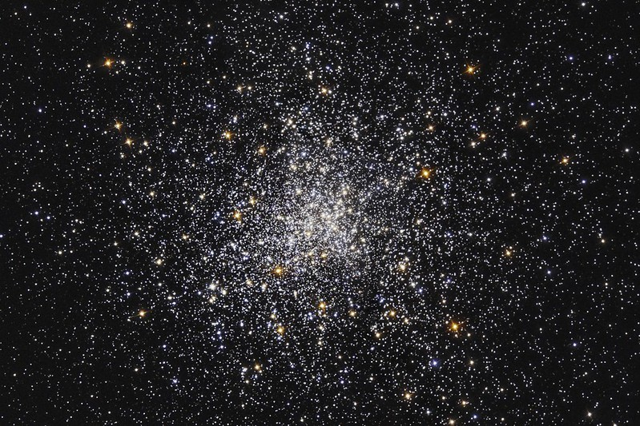
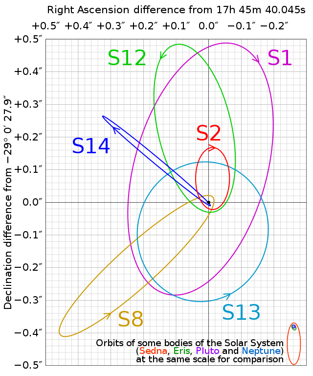
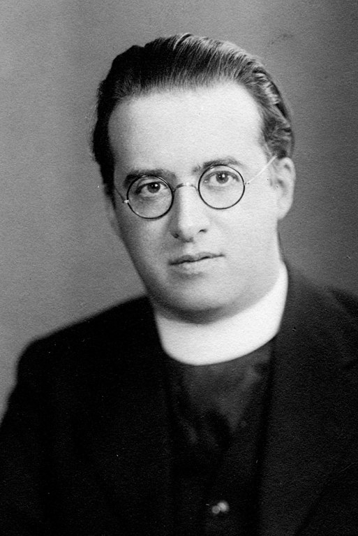
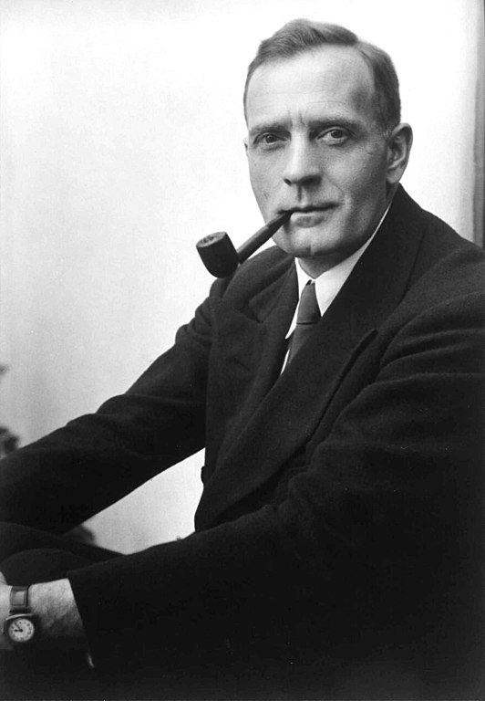
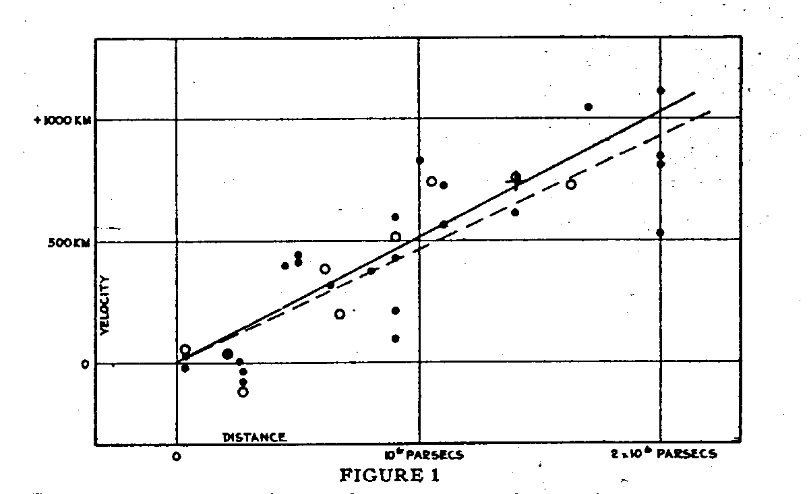
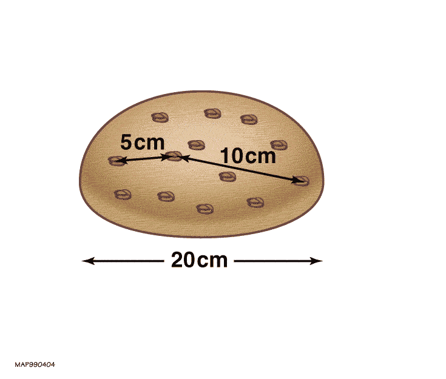

% Les galaxies
% CEA Explorer et comprendre l'Univers
% 7 mai 2020
---
theme: night
transition: fade
---

<figure>
  
  <figcaption style="font-size: 0.4em; color: #666;">
  NASA, ESA and B. Holwerda (University of Louisville)
  </figcaption>
</figure>

---

0. Examen final
1. Structure de la Voie lactée
2. Rotation des galaxies et matière sombre
3. Loi de Hubble et expansion de l'Univers

---

# {data-background-image="../../images/STSCI-H-p2016a-m-2000x1374.jpg"}

<h2 style="background-color: rgba(100, 100, 100, 0.5); padding: 20px;">
Examen final
</h2>

     
<figcaption style="font-size: 0.4em; color: #666;">
   NASA, ESA, STScI
</figcaption>

---

### Examen final (20%)

- 21 mai 2020 de 8h00 à 13h00
- Examen **individuel** sur Teams
- Questions à choix multiples, courtes réponses
- Examen portant sur toute la matière du cours
- Documentation permise
- Consulter un autre humain est interdit, le travail doit être votre travail
  personnel

---

# {data-background-image="../../images/STSCI-H-p2016a-m-2000x1374.jpg"}

<h2 style="background-color: rgba(100, 100, 100, 0.5); padding: 20px;">
Structure de la Voie lactée
</h2>

     
<figcaption style="font-size: 0.4em; color: #666;">
   NASA, ESA, STScI
</figcaption>

---

#### Vue du dessus

<figure>
  
  <figcaption style="font-size: 0.4em; color: #666;">
  [NASA](https://spaceplace.nasa.gov/galaxy/en/)
  </figcaption>
</figure>

---

#### Vue de côté

<figure>
  
  <figcaption style="font-size: 0.4em; color: #666;">
  RJHall [CC BY-SA 3.0](https://creativecommons.org/licenses/by-sa/3.0/deed.en)
  </figcaption>
</figure>

---

#### Amas globulaire

<figure>
  
  <figcaption style="font-size: 0.4em; color: #666;">
  NASA and ESA; S. Djorgovski (Caltech) and F. Ferraro (University of
  Bologna)
  </figcaption>
</figure>

---

#### Orbite des étoiles autour du centre galactique

<figure>
  
  <figcaption style="font-size: 0.4em; color: #666;">
  Cmglee [CC BY-SA 3.0](https://creativecommons.org/licenses/by-sa/3.0/deed.en)
  </figcaption>
</figure>

---

# {data-background-image="../../images/STSCI-H-p2016a-m-2000x1374.jpg"}

<h2 style="background-color: rgba(100, 100, 100, 0.5); padding: 20px;">
Rotation des galaxies et matière sombre
</h2>

     
<figcaption style="font-size: 0.4em; color: #666;">
   NASA, ESA, STScI
</figcaption>

---

## Comment évaluer la masse d'une galaxie?

---

### Relation luminosité-masse

>- Majorité des étoiles moins brillantes que Soleil (M et K)
>- 4 masses solaires &#8594; 1 luminosité solaire
>- Luminosité de la galaxie\ : 25 milliards de luminosités solaires
>- Masse de la galaxie\ : 100 milliards de masses solaires

---

### Rotation de la galaxie

<figure>
  
  <figcaption style="font-size: 0.4em; color: #666;">
  William Crochot [CC BY-SA 4.0](https://creativecommons.org/licenses/by-sa/4.0/deed.en)
  </figcaption>
</figure>

---

### Rotation de la galaxie

Observations combinées avec la troisième loi de Kepler\ :

500 milliards de masses solaires

---

### Matière sombre

<iframe src="../../images/Galaxy_rotation_under_the_influence_of_dark_matter.ogv?embedplayer=yes"
width="720" height="360" frameborder="0" ></iframe>

<figcaption style="font-size: 0.4em; color: #666;">
Ingo Berg [CC BY-SA 3.0](https://creativecommons.org/licenses/by-sa/3.0/deed.en)
</figcaption>

---

# {data-background-image="../../images/STSCI-H-p2016a-m-2000x1374.jpg"}

<h2 style="background-color: rgba(100, 100, 100, 0.5); padding: 20px;">
Loi de Hubble et expansion de l'Univers
</h2>

     
<figcaption style="font-size: 0.4em; color: #666;">
   NASA, ESA, STScI
</figcaption>

---

### Univers en expansion

---

### Loi de Hubble

<figure>
  
  <figcaption style="font-size: 0.4em; color: #666;">
  Relation vélocité-distance dans l'article de Edwin Hubble de 1929.
  </figcaption>
</figure>

---

### Modèle du pain aux raisins

<figure>
  
  <figcaption style="font-size: 0.4em; color: #666;">
  NASA
  </figcaption>
</figure>

---

### Accélération de l'expansion

<figure>
  
  <figcaption style="font-size: 0.4em; color: #666;">
  ESA and the Planck Collaboration
  </figcaption>
</figure>

---

## Notre Univers

### 68% énergie sombre

### 27% matière sombre

### 5% matière ordinaire

---

# {data-background-image="../../images/STSCI-H-p2016a-m-2000x1374.jpg"}

<h1 style="padding: 20px;">
Merci!
</h1>

       
<figcaption style="font-size: 0.4em; color: #666;">
   NASA, ESA, STScI
</figcaption>

