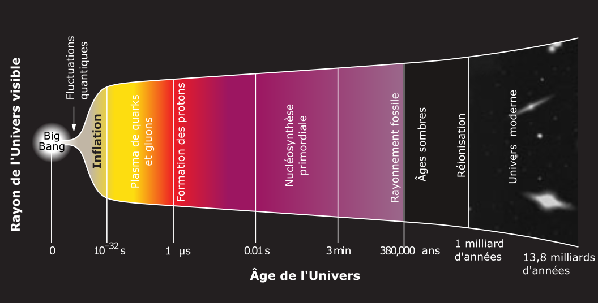

% Cosmologie
% CEA Explorer et comprendre l'Univers
% 4 décembre 2020
---
theme: night
transition: fade
---

1. Rayonnement diffus cosmologique
2. Brève histoire de l'Univers
3. Fin de l'Univers

---

# {data-background-image="../../images/STSCI-H-p2016a-m-2000x1374.jpg"}

<h2 style="background-color: rgba(100, 100, 100, 0.5); padding: 20px;">
Rayonnement diffus cosmologique
</h2>

     
<figcaption style="font-size: 0.4em; color: #666;">
   NASA, ESA, STScI
</figcaption>

---

## Rembobiner l'histoire de l'Univers

<figure>
  
  <figcaption style="font-size: 0.4em; color: #666;">
  pollosaurio [CC BY 2.0](https://creativecommons.org/licenses/by/2.0/)
  </figcaption>
</figure>

---

## Rembobiner l'histoire de l'Univers

>- L'Univers est en expansion
>- Dans le passé il se contractait
>- Il était plus dense et plus chaud
>- On devrait encore pouvoir voir le jeune Univers chaud si on regarde assez loin

---

<figure>
  
  <figcaption style="font-size: 0.4em; color: #666;">
  </figcaption>
</figure>

---

### Rayonnement fossile

- Provient de toutes les directions
- Rayonnement micro-ondes
- A la même température partout
- Lumière qui provient du tout début de l'Univers

---

### Rayonnement fossile

- Observé pour la première fois par Penzias et Wilson en 1965
- Cartographié par COBE (1989), WMAP (2001) et Planck (2009)

---

<figure>
  
  <figcaption style="font-size: 0.4em; color: #666;">
  ESA et la Collaboration Planck
  </figcaption>
</figure>

---

# {data-background-image="../../images/STSCI-H-p2016a-m-2000x1374.jpg"}

<h2 style="background-color: rgba(100, 100, 100, 0.5); padding: 20px;">
Brève histoire de l'Univers
</h2>

     
<figcaption style="font-size: 0.4em; color: #666;">
   NASA, ESA, STScI
</figcaption>

---

<figure>
  
  <figcaption style="font-size: 0.4em; color: #666;">
  Adapté d'une image de la collaboration BICEP2
  </figcaption>
</figure>

---

# {data-background-image="../../images/STSCI-H-p2016a-m-2000x1374.jpg"}

<h2 style="background-color: rgba(100, 100, 100, 0.5); padding: 20px;">
Fin de l'Univers
</h2>

     
<figcaption style="font-size: 0.4em; color: #666;">
   NASA, ESA, STScI
</figcaption>

---

---

# {data-background-image="../../images/STSCI-H-p2016a-m-2000x1374.jpg"}

<h1 style="padding: 20px;">
Merci!
</h1>

       
<figcaption style="font-size: 0.4em; color: #666;">
   NASA, ESA, STScI
</figcaption>

