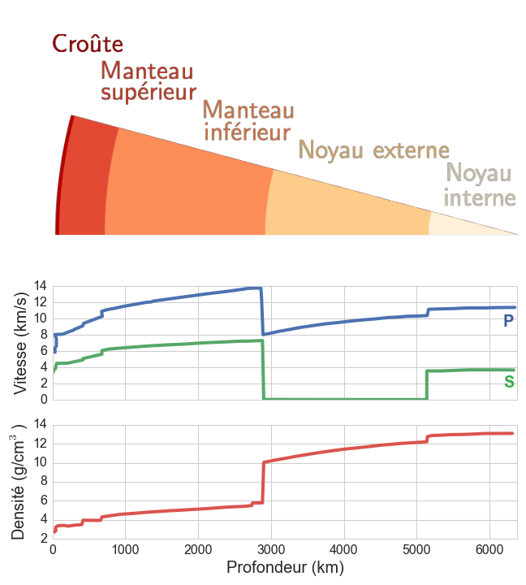
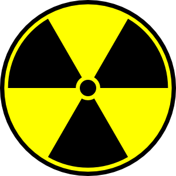
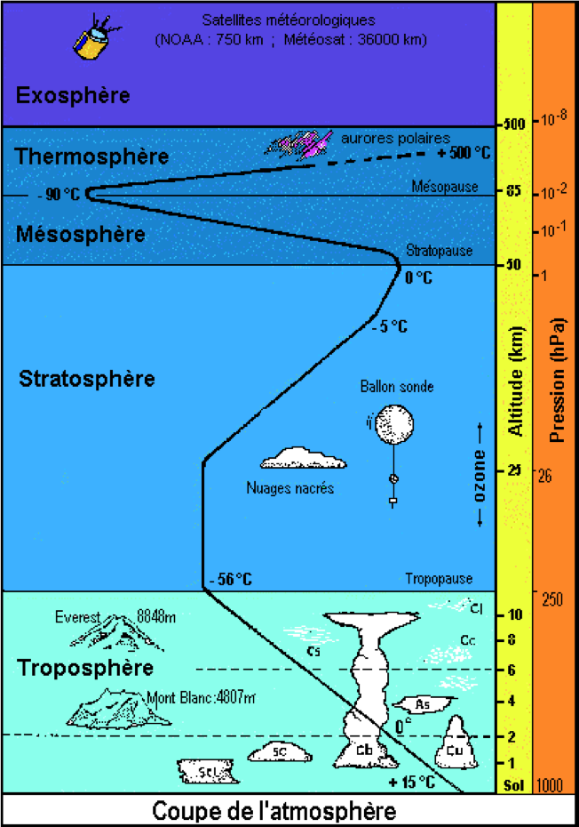
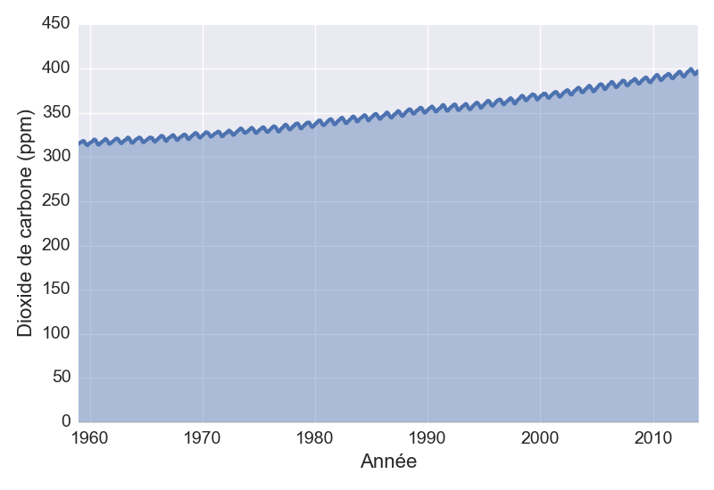

% Le système Terre-Lune
% CEA Explorer et comprendre l'Univers
% 20 octobre 2014
---
theme: default
transition: none
---

<small>NASA/NSSDC</small>

*Lever de Terre tel que vu par les astronautes d'Appolo 8*

---

<small>NASA/NSSDC</small>

*Mosaïque prise par NEAR en 1998*

---

## Constitution interne de la Terre

------------------------- -------------------------
Diamètre équatorial                    $12\;756$ km
Diamètre entre les pôles               $12\;713$ km
Masse                      $5.58 \times 10^{24}$ kg
Masse volumique moyenne         $5\;500$ kg/m${}^3$
Densité moyenne                               $5.5$
------------------------- -------------------------

---

## Constitution interne de la Terre

- Croûte continentale

    >- **Granite**
        - 74% $\mathrm{SiO}_2$
        - 14% $\mathrm{Al}_2\mathrm{O}_3$
        - autres alliages d'O avec K, Na, Ca, Fe
    >- **Densité de 2.7**

---

## Constitution interne de la Terre

- Fond des océans

    >- **Basalte** 
        - 49% $\mathrm{SiO}_2$
        - 16% $\mathrm{Al}_2\mathrm{O}_3$
        - autres alliages d'O avec Mg, Ca, Fe
    >- **Densité de 3**

---

## Constitution interne de la Terre

- Lave

    >- **Olivine**
        - $\mathrm{SiO}_2$ enrichi de Mg et Fe
    >- **Densité de 3.5**

---

## Constitution interne de la Terre

>- Matériaux accessibles : densité d'environ 3
>- Terre : densité moyenne de 5.5

 

>- **Les matériaux situés au centre de la Terre doivent être plus denses**

---

## Constitution interne de la Terre

- Centre de la Terre composé de **fer** et **nickel**
- Densité : 7.87 pour le fer, 8.91 pour le nickel
- Parmi les métaux les plus abondants dans l'Univers

<table>
  <tr>
  <td>
  
  </td>
  <td>
  
  </td>
  </tr>
</table>

---

## Analyse des ondes sismiques

  <small>
    <a href="http://xkcd.com/723/">http://xkcd.com/723/</a>
  </small>

---

## Analyse des ondes sismiques

- Permet de déterminer la composition de la Terre
- Ondes P (*primaires*)
    - se propagent dans les liquides et les solides
- Ondes S (*secondaires*)
    - se propagent dans les solides seulement

---

## Analyse des ondes sismiques

Ondes P

Ondes S

---

---

## Température de la Terre

---

## Température de la Terre

- À la surface : environ 20°C
- Au centre : entre 4000 et 6000°C

---

## D'où vient cette chaleur?

---

## Âge de la Terre

William Thomson, premier Baron de Kelvin

---

## Âge de la Terre

- Kelvin suppose que la Terre était liquide lorsqu'elle s'est formée
- Âge : entre 20 et 400 millions d'années

>- En contradiction avec la théorie de l'évolution!

---

## Âge de la Terre

- Rythme de refroidissement ralenti par la désintégration radioactive
- Radioactivité + Convection : 2 à 3 milliards d'années (John Perry)

---

## Datation au potassium 40

- Potassium 40 se transforme en argon 40
- Demi-vie de 1,3 milliards d'années (Ga)
- Plus vieilles roches sur Terre : 4,0 Ga
- Plus vieilles roches lunaures : 4,4 Ga
- Plus vieilles météorites : 4,6 Ga

---

## Datation radioactive

- Lorsqu'une roche est fondue : remise à 0
    - Par échange avec la matière environnante
- Terre et Lune en fusion pendant plusieurs millions d'années
    - Autrement il existerait des roches de 4,6 Ga sur Terre

---

## Âge de la Terre

#### 4,6 Ga

Même âge que le reste du système solaire

---

## Magnétisme terrestre

- Champ magnétique qui protège du vent solaire
- Cause du champ magnétique : courant dans le noyau liquide (peut-être...)

---

## Magnétisme terrestre

---

## Magnétisme terrestre

<iframe src="https://www.flickr.com/photos/gsfc/4445502419/player/" width="640"
height="500" frameborder="0" allowfullscreen webkitallowfullscreen
mozallowfullscreen oallowfullscreen msallowfullscreen></iframe>

<small>NASA/GSFC/SOHO/ESA</small>

---

## Magnétisme terrestre

    <small><a
href="http://commons.wikimedia.org/wiki/File:Magnetopause.jpg#mediaviewer/File:Magnetopause.jpg">
Magnetopause</a>. Licensed under <a
href="http://creativecommons.org/licenses/by-sa/3.0" title="Creative Commons
Attribution-Share Alike 3.0">CC BY-SA 3.0</a> via <a
href="//commons.wikimedia.org/wiki/">Wikimedia Commons</a>.</small> 

---

## Magnétisme terrestre

- Particules chargées capturées par le champ magnétique
    - Forment les **ceintures de Van Allen**
- Ceinture inférieure : protons et ions
- Ceinture supérieure : électrons

---

## Les ceintures de Van Allen

---

## Aurores polaires

---

## Aurores polaires

---

## Aurores polaires

---

## Dérive des continents

Plaques tectoniques

---

## Dérive des continents

- **Dorsales océaniques** : endroit où nouvelle roche se forme
    - Amérique et Europe s'éloignent de 3 cm par année
- **Tranchées de subduction** : croûte océanique disparaît sous les continents

---

## Dérive des continents

---

## Atmosphère terrestre

- Mince couche autour du globe
- 75% de la masse à moins de 10 km d'altitude

---

## Atmosphère terrestre

Gaz                                Abondance
--------------------------------- ----------
Azote ($\mathrm{N}_2$)                   78%
Oxygène ($\mathrm{O}_2$)                 21%
Argon (Ar)                             0,93%
Eau ($\mathrm{H}_2O$)                 0 - 4%
Gaz carbonique ($C\mathrm{O}_2$)      0,037%

---

## Atmosphère terrestre

- À 20°C, H et He acquièrent des vitesses > 11,2 km/s
- Ces gaz peuvent dont s'échapper de l'atmosphère
- Ceci explique pourquoi il y a très peu d'H et d'He dans l'atmosphère alors
  que ces éléments sont les plus abondants dans l'Univers.

---

## Atmosphère terrestre

---

## Température à la surface de la Terre

- Chaleur provient principalement du Soleil
- Une partie des la lumière solaire est réfléchie
- **Albédo** proportion de la lumière incident qui est réfléchie
    - Albédo terrestre : 35%

---

## Température à la surface de la Terre

- Température moyenne de 20°C
- En ne tenant compte que de l'albédo : -22°C
- Il fait plus chaud en raison de l'effet de serre (CO2)

 

>- Augmentation du niveau de CO2
>- 280 ppm en 1800 à 400 ppm en 2014

---

## Gaz carbonique dans l'atmosphère

<small>Données : [Earth System Research Laboratory/NOAA](ftp://aftp.cmdl.noaa.gov/products/trends/co2/co2_mm_mlo.txt) </small>

---

## La Lune

- Densité de 3,4
- Hautes terres
    - Semblable au basalte (44% SiO2, 26%
      Al2O3,
      autres alliages d'O avec Mg, Ca, Fe)
    - Densité de 2,8 à 3,0
- Mers
    - Roche plus lourde
    - Densité de 3,3 à 3,4

---

## La Lune

- Mers formées il y a 3,3 à 3,8 Ga
    - Il y avait une activité volcanique
- Hautes terres formées entre 4,2 et 4,4 Ga
- Pas de noyaux de fer
    - Pas de champ magnétique

---

## Naissance de la Lune

*Hypothèse la plus plausible*

- Collision entre Terre et objet de la taille de Mars
- Noyau de l'objet s'est intégré à celui de la Terre
- Restes de l'objet ont formé la Lune

---

## Structure de la Lune

- Pas de continent
- **Régolithe** : fine poussière de quelques cm d'épaisseur
- Croûte
    - 60 km sur la face exposée
    - 100 km sur la face cachée
- Hautes terres criblées de cratères
- Énergie interne produite par la Lune ~ 0

---

## Rotation de la Lune

- Période de rotation correspond à la période de révolution
- C'est un exemple de **résonance gravitationnelle**

