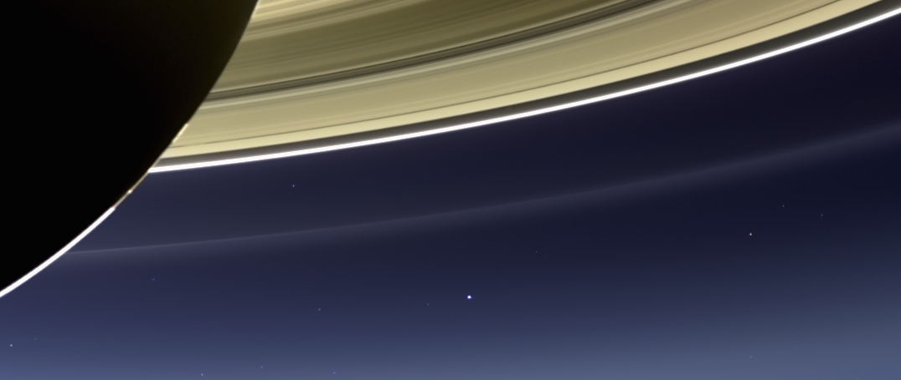
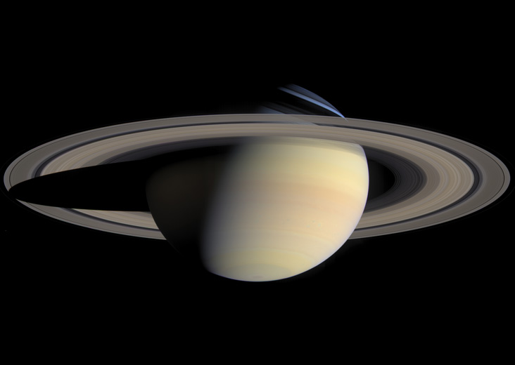

% Croisière interplanétaire (Partie II)
% CEA Explorer et comprendre l'Univers
% 12 novembre 2014
---
theme: default
transition: fade
---

## Les planètes joviennes

<small>NASA</small>

---

## Jupiter

<small>Cassini (2011) | NASA/JPL/University of Arizona</small>

---

## Jupiter

---------------------- -----------------------------------
Distance au Soleil                                5,203 UA
Excentricité                                         0,048
Période de révolution                         11,86 années
Période de rotation                           9h 50min 30s
Diamètre                                        142 800 km
Masse                      1,90$\times$ 1027 kg
Champ gravitationnel                             24,8 N/kg
Densité                                               1,31
Albédo                                                0,52
Température                                         -110°C
---------------------- -----------------------------------

---

## Jupiter

- 70% de toute la masse des planètes
- 1400 fois plus volumineuse que la Terre
- 318 fois plus massive que la Terre
- À peine plus dense que l'eau
- Champ magnétique 17 000 fois plus grand que celui de la Terre
- Aplatissement de 6%

---

## Jupiter

- Composition de la planète
    - Hydrogène (78%)
    - Hélium (20%)
    - Ammoniac
    - Hydrosulfide d'ammonium
    - Eau

---

## Jupiter

- Rotation différentielle
    - Période de rotation équatorial plus courte que la période de rotation des
      pôles
    - Période de rotation de la surface plus courte que la période de rotation
      interne

---

## Jupiter

Grande tache rouge

<small>Voyager 2 (1979) | NASA</small>

---

## Jupiter

Grande tache rouge

- Grosse tempête
- Dure depuis au moins 350 ans

---

## Composition interne de Jupiter

---

## Io

<small>Cassini (2001) | NASA/JPL/University of Arizona</small>

---

## Satellites de Jupiter

- Io
- Ganymède
- Europe
- Callisto
- 12 autres petits satellites

---

## Saturne

<small>Cassini | NASA</small>

---

## Saturne

<small>Cassini | NASA</small>

---

## Saturne

<small>Cassini | NASA/JPL/Space Science Institute</small>

---

## Saturne

---------------------- -----------------------------------
Distance au Soleil                                 9,54 UA
Excentricité                                         0,056
Période de révolution                         29,46 années
Période de rotation                          10h 13min 59s
Diamètre                                        120 000 km
Masse                      5,69$\times$ 1026 kg
Champ gravitationnel                             10,5 N/kg
Densité                                                0,7
Albédo                                                0,76
Température                                         -180°C
---------------------- -----------------------------------

---

## Saturne

- Composée d'hydrogène et d'hélium
- Champ magnétique 500 fois plus grand que celui de la Terre
- Axe de rotation incliné (saisons)
- Aplatissement de 10%

---

## Anneaux de Saturne

- Composés principalement de glace
- 1 km d'épaisseur

---

## Uranus

---

## Uranus

---------------------- -----------------------------------
Distance au Soleil                                19,19 UA
Excentricité                                         0,046
Période de révolution                         84,04 années
Période de rotation                                  16,5h
Diamètre                                         51 120 km
Masse                      8,70$\times$ 1025 kg
Champ gravitationnel                              9,0 N/kg
Densité                                                1,3
Albédo                                                0,51
Température                                         -221°C
---------------------- -----------------------------------

---

## Uranus

---

## Uranus

- Planète couchée
- Atmosphère contient du méthane qui absorbe le rouge
- Possède des anneaux
- 21 satellites

---

## Neptune

---

## Neptune

---------------------- -----------------------------------
Distance au Soleil                                30,06 UA
Excentricité                                         0,010
Période de révolution                         164,8 années
Période de rotation                                   18 h
Diamètre                                         49 528 km
Masse                      1,03$\times$ 1026 kg
Champ gravitationnel                             11,0 N/kg
Densité                                               1,66
Albédo                                                0,35
Température                                         -230°C
---------------------- -----------------------------------

---

## Neptune

- Composition interne très semblable à Uranus
- Inclinaison de l'axe de rotation de 30°
- Phénomènes atmosphériques probablement dus à la production d'énergie par
  contraction gravitationnelle

