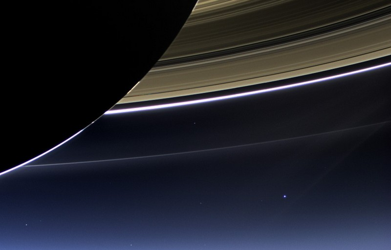
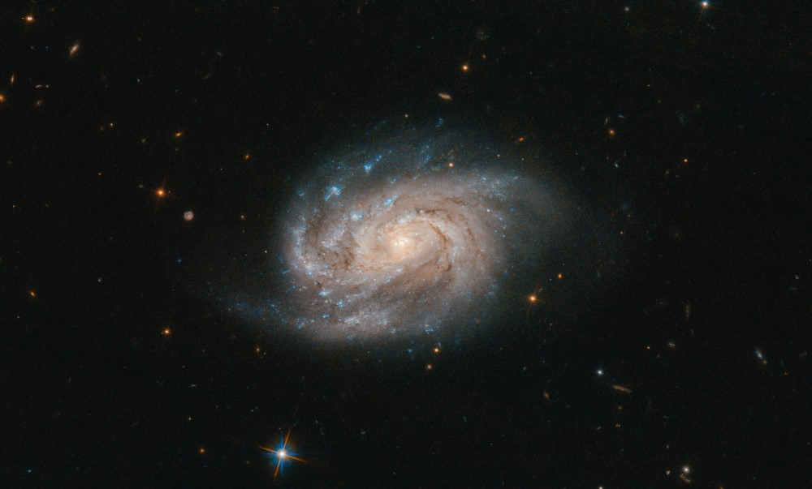

## Vers l'infiniment grand

<figure>
  
  <figcaption>
    La Terre vue de Saturne par la sonde Cassini-Huygens
    (NASA/JPL-Caltech/Space Science Institute)
  </figcaption>
</figure>

Dans cette photo époustouflante prise par la sonde Cassini-Huygens alors
qu'elle se trouvait à proximité de Saturne le 19 juillet 2013, on aperçoit un
petit point bleu en bas à droite. Ce point, c'est notre Terre. Elle apparait
minuscule vue d'une distance de 1\ 440\ 000\ 000\ km. Et pourtant, Saturne est
située dans la cour arrière de notre planète. Les confins du système solaire
sont dix fois plus éloignés de la Terre que ne l'est Saturne. [Les sondes
Voyager 1 et 2](https://voyager.jpl.nasa.gov/), lancées en 1977, ont atteint
les limites du système solaire en 2012 et en 2018, respectivement, après un
voyage de plus de 40\ ans. Voyager 1, aujourd'hui à plus de
22\ 000\ 000\ 000\ km de la Terre, est l'objet fabriqué par l'être humain qui
est le plus loin de la Terre.

Cette distance est déjà vertigineuse, mais elle est minuscule par rapport à la
distance qui nous sépare de l'étoile la plus proche du Soleil,
*Proxima Centauri*. Cette étoile est située à environ 4,3 années-lumière de la Terre,
soit environ 40\ 000\ 000\ 000\ 000\ km, 40\ 000 fois plus loin que Saturne. La
sonde Voyager 1, si elle se dirigeait vers *Proxima Centauri*, y parviendrait
dans environ 74\ 000\ ans à sa vitesse actuelle de 61\ 000\ km/h.

Le Soleil et *Proxima Centauri* ne sont que deux étoiles dans un gigantesque
regroupement d'étoiles qu'on appelle une **galaxie**, notre galaxie, la **Voie
lactée**. Notre galaxie a un diamètre environ 25\ 000 fois plus grand que la
distance qui nous sépare de *Proxima Centauri*. Elle compte 100 milliards
d'étoiles comme notre Soleil. C'est environ le nombre de cerises qu'on peut
mettre dans le Stade olympique à Montréal. Toutes les étoiles qu'on peut voir
dans le ciel à l'œil nu sont des étoiles dans la Voie lactée très
proches de nous. Lorsque le ciel est suffisamment sombre, on peut aussi voir
une bande blanchâtre qui s'étire sur une grande partie du ciel : c'est le reste
des étoiles de la galaxie de même que des nuages de gaz et de poussière. La
photo ci-dessous, prise par le télescope spatial Hubble, montre une autre
galaxie qui ressemble un peu à la notre.

<figure>
  
  <figcaption>
    La galaxie spirale NGC 1803 à environ 200 millions d'années-lumière
    (ESA/Hubble &amp; NASA, A. Bellini et al.)
  </figcaption>
</figure>

La Voie lactée n'est pas la seule galaxie, il existe environ 2000 milliards
d'autres galaxies dans l'Univers observable et chacune de ces galaxies contient
des milliards d'étoiles. Les galaxies sont elles aussi regroupées en amas.
Notre voisine, la **galaxie d'Andromède**, se dirige d'ailleurs vers nous et
entrera en collision avec la Voie lactée dans un peu plus de quatre milliards
d'années. La Voie lactée, la galaxie d'Andromède et une cinquantaine de
galaxies plus petites forment un regroupement qu'on appelle le **groupe
local**.

L'**Univers observable** est l'ensemble de l'espace autour de nous duquel de la
lumière peut nous parvenir. L'Univers lui-même est peut-être plus grand, voire
même infini, mais nous ne pourrons jamais voir au-delà des limites de l'Univers
observable. Cela est dû au fait que la lumière voyage à une vitesse finie et
qu'elle n'a eu le temps de parcourir qu'une certaine distance depuis le début
de l'existence de l'Univers, il y a environ 13,8 milliards d'années.

## Vers l'infiniment petit

Tout cet Univers est composé de la même matière que celle dont nous sommes
nous-même faits. Notre corps est constitué d'**organes** de quelques dizaines
de centimètres qui remplissent des fonctions importantes comme d'envoyer le
sang partout dans le corps, de transformer les aliments et de réfléchir. Ces
organes sont faits d'un assemblage de **cellules**, de petites unités qui
contiennent notre code génétique et qui sont capable de communiquer entre
elles, de produire de l'énergie à partir des aliments que nous ingérons et de
se reproduire. Une cellule typique a un diamètre de 0,000\ 050\ m, soit environ
10\ 000 fois plus petit qu'un organe. L'image ci-dessous, obtenue grâce à un
microscope électronique à balayage, montre des cellules sanguines humaines
grossies 1425 fois.

<figure>
  
  <figcaption>
    Cellules sanguines humaines (CDC/ Janice Carr)
  </figcaption>
</figure>

Nos cellules sont constituées de **molécules**, des structures minuscules comme
le sucre, les lipides et les protéines. Des molécules composent également les
objets qui nous entourent comme le polystyrène, l'eau et les fibres de
carbones.  Ces structures ont des tailles variables, mais elles sont environ
mille fois plus petites que nos cellules. Ces molécules sont des assemblages de
structures plus petites qu'on appelle des **atomes**. Il existe environ 120
sortes d'atomes qui sont répertoriés dans le fameux tableau périodique des
éléments. Parmi ces atomes, l'hydrogène et l'hélium sont les plus petits et les
plus abondants dans l'Univers. Ils ont été formés alors que l'Univers était agé
de quelques minutes seulement. Les autres éléments ont été formés par des
réactions de fusion nucléaire dans le cœur des étoiles ou lors d'explosions
d'étoiles connues sous le nom de **supernova**. L'atome d'hydrogène a une
taille d'environ 0,000\ 000\ 000\ 1\ m. Chaque atome possède un noyau formé de
protons et de neutrons autour duquel se trouve un nuage d'électrons.

Il est possible d'explorer l'échelle des différents constituants de l'Univers
dans l'application web
[Universcale](https://www.nikon.com/about/sp/universcale/), développée par
Nikon. Cette application permet de comprendre comment se comparent les tailles
des différents constituants de notre Univers.

## Puissances de 10 et années-lumière

Comme vous avez pu le constater dans les deux sections précédentes, les
grandeurs avec lesquelles nous travaillerons en astronomie sont énormes.
L'écriture des nombres correspondant devient rapidement confuse (que signifient
tous ces zéros?) et il est très facile d'écrire un zéro de trop ou d'en oublier
un. Pour pallier à ce problème, nous utiliserons souvent la notation
scientifique et les puissances de 10 pour simplifier l'écriture des nombres.
Lorsqu'on écrit 105, on représente le nombre constitué du chiffre 1
suivi de 5 zéros. Si l'exposant est négatif, comme pour 10-9, le
nombre comporte 9 zéros, suivi d'un un, avec une virgule décimale après le
premier zéro. Le tableau ci-dessous résume la signification des puissances de
10.

Nombre                 Nom            Puissance de 10   Préfixe
---------------------  -------------  ----------------  ---------
0,000\ 000\ 000\ 001                  10-12  pico
0,000\ 000\ 001        Milliardième   10-9   nano
0,000\ 001             Millionième    10-6   micro
0,001                  Millième       10-3   milli
1                      Un             100
1000                   Mille          103    kilo
1\ 000\ 000            Million        106    méga
1\ 000\ 000\ 000       Milliard       109    giga
1\ 000\ 000\ 000\ 000                 1012   tera

Table: Quelques puissances de 10 et les préfixes correspondants.

Par exemple, *Proxima Centauri* est une étoile située à
40\ 152\ 290\ 000\ 000\ 000\ m de la Terre, soit 4,015\ ×\ 1016\ m,
ou 4,015\ ×\ 1013\ km. Cette notation est beaucoup plus compacte et
nous évite d'avoir à compter le nombre de positions décimales.

Puisque les distances impliquées en astronomie sont très grandes, il n'est pas
rare d'avoir recours à une unité de mesure alternative, l'**année-lumière**.
Malgré le fait qu'il y ait le mot *année* dans le nom, une année-lumière n'est
pas une mesure de temps, mais bien une mesure de distance. C'est la distance
que la lumière parcourt en un an soit environ 9,46\ ×\ 1015\ m.

## Démarche scientifique

L'échelle du cosmos est difficile à appréhender. Ce qui est incroyable, c'est que
nous soyons en mesure de comprendre, du moins en partie, cet Univers. Les
galaxies les plus lointaines semblent être constituées des mêmes ingrédients
fondamentaux que nos propres corps et obéir aux mêmes lois physiques que celles
qui s'appliquent dans notre système solaire. La compréhension des interactions
nucléaires dans les noyaux d'atomes que nous étudions dans nos laboratoires
terrestres nous permet de savoir ce qui alimente les étoiles. Les ondes
électromagnétiques que nous utilisons pour communiquer avec des téléphones
cellulaires sont aussi émises par les étoiles et les gaz chauds dans les
galaxies. Ces ondes qui se propagent dans l'Univers et nous arrivent de très
loin ont débuté leur voyage il y a fort longtemps et nous arrivent avec de
l'information sur l'histoire passée du cosmos.

Dans ce cours, nous apprendrons beaucoup de choses sur l'Univers, mais aussi
sur la façon dont nous faisons ces découvertes. Une simple observation comme le
cycle du jour et de la nuit peut nous amener à comprendre la façon dont la
Terre et le Soleil se déplacent. Pour y arriver, il faut poser des hypothèses
et essayer de voir quelles sont les conséquences de ces hypothèses. Peut-être
que le Soleil tourne autour de la Terre? Mais alors, comment expliquer le
mouvement erratique de ces autres objets dans le ciel qu'on appelle des
planètes? Si l'hypothèse s'avère incohérente avec les observations que nous
faisons, nous la rejetons et essayons d'en formuler une meilleure. Ce processus
itératif nous amène graduellement vers des modèles de la nature qui sont de
plus en plus précis, qui permettent de faire des prédictions de plus en plus
justes de ce qui se produira dans notre monde. La démarche scientifique est un
processus dynamique qui implique de se poser beaucoup de questions et de
toujours raffiner nos modèles pour qu'ils correspondent le mieux possible à
l'ensemble des observations que nous avons faites.

## Exercices

1. Classer les objets suivants en ordre croissant de grandeur\ :
   Galaxie, cerveau, planète, virus, étoile, montagne, autobus, Univers, électron.

2. À combien d'années-lumière Québec se trouve-t-elle de Montréal?

3. D'où viennent les atomes de carbone qui composent notre corps?

4. Nommer une galaxie se trouvant proche de la nôtre.
