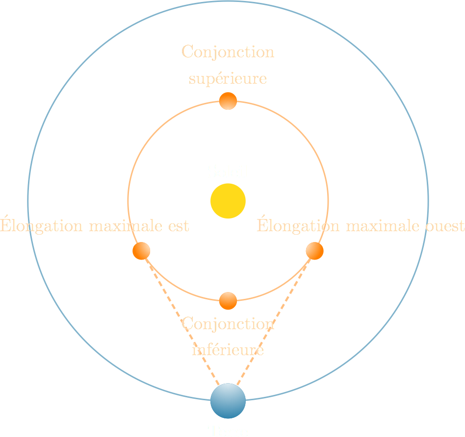

<figure>
  <a href="https://ccp.yale.edu/P240180">
    e siècle avant J.C. (Trustees of the British Museum)"
    width=100%>
  </a>
  <figcaption>
    Tablette 3 du texte mésopotamien Mul Apin, le plus vieux registre des
    constellations et de différents phénomènes célestes, daté du
    VIIe siècle avant J.C. (Trustees of the British Museum)
  </figcaption>
</figure>

Dans ce chapitre, nous ferons un survol des premières observations
astronomiques détaillées des civilisations antiques. La discussion se limitera
aux civilisations mésopotamienne et grecque. Nous savons cependant que
plusieurs autres civilisations, notamment les Mayas et les Chinois, ont fait
des avancées importantes en astronomie à peu près à la même période.

## Les Mésopotamiens

Sur le territoire aujourd'hui occupé par la Syrie et l'Irak se trouvait
autrefois la Mésopotamie. Cette grande région, encadrée par les fleuves Tigre
et Euphrate a été le berceau d'une des plus grandes civilisations de l'histoire
humaine. Les Mésopotamiens y ont régné pendant plus de trois millénaires, de
3200 av. J.C. jusqu'au IIIe siècle après J.C. Les étoiles ont sans
doute intéressé les Mésopotamiens pour la navigation, mais aussi pour des
raisons moins pragmatiques.

Les Mésopotamiens avaient observé que certains astres, la Lune et le Soleil,
avaient une influence sur des phénomènes terrestres. Par exemple, ils avaient
compris le lien entre les phases de la Lune et les marées. Ils en vinrent à
croire que les astres pouvaient aussi avoir une influence sur les êtres
humains, plus particulièrement sur les rois et les grands nobles. Cette
croyance a été le moteur de l'étude plus détaillée des phénomènes célestes et
marque le début de ce qu'on appelle l'**astrologie**, un ensemble de croyances
qui établit un lien entre la position des astres et les comportements ou la
destinée des êtres humains. S'ils avaient connu la méthode scientifique, les
prêtres-astrologues mésopotamiens auraient pu mettre à l'épreuve ces croyances
et s'apercevoir qu'elles ne résistaient pas à la moindre investigation.

Leurs observations du ciel leur a néanmoins permis de reconnaître que les
étoiles, immobiles les unes par rapport aux autres, étaient fondamentalement
différentes des **astres errants**, la Lune, le Soleil, Mercure, Vénus, Mars,
Jupiter et Saturne. Ces astres errants se déplacent par rapport aux étoiles
selon des mouvements qui se répètent à intervalle régulier. Les observations
qui ont permis de découvrir ces cycles marquent le début de l'**astronomie**
une science qui se base sur les observations pour comprendre et prédire ce qui
se produit dans le ciel. Les observations mésopotamiennes étaient très
détaillées (pour l'époque) et leur connaissance des mathématiques
leur permettait d'identifier les schémas récurrents dans leurs observations.
Ils étaient capables de faire des prédictions simples quant aux positions des
astres. Ils ont regroupé les étoiles le long de l'écliptique en douze
**constellations du zodiaque**.

### Planètes inférieures et supérieures

Les Mésopotamiens ont classé les planètes en deux catégories : les **planètes
inférieures** qui ne s'éloignent jamais beaucoup du Soleil et les **planètes
supérieures** qu'on peut retrouver n'importe où le long de l'écliptique. Les
planètes inférieures sont Mercure et Vénus alors que les planètes supérieures
sont Mars, Jupiter et Saturne.

Les planètes inférieures ne sont jamais bien loin du Soleil. Les Mésopotamiens
ont mesuré l'angle entre les planètes inférieures et le Soleil et ont réalisé
que cet angle était toujours inférieur à 44° pour Vénus et 24° pour Mercure.
Lorsqu'une planète inférieure est à sa position la plus éloignée du Soleil, on
dit qu'elle est en **élongation maximale**. Si la planète est vis à vis le
Soleil, on dit qu'elle est en **conjonction**. La figure ci-dessous montre ces
positions dans le **modèle héliocentrique** moderne, c'est-à-dire un modèle où
le Soleil est au centre et les planètes orbitent autour du Soleil. On comprend
maintenant que ces planètes apparaissent toujours proche du Soleil dans le ciel
parce qu'elles sont sur des orbites plus rapprochées du Soleil que celle de la
Terre. Évidemment, les Mésopotamiens ignoraient ce fait.

<figure>
  
  <figcaption>
  Positions particulières des planètes inférieures dans le modèle
  héliocentrique.
  </figcaption>
</figure>

Les planètes supérieures ont un comportement assez différent. Elles sont
parfois proche du Soleil, voire en conjonction, mais il leur arrive également
d'être complètement à l'opposé du Soleil, en **opposition**. Lorsqu'une planète
supérieure est à 90° par rapport au Soleil, on dit qu'elle est en
**quadrature**. La figure ci-dessous montre ces positions dans le **modèle
héliocentrique** moderne. On comprend maintenant que ces planètes apparaissent
n'importe où par rapport au Soleil parce qu'elles sont sur des orbites plus
éloignées du Soleil que celle de la Terre. Évidemment, les Mésopotamiens
ignoraient ce fait.

<figure>
  
  <figcaption>
  Positions particulières des planètes supérieures dans le modèle
  héliocentrique.
  </figcaption>
</figure>

Les Mésopotamiens ont également mesuré le temps que prenait chaque astre errant
pour faire le tour des constellations du zodiaque et le temps pour que les
planètes passent à travers toutes les positions particulières. Il est
remarquable que les Mésopotamiens, à partir de simples observations à l'œil nu
et de quelques instruments de mesure (pour mesurer les angles et le temps),
aient été capables de faire toutes ces observations.

## Les Grecs

Les philosophes grecs ont poursuivi le travail des Mésopotamiens, mais en
faisant des observations encore plus détaillées et en construisant des
modèles qui leur permettaient de faire des prédictions beaucoup plus
précises du mouvement des astres. Leur approche ressemblait beaucoup à la
méthode scientifique moderne. À partir de leurs observations, ils formulaient
des hypothèses quant à la nature des phénomènes et à leur fonctionnement. Puis,
ils utilisaient ces hypothèses pour formuler des prédictions et ils vérifiaient
ensuite ces prédictions avec de nouvelles observations. Lorsque les prédictions
étaient incohérentes avec les observations, le modèle était révisé.
L'image ci-dessous montre une partie d'une machine qui était constituée de
plusieurs engrenages et qui servait à prédire la position de la Lune et du
Soleil de même que les éclipses.

<figure>
  
  <figcaption>
    Machine d'Anticythère qui servait à prédire la position du Soleil
    et de la Lune, 89 av. J.C. (Marsyas [CC BY-SA](http://creativecommons.org/licenses/by-sa/3.0/))
  </figcaption>
</figure>

### Modèle d'Aristote

Lorsqu'on les regarde chaque soir pendant plusieurs semaines, voire plusieurs
mois, on remarque que les planètes se déplacent généralement d'ouest en est par
rapport aux constellations du zodiaque. Il est important de distinguer ce
mouvement du mouvement quotidien de la sphère céleste d'est en ouest : ce qui
nous intéresse maintenant est un mouvement sur une bien plus grande période par
rapport aux étoiles, pas par rapport à la Terre. De plus, les planètes ont des
vitesses qui sont presque constantes.

Aristote, vers 350 av. J.C., proposa un modèle pour décrire le mouvement des
astres. Il savait que la Terre était une **sphère** parce que des observations
simples et accessibles à l'époque 

## Exercices

