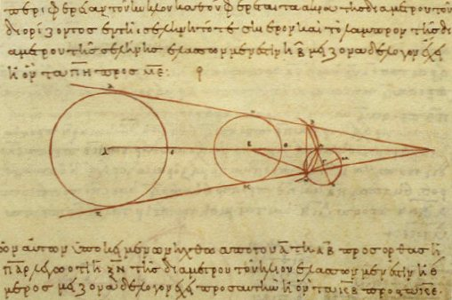
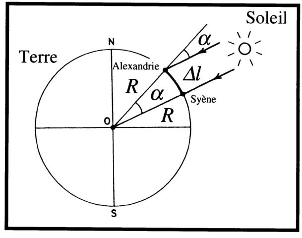

<figure>
  
  <figcaption>
    Image des planètes du système solaire. Les tailles des planètes sont à
    l'échelle, mais les distances entre les planètes ne le sont pas. (NASA)
  </figcaption>
</figure>

Plusieurs éléments du dernier chapitre devraient vous avoir laissé un peu
perplexe. Dans le modèle de Copernic, le Soleil est beaucoup plus loin de la
Terre que ne l'est la Lune. Mais alors, pourquoi la Lune apparaît-elle aussi
grosse que le Soleil dans le ciel? Kepler, pour énoncer sa troisième loi,
devait connaître la grandeur de l'axe majeur des différentes planètes, mais
comment pouvait-il déterminer ces grandeurs? Il s'avère que déterminer les
grandeurs des objets et les distances entre ces objets est un des problèmes
fondamentaux de l'astronomie. C'était vrai à la renaissance et c'est encore
vrai aujourd'hui. Dans ce chapitre nous verrons quelques techniques qui
permettent de déterminer la grandeur des objets dans le système solaire de même
que la distance entre ces objets. Nous discuterons de techniques anciennes,
mais aussi de certaines méthodes modernes.

## Aristarque, le Soleil et la Lune

Le Soleil et la Lune ont la même taille apparente dans le ciel terrestre soit
une taille angulaire d'environ 0,5°. Cette observation ne permet cependant pas
de savoir si le Soleil et la Lune ont la même taille et sont à la même distance
de la Terre, ou si un des deux est plus grand, mais se trouve plus loin de la
Terre.  Au IIIe siècle avant J.-C. L&hairsp;'astronome grec Aristarque de
Samos a conçu une technique pour déterminer la distance relative de ces deux
astres.  L&hairsp;'idée repose sur la **trigonométrie**, branche des mathématiques qui
étudie les liens entre les grandeurs des côtés des triangles et les angles
intérieurs de ces triangles.

<figure>
  
  <figcaption>
    Dessin d'Aristarque de Samos qui lui permit de calculer les distances
    du Soleil et de la Lune.
  </figcaption>
</figure>

Les rapports des côtés d'un **triangle rectangle**, c'est-à-dire un triangle
ayant un angle de 90°, définissent les rapports trigonométriques sinus, cosinus
et tangente.  L&hairsp;'image ci-dessous montre un triangle rectangle de côtés $a$, $b$
et $c$, un des angles de ce triangle et les définitions du cosinus et du sinus
de cet angle. Le lien qui relie les carrés des grandeurs de côtés est connu
sous le nom du **théorème de Pythagore**.

<figure>
  
  <figcaption>
    Théorème de Pythagore et définition du cosinus et du sinus d'un
    angle.
  </figcaption>
</figure>

Lorsque la Lune est en premier quartier ou en dernier quartier, le segment de
droite qui relie la Lune à la Terre arrive directement sur la frontière entre
la partie éclairée et la partie sombre de la Lune. Cela signifie que ce segment
de droite fait un angle de 90° avec le segment de droite qui relie la Lune au
Soleil. En ajoutant le segment de droite qui relie la Terre au Soleil, on
obtient donc un triangle rectangle. Ainsi, en mesurant l'angle entre la Lune et
le Soleil lorsque la Lune est en premier ou en dernier quartier, on peut
obtenir le rapport de la distance Terre-Lune ($a$ dans le schéma ci-dessous)
sur la distance Terre-Soleil ($b$ dans le schéma ci-dessous). Aristarque de
Samos mesura un angle de 87°, ce qui lui permettait de conclure que le Soleil
était environ 19 fois plus loin de la Terre que ne l'était la Lune. L&hairsp;'angle
obtenu par Aristarque n'était pas tout à fait correct et on sait aujourd'hui
que cet angle est en réalité de 89,85° ce qui signifie que le Soleil est
environ 382 fois plus loin de la Terre que ne l'est la Lune.

<figure>
  
  <figcaption>
    Illustration de la méthode d'Aristarque comparer la distance
    Terre-Lune à la distance Terre-Soleil.
  </figcaption>
</figure>

Il est important de comprendre que cette méthode ne permet pas de déterminer la
distance Terre-Lune, ni la distance Terre-Soleil, mais seulement de déterminer
le rapport entre ces deux quantités.

Aristarque, sachant que le Soleil était environ 19 fois plus loin que le
Lune et que les deux astres avaient environ la même taille apparente, il put
conclure que le Soleil devait être environ 19 fois plus grand que la Lune. Ceci
est une conséquence du fait que les rapports des côtés de triangles semblables
sont égaux. Avec les valeurs modernes, on sait plutôt que le Soleil est environ
382 fois plus grand que la Lune. Cette découverte d'Aristarque était importante
parce qu'elle permettait d'avoir une idée de la grandeur du système solaire.

## Ératosthène et la taille de la Terre

Un peu après Aristarque, Ératosthène, un autre philosophe grec, avait trouvé
une méthode pour estimer la taille de la Terre. Rappelez-vous que les grecs
savaient que la Terre était sphérique. Ératosthène voulait estimer la
circonférence de la Terre. Pour y arriver, il mesura l'angle des rayons du
Soleil par rapport à la verticale à Alexandrie au même moment où les rayons du
Soleil arrivaient perpendiculairement au sol dans la ville de Syène, une ville
820\ km plus au sud (voir figure ci-dessous).

<figure>
  
  
  <figcaption>
    Méthode d'Ératosthène pour mesurer la circonférence de la Terre
    (Gauche\ : Raphael Javaux; droite\ : Carlo Denis; [CC BY-SA 3.0](https://creativecommons.org/licenses/by-sa/3.0/deed.fr))
  </figcaption>
</figure>

Il mesura un angle d'environ 7° grâce, encore une fois, à un peu de
trigonométrie. Un peu de géométrie lui permit de conclure que l'angle de 7°
était donc l'angle formé par les segments de droite reliant le centre de la
Terre à Alexandrie et Syène. Sachant qu'un tour complet de la sphère terrestre
équivalait à 360° et connaissant la distance entre Alexandrie et Syène, une
règle de trois lui permit de déduire que la Terre avait une circonférence
d'environ 42\ 000\ km (la valeur moderne de la circonférence terrestre est de
40\ 000\ km). Ératosthène venait d'établir la grandeur de la Terre.

## Hipparque et la distance Terre-Lune

Hipparque réussit à estimer la distance entre la Terre et la Lune. Son approche
reposait sur l'étude des éclipses de Lune. En supposant que le Soleil est
beaucoup plus loin que la Lune, ce qui était connu depuis Aristarque, il savait
que la forme de l'ombre projetée par la Terre était conique. Plus la Lune était
proche de la Terre, plus elle aurait à traverser une ombre importante lors
d'une éclipse de Lune. Par conséquent, l'éclipse durerait plus longtemps. Au
contraire, si la Lune était loin de la Terre, l'ombre à traverser serait plus
petite et alors l'éclipse durerait moins longtemps. Un peu de géométrie permit
à Hipparque de calculer que la distance entre la Terre et la Lune devait être
d'environ 32 diamètres terrestres. Or, le diamètre de la Terre était connu
depuis Ératosthène et donc la distance Terre-Lune pouvait être estimée. On
savait donc que la Lune était à environ 32 &times; (42\ 000\ km / &pi;) =
427\ 800\ km de la Terre (la valeur moderne est 384\ 400\ km).

En combinant ce résultat avec celui d'Aristarque, on pouvait estimer la
distance Terre-Soleil à environ 19 &times; 1\ 344\ 000\ km = 8\ 128\ 200\ km de
la Terre. Avec la valeur moderne du rapport distance Terre-Soleil à distance
Terre-Lune, on obtient plutôt 163\ 419\ 600\ km ce qui est très proche de la
distance Terre-Soleil telle que mesurée aujourd'hui de 150\ 000\ 000\ km.

Remarquez qu'il aurait été impossible pour Hipparque de déterminer la distance
Terre-Lune sans connaître préalablement le diamètre de la Terre. Il n'aurait pu
obtenir que des rapports de grandeurs, comme Aristarque. La mesure de la taille
de la Terre était donc le premier pas dans la détermination de distances
beaucoup plus grandes dans le système solaire. Ce mécanisme, où on se base sur
une distance plus petite pour déterminer une légèrement plus grande est la base
de toutes les déterminations de distances en astronomie. On y réfère souvent
sous le nom de l'**échelle des distances cosmique** : on ne peut atteindre une
distance plus grande qu'en grimpant d'abord sur le barreau correspondant à une
distance plus petite.

## Distance des planètes

Pour déterminer les distances des autres planètes du système solaire, il fallut
attendre le modèle de Copernic. En effet, ce n'est qu'avec ce modèle correct
d'un point de vue géométrique qu'il était possible de concevoir des méthodes
pour mesurer les distances des planètes. L&hairsp;'approche pour les planètes
inférieures est très similaire à celle utilisée pour déterminer la distance
Terre-Lune. On considère le triangle formé par la Terre, le Soleil et la
planète inférieure d'intérêt lorsque celle-ci se trouve en élongation maximale.
À ce moment, l'angle à la position de la planète inférieure est un angle droit.
Avec un peu de trigonométrie, on peut obtenir la distance entre la planète
inférieure et le Soleil en multiple de la distance Terre-Soleil. Puisque la
distance Terre-Soleil est utilisée comme valeur de référence, on la nomme une
**unité astronomique**.

<figure>
  
  <figcaption>
    Illustration de la méthode pour déterminer la distance des planètes
    inférieures
  </figcaption>
</figure>

Pour mesurer les distances des planètes supérieures, Kepler proposa une
technique ingénieuse basée sur l'**effet parallaxe**. Si on tient une pomme à
quelques centimètres de son visage, la pomme n'apparait pas au même endroit par
rapport aux objets lointains si on la regarde avec l'œil droit ou avec l'œil
gauche. Cette disparité est utilisée par le cerveau pour déterminer la distance
à laquelle la pomme se trouve. Évidemment, vous n'avez pas à faire de calculs
trigonométriques complexes pour prendre une pomme, votre cerveau s'en charge.
Le problème c'est que l'effet s'estompe pour les objets plus lointains. Il
faudrait que nos yeux soient plus éloignés l'un de l'autre pour que l'effet
parallaxe nous permette de déterminer des distances au-delà d'environ deux
mètres. Les planètes supérieures sont beaucoup plus loin que deux mètres. Pour
utiliser l'effet parallaxe il faut observer un objet de deux points de vue
différents entre lesquels on connait la distance et il faut que cette distance
soit d'une taille comparable à la distance de l'objet qu'on veut mesurer.

Kepler proposa de mesurer la parallaxe d'une planète supérieure entre deux
moments où elle se trouve au même point de son orbite. À ces deux moments, la
Terre est à deux endroits différents de son orbite entre lesquels on connait
la distance (en unités astronomiques) puisqu'on sait combien de temps s'est
écoulé entre les deux instants.

<figure>
  
  <figcaption>
    Illustration de la méthode de Kepler pour déterminer la distance des
    planètes supérieures
  </figcaption>
</figure>

Une modification de l'idée de la parallaxe a permis de déterminer une valeur de
l'unité astronomique beaucoup plus proche de la réalité que celle obtenue en
Grèce antique. Entre 1671 et 1673, un scientifique italien, Giovanni Domenico
Cassini, et son étudiant français, Jean Richer, ont appliqué l'idée de la
parallaxe pour déterminer la valeur de l'unité astronomique. Ils ont mesuré la
parallaxe de Mars depuis Paris et Cayenne, en Guyane française. Puisqu'ils
connaissaient la distance entre ces deux endroits sur Terre, ils ont pu obtenir
une valeur de distance de Mars. En combinant ce résultat avec la mesure de la
distance Terre-Mars obtenue par Kepler en unités astronomiques, ils ont été en
mesure de déduire la valeur de l'unité astronomique. À partir de ce moment, il
était possible de connaître les distances de tous les astres errants dans le
système solaire.

## Méthode du radar

Il existe aujourd'hui une méthode beaucoup plus efficace et beaucoup plus
précise pour déterminer la distance des objets du système solaire. On utilise
la technique du **radar**. Le principe est d'envoyer une onde radio vers
l'objet dont on veut savoir la distance et de mesurer le temps que prend cette
onde pour atteindre l'objet et être réfléchie vers la Terre. Puisqu'on connait
la vitesse de propagation des ondes radios, on peut en déduire la distance à
laquelle l'objet se trouve.

## Exercices

1. Associez chacune des personnes suivantes à une mesure de distance.
   Personnes : Hipparque, Kepler, Jean Richer, Aristarque, Eratosthène.
   Distances : détermination de l'unité astronomique, circonférence de la
   Terre, rapport des distances Terre-Lune et Terre-Soleil, distance Terre-Mars
   en unités astronomiques, distance Terre-Lune.

2. Qu'est-ce qu'un triangle rectangle?

3. Expliquez pourquoi Hipparque n'aurait pas été capable de déterminer la
   distance Terre-Lune sans les travaux d'Ératosthène.

4. Que signifie l'expression *échelle des distances cosmique*?

5. Expliquez la méthode d'Aristarque pour déterminer la distance Terre-Lune.
   Appuyez votre explication d'un schéma.

6. Énoncez la deuxième loi de Kepler et expliquez ce qu'elle signifie en termes
   des vitesses des planètes.

7. Expliquez la méthode utilisée pour déterminer la distance des planètes
   inférieures en vous appuyant d'un schéma.

8. Est-ce que la méthode que vous avez décrit à la question précédente aurait pu
   être utilisée avec le modèle de Ptolémée?

9. Définissez l'effet parallaxe.

10. Vrai ou faux? Une orbite avec une excentricité de 0,8 ressemble davantage à
    un cercle qu'une orbite avec une excentricité de 0,3.
