<figure>
  <a href="https://solarsystem.nasa.gov/resources/487/our-solar-system/?category=solar-system_our-solar-system">
    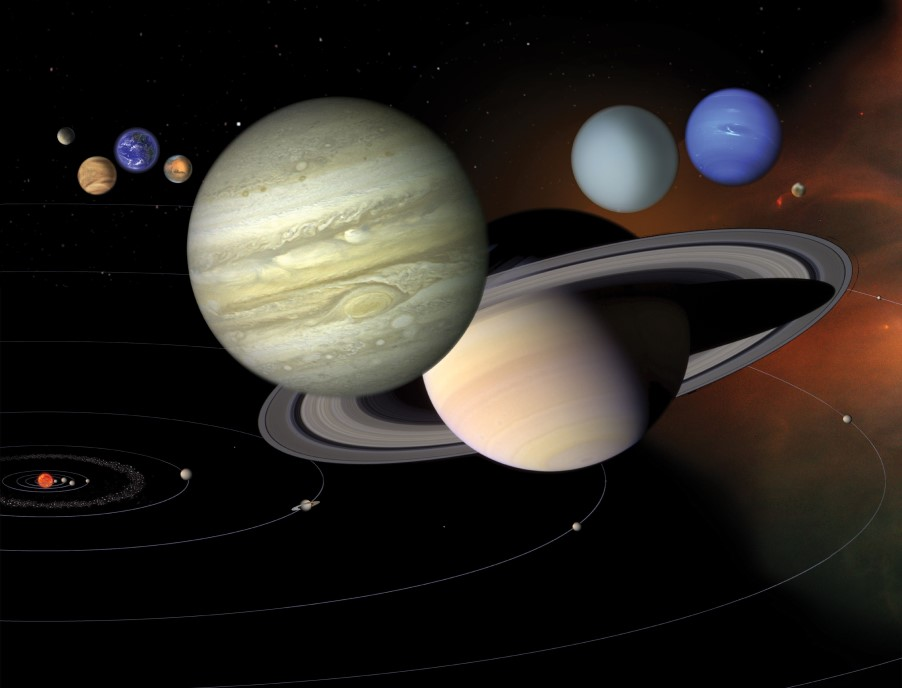
  </a>
  <figcaption>
    Vue d'artiste du système solaire (NASA/JPL).
  </figcaption>
</figure>

Jusqu'à la deuxième moitié du vingtième siècle, peu de choses étaient connues
sur les astres du système solaire. Les observations avaient permis de bien
comprendre le mouvement des différentes planètes, mais les caractéristiques de
ces planètes étaient difficiles à déterminer. À partir de la deuxième moitié du
vingtième siècle, l'exploration spatiale et l'envoi de sondes un peu partout
dans le système solaire nous ont fait découvrir nos voisines dans toute leur
splendeur.

## Structure du système solaire

Le système solaire est composé d'une étoile, le Soleil, autour de laquelle
plusieurs milliers d'objets sont en orbite. Parmi ces objets, on retrouve huit
planètes, dont les six connues des anciens (Mercure, Vénus, la Terre, Mars,
Jupiter et Saturne) et les deux découvertes au XIXe siècle (Uranus
et Neptune).

Une **planète** est définie par l'Union astronomique internationale comme un
objet

- qui orbite autour du Soleil
- qui a une masse suffisamment grande pour que sa gravité le rende environ sphérique
- qui a «nettoyé» son orbite

<figure>
  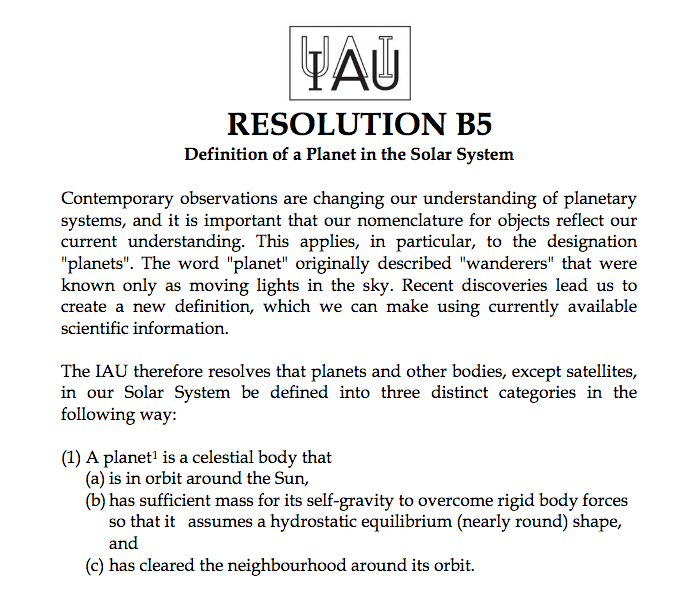
  <figcaption>
    Résolution B5 de l'Union astronomique internationale adoptée en 2006.
  </figcaption>
</figure>

Les quatre planètes les plus près du Soleil ont des structures similaires à
celle de la Terre et on les appelle donc les **planètes telluriques**. Elles
sont principalement composées de roches et ont des densités d'environ 5\
g/cm3.Les quatre planètes les plus éloignées du Soleil sont
beaucoup plus grosse et sont gazeuses. Elles ont des densités entre 1 et 2\
g/3. En raison de leur ressemblance à Jupiter, on les appelle les
**planètes joviennes**.

Une **planète naine** est un objet sphérique en orbite autour du Soleil, mais
qui n'a pas «nettoyé» son orbite, c'est-à-dire qu'il y a d'autres objets sur
l'orbite de la planète naine. Pluton, Céres et Eris sont quelques unes des
planètes naines connues.

Un **astéroïde** est un objet en orbite autour du Soleil qui n'est pas
suffisamment massif pour avoir une forme sphérique. Il existe des milliers
d'astéroïdes dans le système solaire.

Au-delà de l'orbite de Neptune, on retrouve une région qui contient de nombreux
astéroïdes et planètes naines nommée la **Ceinture de Kuiper**. Pluton se
retrouve dans cette région. Encore plus loin dans le système solaire se trouve
le **Nuage de Oort**. Ce dernier, contrairement à la Ceinture de Kuiper, a une
forme probablement sphérique. On pense que la majorité des comètes viennent de
cette région du système solaire.

La majorité de la masse dans le système solaire est concentrée dans le Soleil.
Le reste est principalement contenue dans Jupiter et Saturne. Les autres
planètes représentent une partie infime de la masse du système solaire.

Objet                             Masse (%)
-------------------------------- ----------
Soleil                                99,80
Planètes principales                   0,14
Nuage de Oort                          0,05
Ceinture de Kuiper                    0,001
Astéroïdes, satellites, anneaux    < 0,0001

Table: Distribution de la masse dans le système solaire

 

Planète   Masse (%)
-------- ----------
Mercure        0,01
Vénus          0,18
Terre          0,22
Mars           0,02
Jupiter       71,14
Saturne       21,30
Uranus         3,26
Neptune        3,86

Table: Distribution de la masse parmi les planètes

Puisque la source principale de chaleur dans le système solaire est le Soleil,
en général, plus on s'éloigne de lui, plus il fait froid. Les planètes ont une
température de surface moyenne qui respecte cette relation, sauf Vénus qui est
la planète la plus chaude. Le graphique ci-dessous montre la température
moyenne des planètes.

<figure>
  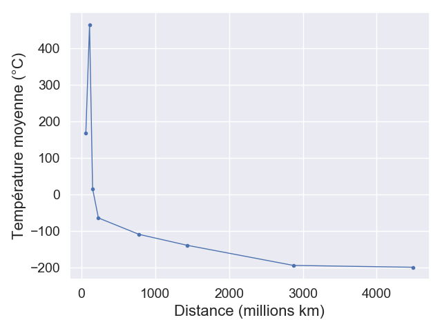
  <figcaption>
  Température moyenne de surface des planètes du système solaire
  </figcaption>
</figure>

Vénus est beaucoup plus chaude que Mercure en raison de son atmosphère très
riches en gaz à effet de serre. Cette atmosphère absorbe la chaleur du Soleil
et l'empêche de s'échapper.

## Soleil

L'astre central dans le système solaire est évidemment le Soleil. Sa gravité
est ce qui maintient la cohésion du système solaire. Nous étudierons les
étoiles plus tard dans le cours, mais nous pouvons néanmoins décrire certaines
caractéristiques de base de notre étoile.

<figure>
  <a href="https://www.flickr.com/photos/gsfc/4923566097">
  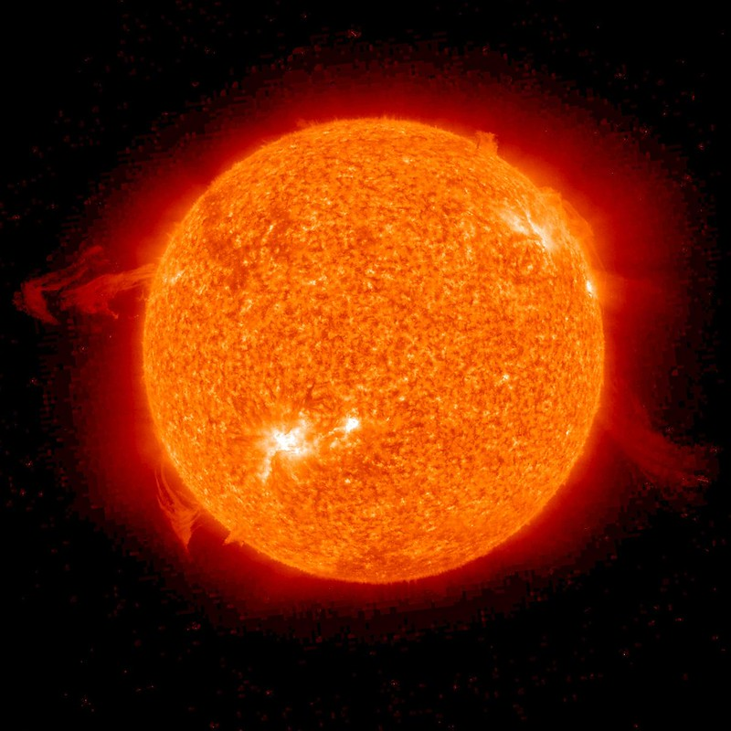
  </a>
  <figcaption>
  Le Soleil en éruption tel que photographié par la sonde spatiale SOHO
  (NASA/GSFC/SOHO).
  </figcaption>
</figure>

Le Soleil est une étoile naine jaune de type spectral G2. Il a un rayon environ
100 fois plus grand que celui de la Terre, 695\ 508\ km, et une masse de
333\ 000 fois plus grande ce celle de la Terre,
1,9891\ &times;\ 1030\ kg.  Il est principalement composé
d'hydrogène et d'hélium avec quelques traces (moins de 2% de sa masse) de
carbone, d'oxygène, de néon et de quelques autres atomes plus lourds. La gravité
à la surface du Soleil est environ 30 fois plus forte qu'à la surface de la
Terre.

Comme toutes les étoiles, le Soleil est une énorme boule de gaz chaud qu'on
appelle un **plasma**. Puisque le Soleil est constitué de gaz, nous pourrions
passer à travers sans difficulté (si nous pouvions survivre à la chaleur
extrême). La densité moyenne du Soleil est de 1,4\ g/cm3, soit à
peine plus que celle de l'eau. Parce que c'est une boule de gaz, la surface du
Soleil n'est pas aussi clairement définie que la surface de la Terre. On ne
pourrait pas marcher à la surface du Soleil.

La température du Soleil varie énormément selon la distance par rapport au
centre. Au centre, la température atteint 15.7 millions de degrés Celsius.
Cette température est suffisamment élevée pour que les atomes d'hydrogène
soient accélérés à des vitesses près de celle de la lumière et entre violemment
en collision les uns avec les autres. Ces collisions sont si violentes que les
atomes d'hydrogène peuvent **fusionner** et former des atomes d'hélium. Ce
genre de **réactions nucléaires** libère d'énormes quantités d'énergie sous
forme de radiation. Cette énergie migre vers la surface du Soleil en environ
170\ 000 ans après quoi elle peut être expulsée dans l'espace. La surface du
Soleil que nous voyons est à une température d'environ 5500°C, beaucoup plus
froide que le cœur.

Le bouillonnement de plasma chaud dans le Soleil, qu'on appelle le mouvement de
**convection**, crée d'intense courants électriques qui à leur tour génèrent le
**champ magnétique** du Soleil. Ce champ magnétique intense et toujours
changeant est responsable des taches solaires, des éruptions solaires et des
éjections de masse coronale. Une **éjection de masse coronale** se produit
lorsque des particules du plasma sont accélérées le long des lignes de champ
magnétique et sont en partie éjectées dans l'espace. Une éjection de masse
coronale peut se produire à partir de filaments solaires qui peuvent atteindre
plusieurs dizaines de fois le diamètre de la Terre en hauteur. Typiquement, une
éjection de masse coronale envoie 1012\ kg de matière dans l'espace.
C'est mille millions de tonnes! L'**activité solaire** varie sur une période de
11 ans.

<figure>
  <a href="https://solarsystem.nasa.gov/resources/758/brief-outburst/?category=solar-system_sun">
  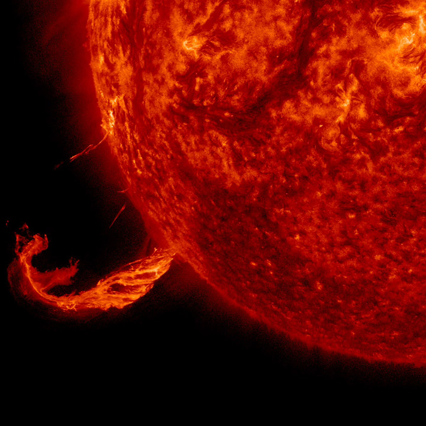
  </a>
  <figcaption>
  Éjection de masse coronale qui a duré environ trois heures le 24 février
  2015.
  (Solar Dynamics Observatory, NASA)
  </figcaption>
</figure>

### Missions d'exploration

Beaucoup de ce que nous connaissons aujourd'hui à propos du Soleil vient
d'observations faites par les observatoires spatiaux
[Solar and Heliospheric Observatory](https://sohowww.nascom.nasa.gov/home.html)
(SOHO) et [Solar Dynamics Observatory](https://sdo.gsfc.nasa.gov/) (SDO). SOHO
a été lancé en 1995 et sa mission principale est de comprendre les différents
mécanismes internes dans le Soleil et comment ces mécanismes donnent lieu à la
production du vent solaire. SDO, lancé en 2010, a pour mission d'étudier
l'impact du vent solaire sur la Terre.

<figure>
  <a href="https://sohowww.nascom.nasa.gov/gallery/Spacecraft/soho_photo3.html">
  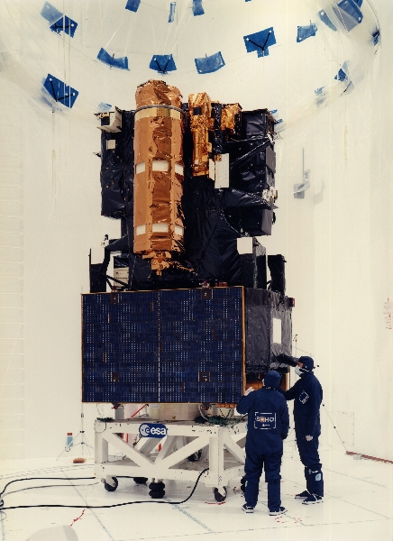
  </a>
  <a href="https://sdo.gsfc.nasa.gov/">
  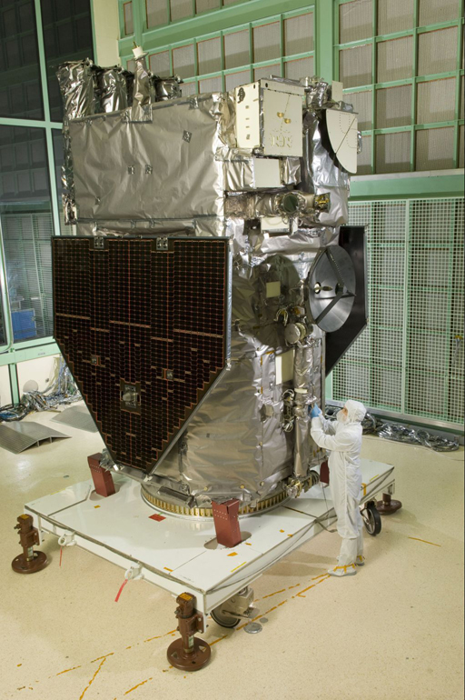
  </a>
  <figcaption>
  Sondes spatiales SOHO (à gauche) et SDO (à droite)
  (SOHO (ESA & NASA); NASA/SDO and the AIA, EVE and HMI science teams)
  </figcaption>
</figure>

### À surveiller

La [sonde spatiale Parker](https://www.nasa.gov/content/goddard/parker-solar-probe)
lancée en 2018 frôlera le Soleil au cours des prochaines années. Elle
s'approchera du Soleil plus que n'importe quelle autre sonde, à une distance
d'environ le dixième du rayon de l'orbite de Mercure. Parker permettra de mieux
comprendre le vent solaire et la région supérieure de l'atmosphère du Soleil
qu'on appelle la **couronne**.

Le télescope de 4\ m [Daniel K. Inouye Solar Telescope](https://www.nso.edu/telescopes/dki-solar-telescope)
(DKIST) installé à Hawai'i permettra d'obtenir des images de la surface du
Soleil avec une résolution inégalée. La mission première de DKIST est de mieux
comprendre le champ magnétique solaire.

<figure>
  <a href="https://www.nso.edu/press-release/inouye-solar-telescope-first-light/">
  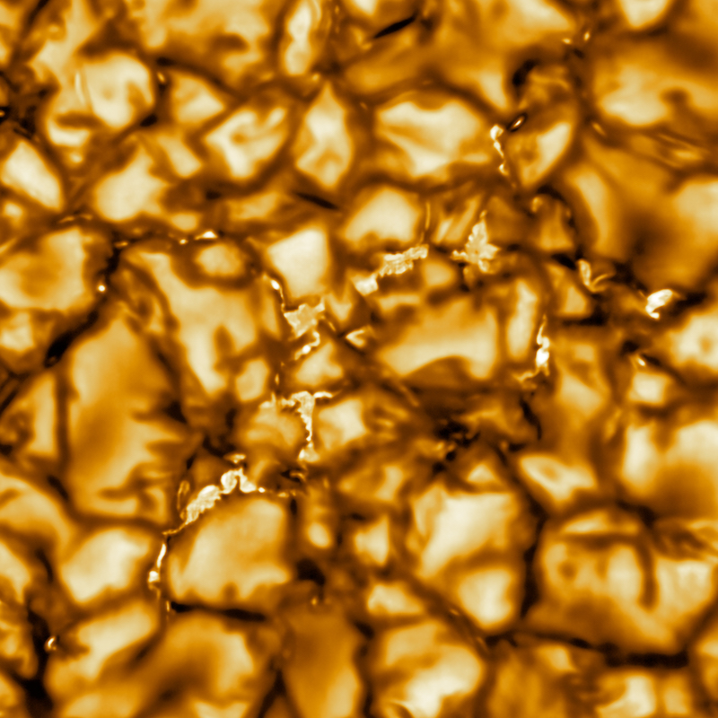
  </a>
  <figcaption>
  Image de la surface du Soleil photographiée par DKIST (NSO/AURA/NSF
  [CC BY 4.0](https://creativecommons.org/licenses/by/4.0/))
  </figcaption>
</figure>

## Mercure

<figure>
  <a href="https://messenger.jhuapl.edu/Explore/Science-Images-Database/gallery-image-911.html">
  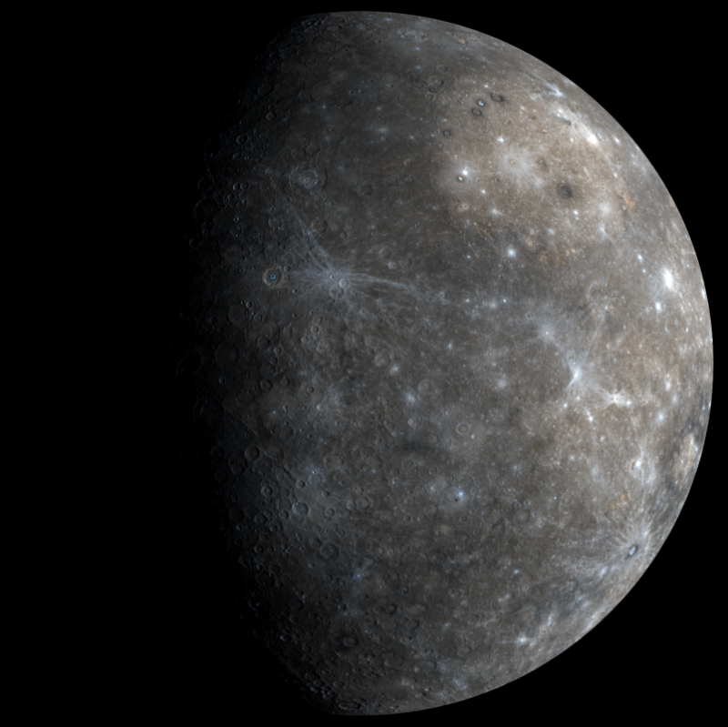
  </a>
  <figcaption>
  NASA/Johns Hopkins University Applied Physics Laboratory/Carnegie Institution of Washington
  </figcaption>
</figure>

À 3,6 minutes-lumière du Soleil, on retrouve Mercure. Puisque c'est la planète
la plus proche du Soleil, c'est aussi celle qui tourne le plus rapidement, à
48\ km/s. Cette planète tourne autour du Soleil en 88 jours terrestres et elle
tourne sur elle-même en 59 jours. En raison de la combinaison de ces deux
mouvements, la durée d'une période jour-nuit complète est de 176 jours. C'est
la plus petite planète et elle ne possède presque aucune atmosphère parce que
sa gravité n'est pas suffisamment forte pour retenir le gaz.

Mercure fut visitée en 1974 et en 1975 par la sonde spatiale Mariner 10, puis
entre 2008 et 2015 par MESSENGER. MESSENGER nous a fourni des images haute
résolution de la surface de Mercure puis s'est écrasée à la surface le 30
avril 2015 après avoir épuisé son carburant.

<figure>
  <a href="https://www.nasa.gov/multimedia/imagegallery/image_feature_1483.html">
  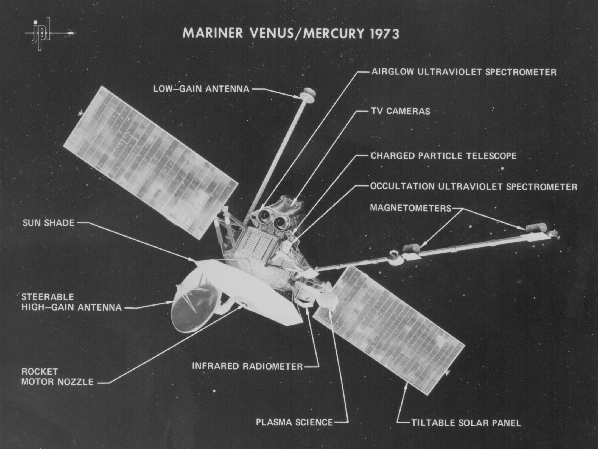
  </a>
  <figcaption>
  Sonde Mariner 10 (NASA/JPL)
  </figcaption>
</figure>

### À surveiller

La sonde spatiale [BepiColombo](https://sci.esa.int/web/bepicolombo) de
l'Agence spatiale européenne et de la Japan Aerospace Exploration Agency
devrait arriver en orbite autour de Mercure en 2025.

## Vénus

<figure>
  <a href="https://solarsystem.nasa.gov/resources/688/computer-simulated-global-view-of-venus/?category=planets_venus">
  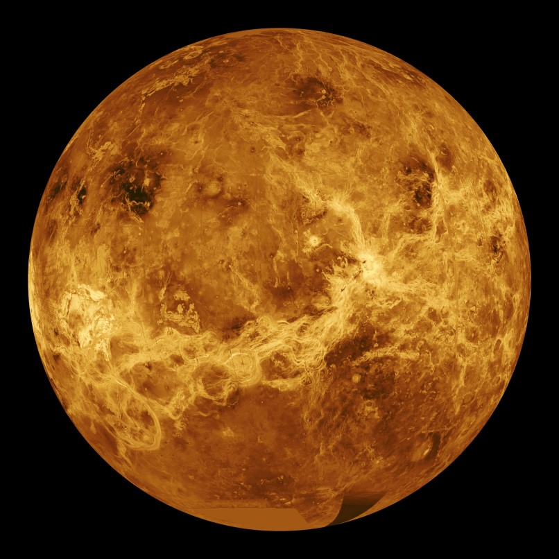
  </a>
  <figcaption>
  Vénus vue par le radar de Magellan (NASA/Jet Propulsion Laboratory-Caltech)
  </figcaption>
</figure>

À 6 minutes-lumière du Soleil se trouve Vénus, un monde chaud et acide, balayé
par des tempêtes constantes. Sur Vénus, le jour est plus long que l'année et la
direction de la rotation est opposée à la direction de révolution ce qui fait
qu'un cycle jour-nuit dure 117 jours terrestres. La température moyenne est de
477°C en raison de l'intense effet de serre. Cet effet de serre est dû à une
atmosphère composée principalement de dioxyde de carbone et de nuages d'acide
sulfurique. La pression atmosphérique sur Vénus est près de 100 fois plus
grande que celle sur Terre.

C'est une planète rocheuse avec une structure interne similaire à celle de la
Terre. Un noyau de fer est surmonté d'un manteau de roche chaude qui bouge
lentement, créant un mouvement de plaques tectoniques et des volcans.

La planète a été visitée à de nombreuses reprises (notamment par les sondes
Pioneer et Mariner). C'est la sonde spatiale Magellan qui a cartographié la
totalité de la surface de Vénus au début des années 1990. Les soviétiques ont
été les seuls à tenter de se poser sur Vénus. Les sondes Venera-13 et
Venera-14, de même que leurs successeurs Vega-1 et Vega-2 ont réussi à se poser
et à transmettre quelques données. En raison des conditions extrêmes à la
surface de la planète, ces sondes ont eu une durée de vie très courte. Par
exemple, Venera-13 a été fonctionnelle environ 2 heures.

<figure>
  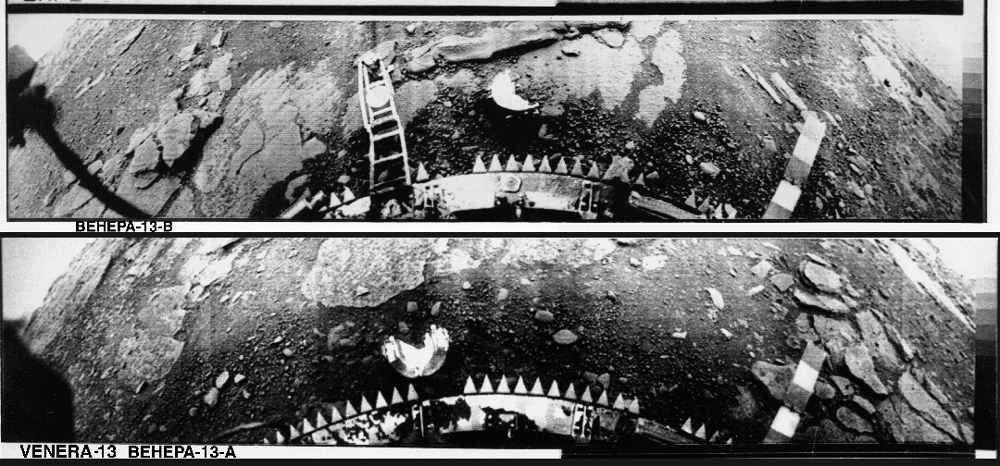
  <figcaption>
  Surface de Vénus photographiée par Venera-13 (URSS)
  </figcaption>
</figure>

### À surveiller

La sonde spatiale japonaise [Akatsuki](http://akatsuki.isas.jaxa.jp/en/), en
orbite autour de Vénus depuis 2015, étudie la météo de Vénus pour comprendre
les mouvements de son atmosphère.

## Terre

<figure>
  <a title="View of rising Earth about five degrees above the Lunar horizon"
    href="http://nssdc.gsfc.nasa.gov/photo_gallery/photogallery-earthmoon.html">
  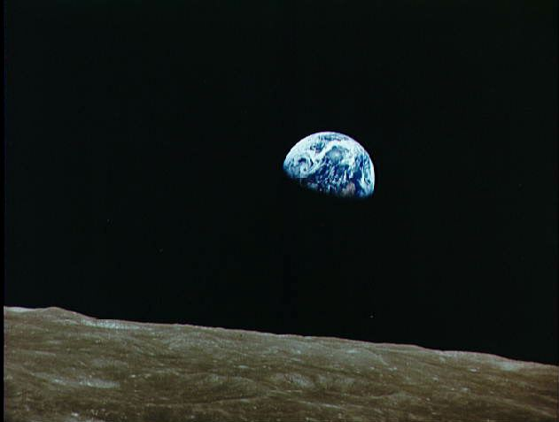
  </a>
  <figcaption>
  Lever de Terre sur la Lune (NASA/NSSDC)
  </figcaption>
</figure>

La Terre est la planète la plus accessible pour faire des mesures
scientifiques. Ce n'est pas pour rien que nous en connaissons plus à son sujet
que n'importe quelle autre planète. La densité moyenne de la Terre est de
5,5\ g/cm3, ce qu'on peut déterminer facilement une fois qu'on
connait le rayon de la Terre et sa masse. Cependant, on observe que la majorité
des matériaux accessible à la surface de la Terre ont une densité de l'ordre de 
3\ g/cm3, cela signifie donc que la matière au centre de la Terre
doit être beaucoup plus dense. Cette information, combinée avec l'étude des
ondes sismiques a permis de déduire que le cœur terrestre est probablement
composé de fer et de nickel.

La datation au potassium 40 des roches terrestres et des météorites a permis
d'établir que l'âge de la Terre est le meme que celui du reste du système
solaire, soit de 4,6 milliards d'années. La Terre possède un **champ
magnétique** qui agit comme un bouclier qui nous protège du vent solaire. Les
particules chargées en provenance du Soleil sont déviées dans l'espace ou vers
les pôles.  Lorsqu'elles entrent en collision avec les molécules de notre
atmosphère, ces particules chargées produisent les **aurores polaires**.

## Mars

<figure>
  <a href="https://hubblesite.org/contents/media/images/2001/24/1090-Image.html?news=true">
  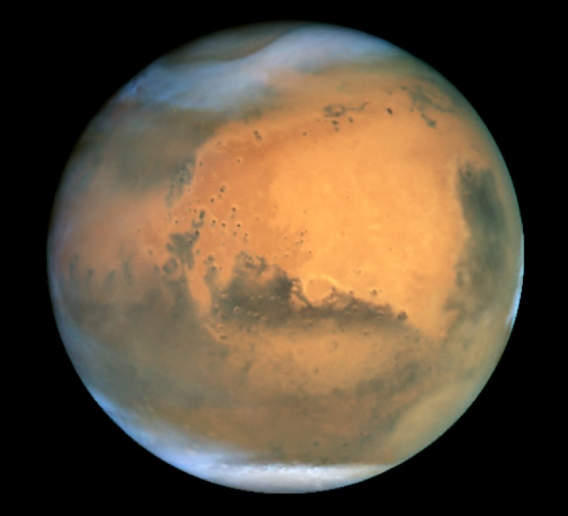
  </a>
  <figcaption>
  Mars photographiée par Hubble (NASA and The Hubble Heritage Team
  (STScI/AURA))
  </figcaption>
</figure>

Mars est environ deux fois plus petite que la Terre. Cette planète possède une
atmosphère ténue riche en dioxyde de carbone. On pense que l'atmosphère de Mars
était beaucoup plus dense autrefois, mais que l'absence de champ magnétique sur
la planète a fait en sorte que le vent solaire a balayé en partie l'atmosphère.
La surface de Mars est rougeâtre parce qu'elle est couverte d'**oxyde de fer**,
mieux connue sous le nom de rouille.

Il n'y a pas d'activité tectonique sur Mars. Par conséquent il n'y a pas de
chaînes de montagnes, et puisque les volcans crachent toujours leur lave au
même endroit, on y trouve des montagnes énormes. Le plus grand volcan du
système solaire, le **mont Olympus**, se trouve sur Mars. Avec une hauteur de
23\ km, il est trois fois plus haut que l'Everest.

<figure>
  <a href="http://mars.nasa.gov/gallery/atlas/images/oly-az.jpg">
  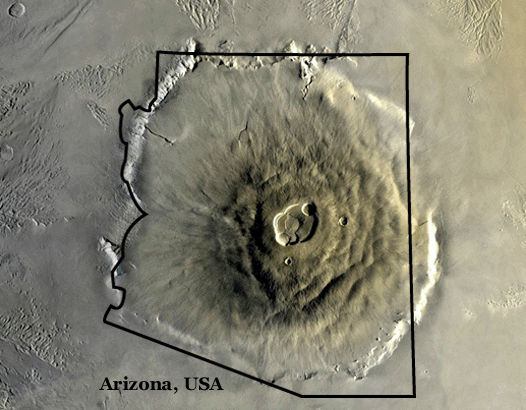
  </a>
  <figcaption>
  Mont Olympus sur Mars : la plus haute montagne du système solaire (NASA/JPL)
</figcaption>
</figure>

Plusieurs sondes se sont posées à la surface de Mars, dont Spirit et
Opportunity en 2004. Ces sondes ont exploré la surface de Mars et ont montré
qu'il y a déjà eu de l'eau sur Mars. Spirit, après avoir parcouru 7,73\ km sur
une période de six ans, s'est coincée dans le sable. Les efforts pour la sortir
de ce pétrin ont échoué et la mission de Spirit s'est terminée en 2011.
Opportunity a été plus chanceuse et a pu continuer sa mission sans grande
anicroche jusqu'en 2018 où une tempête de sable l'a recouverte. Elle a parcouru
45\ km pendant les 14 ans de sa mission.

### À surveiller

La sonde [InSight](https://solarsystem.nasa.gov/missions/insight/in-depth/)
s'est posée sur Mars en 2018. Elle a pour mission d'aider à comprendre comment
Mars et les autres planètes telluriques se sont formées.

## Jupiter

<figure>
  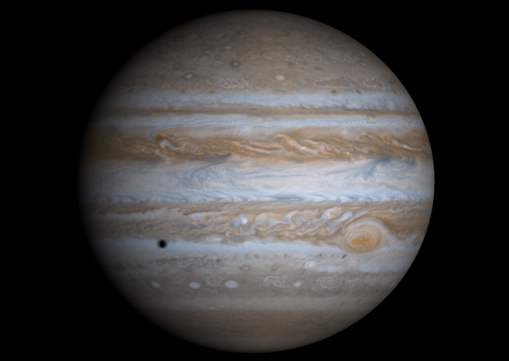
  <figcaption>
  Cassini (2011) | NASA/JPL/University of Arizona
  </figcaption>
</figure>

Jupiter est une géante gazeuse dont la densité est a peine plus élevée que
celle de l'eau. Puisqu'elle est gazeuse, elle ne tourne pas sur elle-même au
même rythme partout. La période de rotation à l'équateur est plus courte que la
période de rotation près des pôles. C'est ce qu'on appelle la **rotation
différentielle**. Cette rotation différentielle est en partie responsable des
tourbillons complexes qu'on observe dans la haute atmosphère de Jupiter. La
planète est principalement composée d'hydrogène et d'hélium, mais elle contient
aussi des traces d'ammoniac, d'hydrosulfide d'ammonium et d'eau.

Jupiter possède un champ magnétique très intense qui, à l'instar de celui de la
Terre, génère des aurores polaires dans la haute atmosphère de la planète. On
pense qu'il est dû à l'hydrogène métallique qui se trouve sous l'atmosphère de
Jupiter, dans la région où la matière passe de l'état gazeux à l'état solide en
raison de la pression très élevée. Cet **hydrogène métallique** est si
compressé que les électrons sont arrachés aux atomes en peuvent circuler
librement, comme dans un métal. Ces électrons, en circulant, créent des
courants électriques qui à leur tour génèrent le champ magnétique intense de
Jupiter. Au centre de Jupiter se trouve probablement un noyau de roche et de
métal.

<figure>
  
  <figcaption>
  Grande tache rouge de Jupiter photographiée par la sonde Juno en 2017 (NASA/JPL-Caltech/SwRI/MSSS/Bjorn Jonsson)
  </figcaption>
</figure>

La **Grande tache rouge** est un incontournable à la surface de Jupiter. Il
s'agit d'une tempête énorme qui fait rage depuis au moins 350 ans. Sa taille
est environ deux fois le diamètre terrestre, mais on a observé une légère
diminution dans les dernières années.

Jupiter possède près de 80 satellites donc les quatre **lunes galiléennes** :
Io, Ganymède, Europe et Callisto.

## Saturne

<figure>
  
  <figcaption>
    Saturne photographiée par Cassini (NASA)
  </figcaption>
</figure>

Saturne, célèbre pour ses nombreux anneaux facilement visibles depuis la Terre,
ressemble beaucoup à Jupiter dans sa composition. Elle est aussi constituée
principalement d'hydrogène et d'hélium avec une couche d'hydrogène métallique
qui repose sur un noyau de roches et de métaux. Les anneaux de Saturne sont
composés de glace et de roches et ont une épaisseur de seulement 1\ km.

## Uranus

<figure>
  
  <figcaption>
    Uranus photographiée par Voyager 2 en 1986 (NASA)
  </figcaption>
</figure>

La couleur bleu-vert d'Uranus est due à la présence de méthane dans son
atmosphère. Ce gaz absorbe la lumière rouge ce qui fait que la lumière solaire
réfléchie par la surface d'Uranus a cette teinte particulière. En plus du
méthane, on retrouve dans cette planète de l'hydrogène, de l'hélium, de
l'ammoniac et de l'eau. Le centre de la planète est probablement constitué d'un
mélange de glace, de roches et de métaux.

À l'instar de Vénus, la rotation d'Uranus est dans le sens contraire de celui
des autres planètes. L'axe de rotation d'Uranus est incliné à près de 90° par
rapport à l'axe de révolution, c'est-à-dire que la planète tourne sur
elle-même en étant «couchée» sur son orbite. Ceci fait d'Uranus la planète avec
les saisons les plus étranges du système solaire : pendant l'hiver, la moitié
de la planète est plongée dans une nuit constante, alors que l'été, il fait
toujours soleil.

## Neptune

<figure>
  
  <figcaption>
    Neptune photographiée par Voyager 2 en 1989 (NASA)
  </figcaption>
</figure>

Neptune a une composition interne semblable à Uranus. L'atmosphère de Neptune
est cependant légèrement plus active que celle d'Uranus. On pense que c'est dû
à une source d'énergie interne de la planète provenant de sa contraction
gravitationnelle.

## Pluton

<figure>
  
  <figcaption>
    Pluton photographiée par la sonde New Horizons en 2018 (NASA/Johns Hopkins University Applied Physics Laboratory/Southwest Research Institute/Alex Parker)
  </figcaption>
</figure>

La sonde New Horizons, après un voyage de près de 10 ans, a atteint Pluton, une
planète naine située la plupart du temps au-delà de l'orbite de Neptune, en
2015. Pluton est une planète naine rocheuse avec une surface étonnamment riche
en structures de toutes sortes : plaines, cratères, montagnes. Les données
scientifiques provenant de la sonde New Horizons sont encore étudiées à l'heure
actuelle.

## Exercices

1. Expliquez la différence entre une planète naine et une planète.
2. Expliquez la différence entre une planète naine et un astéroïde.
3. Considérons une boîte de céréale représentant la masse totale du système
   solaire. La masse de la Terre correspond à : a) les 3/4 de la boîte de
   céréales b) un peu moins du dixième de la boîte de céréales c) une céréale d) un tout petit morceau d'une céréale.
4. Expliquez pourquoi on devrait s'attendre à ce que Mercure soit la planète la
   plus chaude du système solaire.
5. Expliquez pourquoi c'est plutôt Vénus qui est la planète la plus chaude du
   système solaire.
6. Qu'est-ce qui est nécessaire pour que les réactions de fusion nucléaire
   puissent se produire?
7. Définissez une éjection de masse coronale.
8. Associez à chacun des astres suivants la caractéristique appropriée.
   Planètes\ : Mercure, Vénus, Terre, Mars, Jupiter, Saturne, Uranus, Neptune,
   Pluton.

   Caractéristiques\ :
   - possède le système d'anneau le plus impressionnant du système solaire,
   - n'est pas une planète,
   - possède des océans d'eau liquide à sa surface,
   - a le champ magnétique le plus intense du système solaire après le Soleil,
   - son atmosphère riche en méthane lui donne sa couleur particulière,
   - a la vitesse de révolution la plus rapide,
   - son atmosphère contient des nuages d'acide sulfurique,
   - son axe de rotation est presque perpendiculaire à son axe de révolution,
   - le plus haut volcan du système solaire s'y trouve.
9. Quelle substance chimique est responsable de la couleur rougeâtre de Mars?
10. Expliquez ce qu'est de l'hydrogène métallique et en quoi cette substance
    est reliée au champ magnétique de Jupiter.
11. Classez les astres suivants du plus petit au plus grand\ : Neptune, Mars,
    Mercure, Soleil, Terre, Pluton
