<figure>
  <a href="https://www.jpl.nasa.gov/spaceimages/details.php?id=PIA23128">
    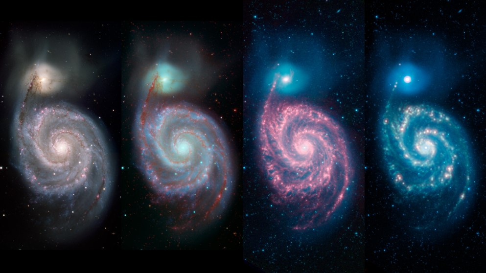
  </a>
  <figcaption>
    Quatre images de la galaxie du Tourbillon (Messier 51) qui montrent les
    différents détails visibles avec différents types de lumière
    (NASA/JPL-Caltech)
  </figcaption>
</figure>

Au dernier chapitre, nous avons vu comment les multiples sondes spatiales
développées durant la deuxième moitié du vingtième siècle nous ont permis de
découvrir les planètes et les autres objets de notre système solaire. Envoyer
un robot sur Mars est une excellente façon de récolter de l'information sur
cette planète, mais ce n'est malheureusement pas une approche réaliste pour la
grande majorité des objets qui peuplent le cosmos. L'étoile la plus proche est
à environ 4,2 années-lumière de la Terre, il est très peu probable que nous
parvenions à y envoyer quoi que ce soit avant quelques siècles.

Pour étudier les objets plus lointains dans l'Univers, nous devons donc utiliser
des techniques d'observation très semblables à celles utilisées par les
astronomes mésopotamiens. Un très grand nombre d'astres émettent de la lumière
et une partie de cette lumière nous parvient. En la détectant et en mesurant
ses propriétés, nous pouvons déduire beaucoup de chose sur l'astre qui en est
la source. Dans ce chapitre, nous découvrirons d'abord ce qu'est la lumière,
puis nous explorerons les différentes façons de la détecter.

## Lumière

### Une brève histoire de la lumière

Dès l'antiquité grecque, les philosophes naturels se sont intéressés à la
nature de la lumière et à l'étude de ses propriétés. Euclide et Ptolémée, deux
savants dont nous avons déjà parlé dans ce cours, ont tous deux écrit un
ouvrage sur l'**optique**, c'est-à-dire l'étude des phénomènes lumineux. Ils
connaissaient les phénomènes de réflexion et de réfraction. La **réflexion** se
produit lorsque la lumière arrive sur un matériel et «rebondit» sur ce matériel.
Un exemple courant du phénomène de réflexion est la déviation de la lumière qui
frappe un miroir. La **réfraction** est la déviation de la trajectoire de la
lumière qui se produit lorsqu'elle passe d'un milieu transparent à un autre.
Par exemple, lorsqu'on plonge une cuillère dans un verre d'eau, la cuillère
semble brisée alors qu'elle ne l'est pas.

<figure>
  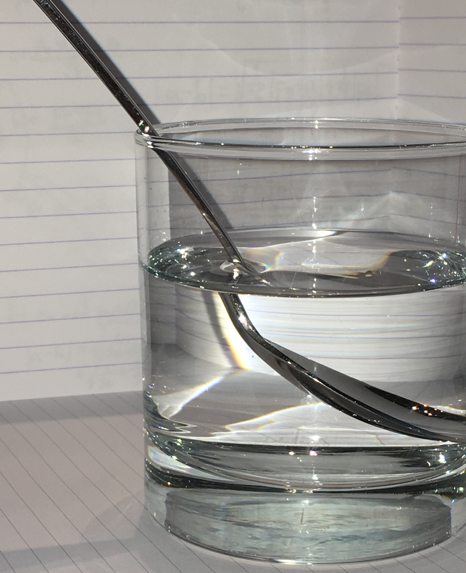
  <figcaption>
    La lumière peut être déviée lorsqu'elle passe d'un milieu transparent à un
    autre. Ici on voit cette déviation causée par le passage de la lumière de
    l'eau à l'air.
  </figcaption>
</figure>

À la Renaissance, René Descartes, Robert Hooke, Isaac Newton et Christiaan
Huygens ont cherché à comprendre la nature de la lumière et à décrire de
nouveaux phénomènes. Descartes et Newton pensaient que la lumière était
composée de plusieurs petites particules qui voyageaient en ligne droite et qui
rebondissait sur les surfaces comme des balles de billard. Cette **théorie
corpusculaire de la lumière** permettait de décrire correctement les phénomènes
de réflexion et de réfraction. Newton a également découvert le phénomène de
**dispersion**\ : si on fait passer un faisceau de lumière blanche à travers un
prisme, la lumière qui en ressort est composée de toutes les couleurs de
l'arc-en-ciel. Selon Newton, ceci s'expliquait par le fait que les particules
de lumière des différentes couleurs n'étaient pas réfractées exactement de la
même façon.

<figure>
  <a href="https://www.flickr.com/photos/alfredolouro/3776192271">
    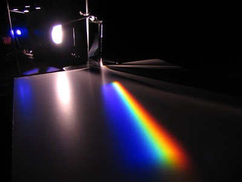
  </a>
  <figcaption>
    La lumière blanche qui traverse un prisme en ressort sous forme de
    différentes couleurs
    (Alfredo Louro [CC BY-NC-SA 2.0](https://creativecommons.org/licenses/by-nc-sa/2.0/))
  </figcaption>
</figure>

À la même époque, Robert Hooke et Christiaan Huygens étaient convaincus que la
lumière n'était pas composée de particules, mais était plutôt une onde
semblable à celle qui se propage à la surface d'un lac quand on y jette une
roche. Huygens suggérait que cette onde se propageait dans un milieu qu'il
nomma **éther**. La **théorie ondulatoire de la lumière** de Huygens permettait
d'expliquer correctement la réflexion, la réfraction et la dispersion, mais
aussi d'autres phénomènes. Par exemple, si la lumière était composée de
particules, lorsque deux faisceaux lumineux se croisent, ils devraient entrer
en collision. Ceci ne concorde pas avec les observations. Dans la théorie
ondulatoire, il est tout à fait possible que deux faisceaux lumineux se
croisent sans interagir. La théorie ondulatoire explique aussi le phénomène de
**diffraction** qu'on observe lorsque la lumière passe à travers une petite
ouverture.

<figure>
  <a href="https://commons.wikimedia.org/wiki/File:Wave_Diffraction_4Lambda_Slit.png">
    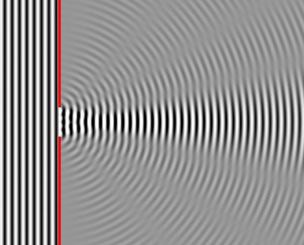
  </a>
  <figcaption>
    Diffraction d'une onde qui passe à travers une petite ouverture. La
    direction de propagation de l'onde change suite au passage dans
    l'ouverture. (Dicklyon)
  </figcaption>
</figure>

Le physicien anglais Thomas Young a fait une expérience célèbre au début du
XIXe qui supportait la théorie ondulatoire de la lumière. Il a fait
passer de la lumière par deux fentes et a remarqué que la lumière interagissait
avec elle-même et créait des zones où l'intensité lumineuse était grande et des
zones où l'intensité lumineuse était très faible. Ce genre de résultat n'était
cohérent qu'avec la théorie ondulatoire de la lumière.

Le grand nombre d'observations cohérentes avec la théorie ondulatoire ont fait
en sorte qu'elle soit acceptée comme la description correcte jusqu'au début du
XXe siècle. À ce moment, des expériences sur l'interaction entre la
lumière et certains circuits électriques, l'**effet photoélectrique**,
donnaient des résultats incohérents avec la théorie ondulatoire. Albert
Einstein a expliqué ce phénomène en considérant la lumière comme une particule,
appelée un **photon**. Cette hypothèse est un des fondements de la **mécanique
quantique**, la théorie moderne qui décrit comment la lumière et les objets de
taille subatomique (électrons, protons, neutrons, etc.) se comportent.
Cependant, cette nouvelle réalisation ne contredisait pas la théorie
ondulatoire de la lumière. La théorie quantique présente la lumière comme une
onde, mais une onde qui se comporte comme une particule lorsqu'elle interagit
avec des objets subatomiques. Cette description n'est pas très intuitive et
semble décrire la lumière de deux façons incompatibles, c'est pourquoi on lui
fait souvent référence comme la **dualité onde-particule** de la lumière. Les
succès très nombreux de la mécanique quantique nous ont convaincu que cette
description est la bonne. La nature n'a aucune obligation de se comporter d'une
façon qui a du sens à nos yeux.

### Nature de la lumière

Voici ce que nous connaissons aujourd'hui à propos de la lumière. C'est une
**onde électromagnétique**. Une onde est une oscillation qui se propage dans un
certain milieu. Par exemple, une corde tendue qu'on secoue est parcourue d'une
onde. Une roche lancée dans un lac créé une vibration de la surface du lac qui
s'éloigne du point d'impact. La lumière se propage dans le **champ
électromagnétique** qui est une propriété de l'espace. En chaque point de
l'espace, on peut mesurer le champ électromagnétique un peu comme on peut
mesurer la température. Le champ électromagnétique est généré par les objets
qui ont une charge électrique (par exemple les électrons) et qui se déplacent.
Si le champ électromagnétique est «secoué», une oscillation de ce champ se
propagera en s'éloignant de la source. Cette oscillation qui se déplace, c'est
la **lumière**.

Considérons l'exemple d'un téléphone cellulaire qui communique avec une tour de
télécommunication. Sur la tour, il y a une antenne métallique dans laquelle des
électrons se déplacent très rapidement. Ce mouvement des électrons génère une
perturbation dans le champ électromagnétique et cette perturbation s'éloigne de
l'antenne. L'onde électromagnétique se propage jusqu'au téléphone cellulaire et
les électrons qui se trouvent dans l'antenne du téléphone se mettent à osciller
sous l'influence de l'onde. Cette oscillation active un circuit électrique qui
transforme l'information contenue dans le mouvement des électrons en image qui
peut s'afficher sur l'écran.

L'exemple précédent vous montre que les ondes radios utilisées par les
cellulaires (et les radios AM et FM, et la télévision, etc.) sont une forme de
lumière. On distingue les différentes formes de lumière par leur **longueur
d'onde**, c'est-à-dire la distance entre deux crêtes successives de l'onde (voir
l'image ci-dessous).

<figure>
  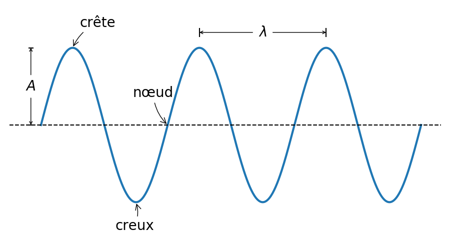
  <figcaption>
    Une onde est caractérisée par sa longueur d'onde &lambda; qui est la
    distance entre deux crêtes successives. L'amplitude de l'onde *A* est
    reliée à son intensité.
  </figcaption>
</figure>

Les **ondes radio** sont une forme de lumière qui a des longueurs d'onde de
plus de 1\ m. La **lumière visible**, celle à laquelle nos yeux sont
sensibles, a une longueur d'onde comprise entre 400 et 700\ nm, soit entre
0,000\ 000\ 400\ m et 0,000\ 000\ 700\ m. Les ondes électromagnétiques de 700\
nm à 1\ mm sont les **infrarouges**, alors que celles de 10\ nm à 400\ nm sont
les **ultraviolets**. Les ondes de 1\ mm à 1\ m sont les **microondes**.  Les
ondes ayant une longueur d'onde inférieure à 10\ nm sont les **rayons X** et
ceux avec une longueur d'onde inférieure à
1\ pm = 1\ &times;\ 10-12\ m sont les **rayons gamma**.

<figure>
  <a href="https://commons.wikimedia.org/wiki/File:Spectre_%C3%A9lectromagn%C3%A9tique.png">
    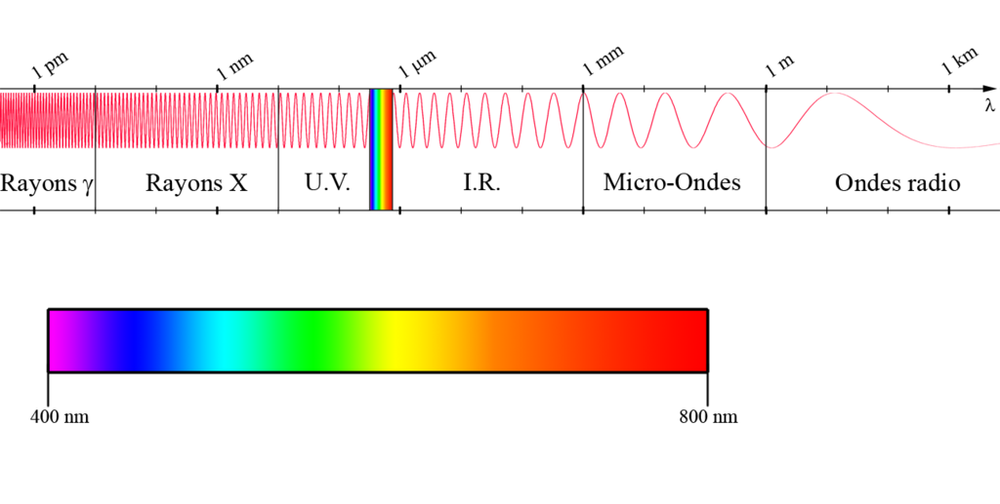
  </a>
  <figcaption>
    Spectre électromagnétique (Ploufandsplash [CC BY-SA
    3.0](https://creativecommons.org/licenses/by-sa/3.0/deed.en))
  </figcaption>
</figure>

En astronomie, nous observons le ciel à toutes les longueurs d'onde possibles,
pas seulement la lumière visible. Ceci nous permet de «voir» beaucoup plus de
choses et de comprendre un plus large éventail de phénomènes.

### Vitesse de la lumière

Depuis le développement de la théorie de la relativité restreinte d'Einstein,
nous savons que la vitesse de la lumière est la même pour tous les
observateurs, peu importe comment ils se déplacent par rapport à la source
lumineuse. Cette vitesse a été mesurée précisément a de nombreuses reprises et
aujourd'hui, on la définit comme une constante dont la valeur est

*c* = 299\ 792,458\ km/s

exactement. Cette vitesse, combinée avec une définition formelle de la seconde
basée sur les oscillations d'un atome de césium, sert à définir le mètre.

En astronomie, les distances sont si grandes qu'il est commun d'utiliser les
**années-lumière** pour les mesurer. Les tableaux ci-dessous montrent quelques
équivalences entre différentes distances.

\*-lumière                     Distance en km
----------------------- ---------------------
Seconde-lumière                299 792,458 km
Minute-lumière               17 987 547,48 km
Semaine-lumière            181 314 478 598 km
Année-lumière            9 454 254 955 488 km
----------------------- ---------------------

 

Distance                              \*-lumière
------------------------  ----------------------
Terre-Soleil                8,32 minutes-lumière
Pluton-Soleil                 5,5 heures-lumière
Soleil-Proxima Centauri      4,22 années-lumière

## Télescopes

Un **télescope** est un instrument qui sert à collecter la lumière provenant
d'un objet très lointain. Cette lumière peut être de la lumière visible, mais
aussi des ondes radio, des rayons X ou tout autre type d'ondes
électromagnétiques. Il existe deux types principaux de télescope définit en
fonction de l'élément optique utilisé pour concentrer la lumière. Un télescope
**réfracteur** utilise une lentille convergente (comme une loupe) pour
concentrer la lumière. Un télescope **réflecteur** utilise un miroir concave
pour concentrer la lumière.

### Réfracteurs

Dans un télescope réfracteur, une lentille convergente agit comme **objectif**,
c'est-à-dire comme élément optique collecteur de lumière. Cette lentille fait
converger la lumière arrivant d'objet lointain en un point. La lentille fait
dévier la lumière grâce au phénomène de réfraction, d'où le nom de ce type de
télescope. Une deuxième lentille, l'**oculaire** est utilisée pour obtenir un
grossissement supplémentaire de l'image.

Galilée a été le premier à utiliser ce type de télescope pour faire de
l'astronomie, on l'appelle donc souvent une **lunette de Galilée**. Pour qu'un
tel télescope fonctionne bien, il est primordial que les lentilles utilisées
soit faites d'un verre de très haute qualité pour éviter l'apparition de
défauts dû à l'instrument.

<figure>
  <a href="https://www.flickr.com/photos/internetarchivebookimages/14579971409/">
    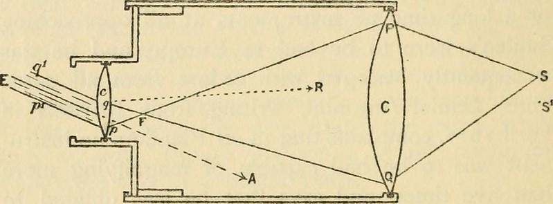
  </a>
  <figcaption>
    Schéma d'un télescope réfracteur du type utilisé par Galilée (tiré de
    Fahie, J.J. *Galileo, his life and work*. London, 1903)
  </figcaption>
</figure>

Les télescopes réfracteurs sont sujets au problème d'**aberration chromatique**.
Puisque les différentes couleurs sont déviées différemment dans une
lentille, le trajet suivi par la lumière rouge est légèrement différent du
trajet suivi par la lumière violette. Par conséquent, l'image produite par un
télescope réfracteur peut montrer un décalage entre le rouge et le violet. Ce
genre de problème peut être minimisé en utilisant des agencements plus
complexes de lentilles, mais il ne peut pas être complètement éliminé.

<figure>
  <a href="https://commons.wikimedia.org/wiki/File:Chromatic_aberration_1_14_2009.jpg">
    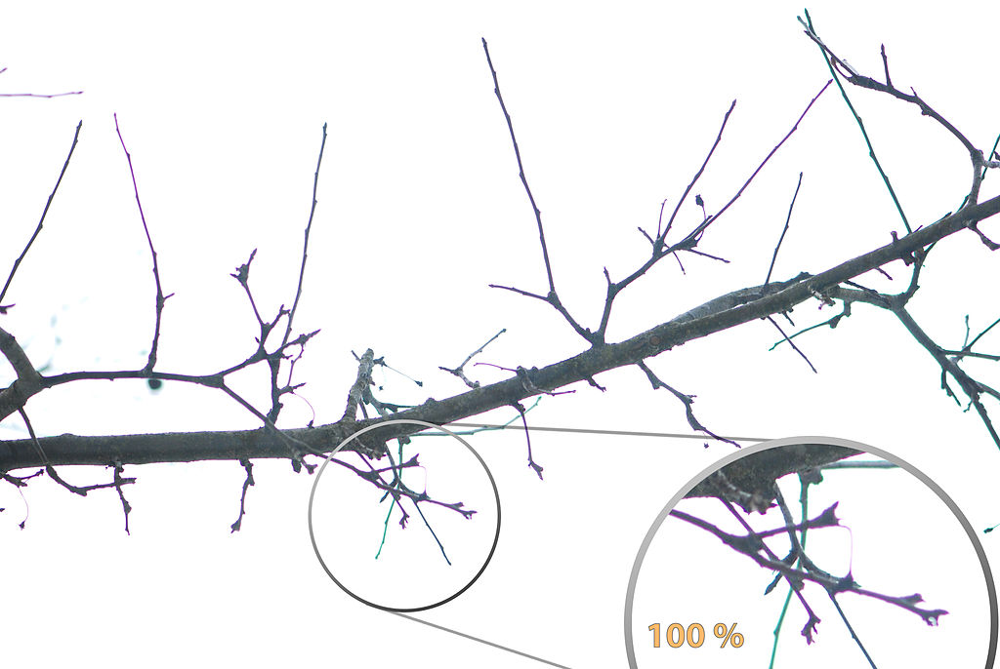
  </a>
  <figcaption>
    Aberration chromatique qui fait que l'image violette et l'image bleu sont
    légèrement décalées (Wilder Kaiser [CC BY-SA 3.0](https://creativecommons.org/licenses/by-sa/3.0/deed.en))
  </figcaption>
</figure>

Un autre problème des télescopes réfracteurs est la taille. Si on veut
construire un télescope avec une plus grande ouverture (pour capter plus de
lumière et donc voir des objets ayant une magnitude plus grande), il faut une
lentille plus grosse. Plus la lentille est grosse et plus elle aura tendance à
se déformer sous son propre poids. Une lentille déformée produira une image
déformée qui sera très difficile à interpréter. Ceci s'ajoute au fait que
produire une lentille parfaitement transparente et de grande taille est
techniquement très difficile. Pour ces raisons, les télescopes réfracteurs ne
sont plus vraiment utilisés en astronomie aujourd'hui.

<figure>
  <a href="https://commons.wikimedia.org/wiki/File:Refracting_telescope_of_the_Strasbourg_observatory.jpg">
    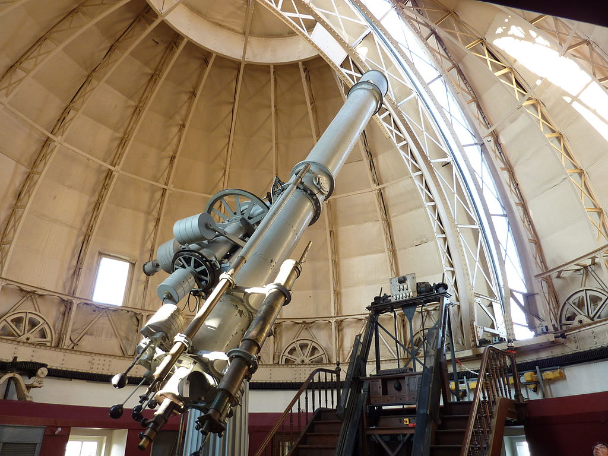
  </a>
  <figcaption>
    Télescope réfracteur de l'Observatoire astronomique de Strasbourg en France
    (Pethrus [CC BY-SA 3.0](https://creativecommons.org/licenses/by-sa/3.0/deed.en))
  </figcaption>
</figure>

### Réflecteurs

Dans un télescope réflecteur, l'objectif est un miroir concave. Ce miroir
concentre la lumière vers un oculaire qui est une lentille. Le parcours de la
lumière passe souvent par un miroir secondaire qui ne fait que réorienter le
faisceau. Ce type de télescope a été inventé et utilisé par Isaac Newton.

<figure>
  <a href="https://www.flickr.com/photos/internetarchivebookimages/14586694887/">
    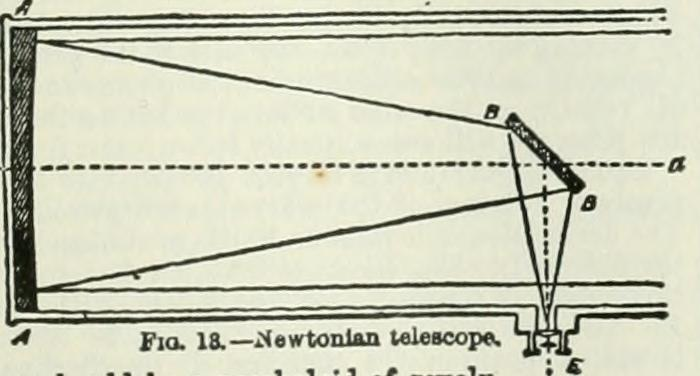
  </a>
  <figcaption>
    Télescope réflecteur de type newtonien
    (Pethrus [CC BY-SA 3.0](https://creativecommons.org/licenses/by-sa/3.0/deed.en))
  </figcaption>
</figure>

Les télescopes réflecteurs ne sont pas sujet à l'aberration chromatique. De
plus, puisque la lumière ne passe pas à travers le miroir, ce dernier, même
s'il est très gros, peut être solidement supporté par l'arrière ce qui élimine
les problèmes de déformations dont souffrent les réfracteurs. Pour ces raisons,
tous les télescopes modernes utilisés en recherche sont des réflecteurs.

<figure>
  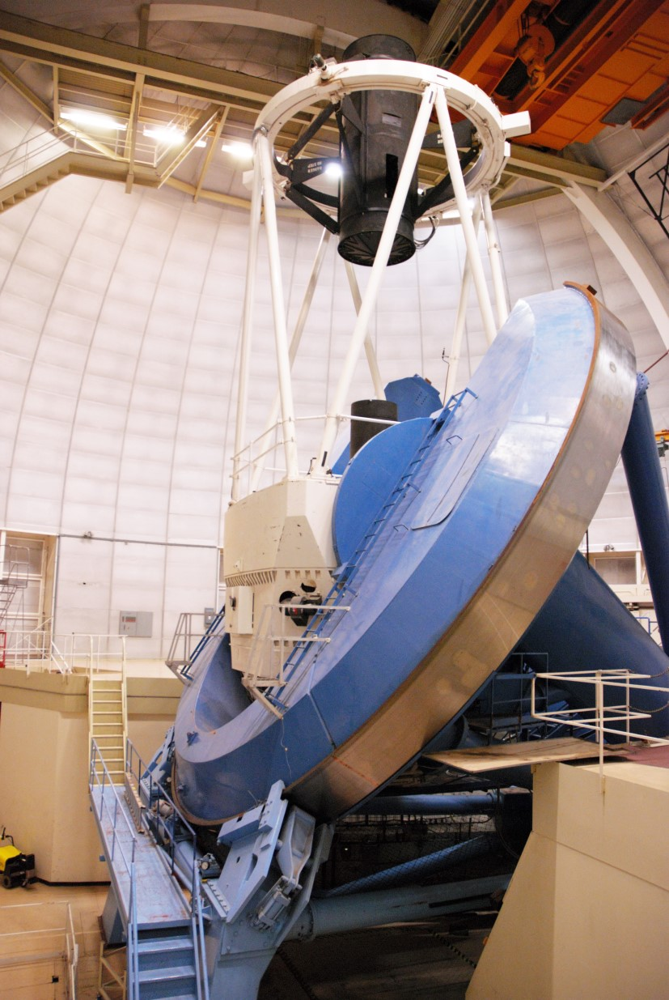
  <figcaption>
    Télescope réflecteur Mayall de 4\ m à Kitt Peak. Le miroir principal a une
    masse de 15 tonnes.
  </figcaption>
</figure>

Les télescopes modernes sont tous équipé de détecteurs numériques. Les
astronomes professionnels ne collent pas leur œil à l'objectif comme ça se
faisait du temps de Newton. Les détecteurs numériques sont installés à
l'oculaire et transforment la lumière reçue en fichiers numériques qui peuvent
par la suite être traités sur des ordinateurs.

<figure>
  <a href="https://xkcd.com/1791/">
    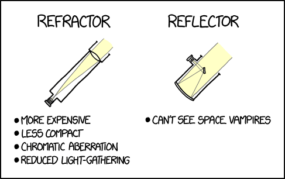
  </a>
  <figcaption>
  (xkcd [CC BY-NC 2.5](https://creativecommons.org/licenses/by-nc/2.5/))
  </figcaption>
</figure>

### Montures

Un télescope doit pouvoir être pointé vers l'étoile ou l'objet à observer. Il
faut donc que le système optique soit fixé à une **monture** qui lui sert de
support et de mécanisme de pointage. Il existe deux grandes catégories de
montures en usage courant : la monture équatoriale et la monture alt-azimutale. Ces
types de monture font référence au système de coordonnées utilisé. Sans grande
surprise, la monture équatoriale utilise le système de coordonnées
équatoriales, c'est-à-dire que la monture peut tourner autour de deux axes dont
un correspond à l'axe nord-sud céleste (permet de régler l'ascension droite) et
l'autre est dans le plan de l'équateur céleste (permet de régler la
déclinaison). Ce type de monture est difficile à construire et est en général
très massif, pouvant atteindre plusieurs centaines de tonnes. L'image du Mayall
ci-dessus montre une monture équatoriale.

Les montures alt-azimutales utilisent le système de coordonnées
altitude-azimut. Elles sont plus faciles à construire, mais plus difficiles à
opérer parce qu'il faut constamment calculer des changements de coordonnées.
Ceci est beaucoup plus simple aujourd'hui grâce au recours à des ordinateurs et
beaucoup de systèmes modernes utilisent les montures alt-azimutales.

En plus de pointer le télescope, la monture remplit une autre fonction
essentielle. Rappelez-vous que la Terre tourne sur elle-même ce qui cause un
mouvement apparent des astres dans le ciel. La position apparente d'une étoile
change donc constamment au cours d'une nuit. Si on veut l'observer plus de
quelques secondes, ce qui est souvent le cas, le télescope doit être bougé de
telle sorte qu'il compense pour la rotation de la Terre. Ce mouvement de la
monture est appelé l'**entraînement sidéral**. Calculer l'entraînement sidéral
pour une monture équatoriale est simple : il suffit de faire tourner la monture
autour de l'axe nord-sud dans le sens contraire de la rotation de la Terre
exactement au même rythme que la rotation de la Terre (soit 360° en 24h). Pour
une monture alt-azimutale, le calcul est plus complexe et il faut tourner
autour des deux axes simultanément à un rythme qui n'est pas toujours le même.
L'utilisation d'un ordinateur pour contrôler la monture est nécessaire dans ce
cas.

### Autres types de télescopes

Il existe beaucoup d'autres types de télescopes : les radiotélescopes, les
télescopes spatiaux, les détecteurs d'ondes gravitationnelles, etc. Nous
n'avons pas le temps d'étudier ces télescopes en détail, mais si vous voulez,
ils sont d'excellents sujets pour votre production écrite.

## Exercices

1. Expliquez la différence entre la réflexion et la réfraction.

2. Définissez le phénomène de la dispersion.

3. Définissez le phénomène de la diffraction.

4. D'après vous, les arcs-en-ciel sont causés par quel phénomène : la
   réflexion, la réfraction, la dispersion ou la diffraction? Expliquez votre
   raisonnement.

5. Expliquez la différence entre la théorie ondulatoire et la théorie
   corpusculaire de la lumière en prenant soin de définir chacune de ces deux
   théories.

6. Nommez deux expériences qui montraient que la lumière est une onde.

7. Nommez deux expériences qui montraient que la lumière est une particule.

8. Est-ce que l'effet photoélectrique supportait la théorie ondulatoire ou la
   théorie corpusculaire?

9. Classez les types d'ondes électromagnétiques suivantes en ordre croissant de
   longueur d'onde : rouge, microonde, rayon gamma, bleu, ultraviolet, rayon
   X, onde radio, vert.

10. À quelle vitesse se propagent les rayons X? À quelle vitesse se propagent les
    ondes radio?

11. Expliquez deux avantages des télescopes réflecteurs par rapport aux télescopes
    réfracteurs.

12. Vrai ou faux? Aujourd'hui, la vaste majorité des télescopes utilisés en
    recherche sont des télescopes réflecteurs.

13. Expliquez ce qu'est l'aberration chromatique. Votre explication doit
    mentionner lesquels des phénomènes suivants sont impliqués : réflexion,
    réfraction, dispersion, diffraction.

14. Nommez un avantage des montures équatoriales. Nommez un avantage des
    montures alt-azimutales.

15. Définissez l'entraînement sidéral.
