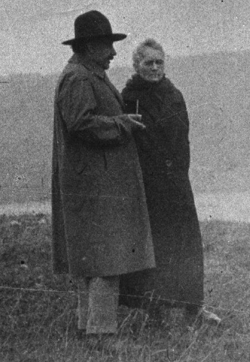
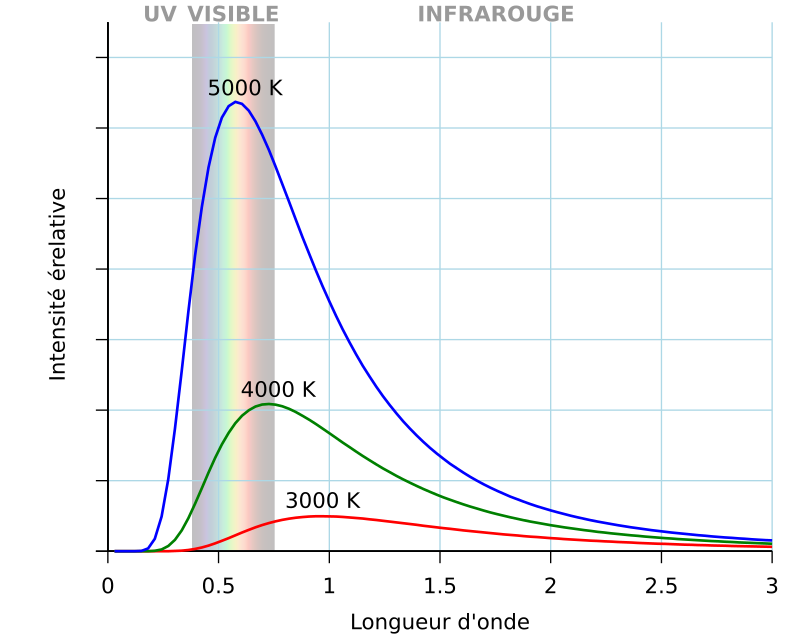

<figure>
  
  <figcaption>
    L'étoile Zeta Ophiuchi précédée de l'onde de choc créée par son vent
    stellaire
    (NASA, JPL-Caltech, Spitzer Space Telescope)
  </figcaption>
</figure>

Depuis le debut du cours, nous avons beaucoup parlé des étoiles. Cependant,
nous n'avons jamais vraiment étudié les étoiles en détail : de quoi sont-elles
faites? comment changent-t-elles? C'est ce que nous survolerons dans ce
chapitre. L'astrophysique stellaire est un domaine vaste et nous ne ferons
qu'effleurer sa surface. Nous nous limiterons à une description des étoiles
sembables à notre Soleil. La première question à laquelle nous tenterons de
répondre, c'est d'expliquer comment le Soleil peut briller depuis aussi
longtemps.

## Âge du Soleil

À l'époque de Newton, l'âge de l'Univers était inconnu. Newton, un chrétien
très croyant, en se basant sur la Bible, avait estimé l'âge de l'Univers à un
peu moins de 4000 ans. Cette estimation était en accord avec la date de la
Création acceptée par l'église. Au XVIIIe et au XIXe
siècles, des scientifiques commencèrent à remettre en cause cette valeur de
l'âge de l'Univers. Georges-Louis Leclerc, Compte de Buffon, en se basant sur
des observations géologiques et des résultats expérimentaux, estima que l'âge
de la Terre devait être de quelques centaines de milliers d'années. Buffon
s'intéressa aussi à la biologie et jetta les bases de ce qui devint plus tard
une théorie de l'évolution. Jean-Baptiste de Lamarck et, plus tard, Charles
Darwin menèrent au développement de la théorie de l'évolution. Selon Darwin,
l'évolution par sélection naturelle nécessitait des centaines de millions
d'années. Les géologues de l'époque, en étudiant les structures rocheuses,
estimèrent également l'âge de la Terre à plusieurs centaines de millions
d'années. Puisqu'il était difficile d'imaginer une Terre sans Soleil, le
consensus était que l'âge du Soleil devait être sensiblement le même que l'âge
de la Terre.

En admettant que les scientifiques de l'époque avait raison, comment pouvait-on
expliquer que le Soleil brille depuis quelques centaines de millions d'années?
Au XIXe siècle, la meilleure source d'énergie connue était la
combustion du charbon, un processus chimique. William Thomson, Lord Kelvin, et
Hermann von Helmholtz estimèrent que le Soleil, s'il tirait son énergie de la
combustion du charbon, pourrait briller pendant quelques milliers d'années.
Ce temps était beaucoup trop court et contredisait les estimations des
biologistes et des géologues. Thomson et von Helmholtz développèrent un autre
modèle basée sur la force gravitationnelle. Lorsqu'un laisse tomber une roche,
de l'énergie gravitationnelle est libérée et transformée en énergie de
mouvement (qu'on peut détecter si on place sa main sous la roche). Si le
Soleil était autrefois plus gros qu'il ne l'est actuellement et que la
matière le composant soit en train de tomber vers son centre, de l'énergie
gravitationnelle pourrait être libérée sous forme de chaleur et de lumière.
Avec ce modèle, Thomson et von Helmholtz arrivèrent à un âge de l'ordre de 10
millions d'années. Ce résultat était beaucoup mieux que celui de quelques
millénaires, mais il ne concordait toujours pas très bien avec les centaines de
millions d'années requises pour l'évolution des espèces et la formation des
structures géologiques.

Il fallut attendre le début XXe siècle pour finalement comprendre ce
qui pouvait servir de source d'énergie pour le Soleil. Les premières études des
substances radioactives (notamment par Marie Curie), la découverte de
l'équivalence masse-énergie (par Albert Einstein) puis l'étude approfondie de
la physique nucléaire menèrent à la réalisation que l'énergie du Soleil
provenait principalement des réactions nucléaires. En 1920, Arthur Stanley
Eddington publia un article dans lequel il présentait un modèle impliquant la
fusion d'hydrogène en hélium. Une réaction de **fusion nucléaire** se
produit lorsque deux atomes entrent en collision si violemment que leur noyaux
se combinent en un seul noyau, libérant d'énormes quantités d'énergie. En
tenant compte de la fusion nucléaire, on peut estimer que le Soleil devrait
vivre environ 10 milliards d'années. C'est le modèle actuellement accepté.

<figure>
    
  <figcaption>
    Marie Curie et Albert Einstein en 1929.
  </figcaption>
</figure>

## Structure stellaire

Grâce la spectroscopie (que nous avons décrit au [chapitre
précédent](08-distances-au-dela.html)), on sait que la matière qui compose
l'Univers est principalement de l'hydrogène et de l'helium. Il y a un peu
d'oxygène, d'azote, de carbone et de néon. Tout le reste est présent en très
petite quantité. La composition des étoiles est sensiblement la même : elles
sont principalement composées d'hydrogène et d'hélium, avec un peu d'oxygène,
de carbone, d'azote et de néon. Une étoile est une énorme sphère de gaz très
chaude. La masse des étoiles est très grande, allant de quelques centaines de
milliers de fois celle de la Terre à près de 100 millions de fois la masse de
la Terre. Ces masses énormes font des étoiles des endroits où la gravité est
très forte. Cette gravité tire le gaz vers le centre de l'étoile et le comprime
jusqu'à des pressions de plusieurs milliards de fois plus grande que la
pression atmosphérique terrestre. Lorsque la pression est si élevée, la
température l'est aussi.

S'il n'y avait pas de pression, la masse de l'étoile ferait en sorte qu'elle
s'effondrerait sur elle-même jusqu'à ce que sa matière soit concentrée en un
seul point. La pression interne empêche le gaz de s'effondrer en le poussant
vers l'extérieur. Une étoile est donc en **équilibre hydrostatique**,
c'est-à-dire que la force de gravité qui tire l'étoile vers sont centre est
parfaitement contrebalancée par la pression qui pousse l'étoile vers
l'extérieur.

<figure>
  
  <figcaption>
    Une étoile comme le Soleil a cœur très chaud, une zone de radiation où
    l'énergie en provenance du coeur voyage vers la surface grâce à la
    radiation, une zone de convection dans laquelle l'énergie voyage grâce aux
    mouvements de convection de la matière. Les couches externes de l'étoile
    sont collectivement appelées l'atmosphère de l'étoile. (Adapté de
    Kelvinsong [CC BY-SA 3.0](https://creativecommons.org/licenses/by-sa/3.0/deed.en))
  </figcaption>
</figure>

Les réactions de fusion nucléaire se produisent uniquement lorsque la
température et la pression sont très élevées. Il faut que les atomes entrent en
collision très violemment pour que les noyaux puissent rester collés ensembles.
Dans les étoiles les réaction nucléaires se produisent donc uniquement dans le
cœur. L'énergie produite lors de ces réactions contribue à la pression élevée
qui règne dans le cœur de l'étoile. L'énergie libérée se fraye lentement un
chemin vers la surface de l'étoile et s'en échappe sous forme de lumière après
un périple de plusieurs centaines de milliers d'années.  Lors des réactions de
fusion nucléaire, des éléments léger comme l'hydrogène et l'hélium sont
combinés pour former des éléments plus lourds comme l'oxygène, le carbone et
l'azote. Au fil de sa vie, le noyaux d'une étoile devient donc de plus en plus
riche en éléments autres que l'hydrogène et l'hélium.

## Diagrammes de Hertzsprung-Russell

Au dernier chapitre, nous avons discuté des types spectraux et nous avons vu
qu'ils permettent de regrouper les étoiles en fonction de leur couleur. Il
s'avère que la couleur d'une étoile est directement liée à sa température.  En
effet, les étoiles se comporte (du moins, en première approximation) comme des
objets qu'on appelle des **corps noirs**. Un corps noir est un objet qui
absorbe toute la radiation qu'il reçoit (et donc qui n'est pas du tout
réfléchissant) et qui émet de la radiation en raison de sa température. Le
spectre émis par un corps noir dépend uniquement de sa température : un corps
noir froid émet de la lumière rouge alors qu'un corps noir chaud émet de la
lumière bleue.

<figure>
  
  <figcaption>
    Les étoiles émettent environ comme un corps noir. Ce graphique montre
    l'intensité relative des différentes couleurs émises par des corps noirs de
    différentes températures.
  </figcaption>
</figure>

Puisque le type spectral est lié à la couleur et que la couleur est liée à la
température, on peut déterminer la température d'une étoile à partir de son
type spectral. La **température effective** est la température de surface de
l'étoile qu'on peut déduire de cette façon.  En combinant cette information
avec la luminosité de l'étoile, on peut la représenter sur un graphique où
l'axe horizontal représente la température effective et l'axe vertical
représente la luminosité. On appelle ce genre de graphique un **diagramme de
Hertzsprung-Russell** ou diagramme HR. Ci-dessous vous voyez un diagramme HR
sur lequel sont représentées environ 23\ 000 étoiles. Remarquez que la
température augmente de droite à gauche sur ce genre de diagramme.

<figure>
  
  <figcaption>
    Diagramme de Hertzsprung-Russell montrant environ 23\ 000 étoiles tirés
    principalement du catalogue Hipparcos.
    (Richard Powell [CC BY-SA 2.5](https://creativecommons.org/licenses/by-sa/2.5/deed.fr))
  </figcaption>
</figure>

Sur ce diagramme, on constate que la majorité des étoiles sont regroupées le
long d'un axe qui va du coin supérieur gauche au coin inférieur droit. On
appelle cet axe la **séquence principale**. Environ 80% des étoiles se trouvent
dans la séquence principale. Au-dessus de la séquence principale se trouvent
les étoiles qu'on appelle des **géantes**. Ces étoiles sont plus lumineuses que
les étoiles de même température sur la séquence principale parce qu'elles sont
plus grosses (mais pas nécessairement plus massives). Les étoiles en dessous de
la séquence principale sont des **naines blanches**. Les naines blanches sont
moins lumineuses que les étoiles de la séquence principale parce qu'elles sont
plus petites.

Pourquoi y a-t-il différents groupes dans un diagramme HR? Est-ce que les
étoiles géantes ont toujours été géantes? Est-ce que les étoiles de la séquence
principale commencent leur vie comme de grosses étoiles O très chaude et se
refroidissent graduellement à mesure qu'elles épuisent leur carburant nucléaire
en descendant le long de la séquence principale? Ces questions ont mené les
astrophysiciens à élaborer, au cours du XXe siècle, la théorie de
l'évolution stellaire que nous utilisons aujourd'hui.

## Évolution stellaire

Nous savons aujourd'hui que les étoiles le long de la séquence principale n'ont
pas la même masse. Les étoiles en haut à gauche sont plus massive alors que
celles en bas à droite sont moins massive. Puisque la masse d'une étoile
change peu au cours de sa vie, l'évolution d'une étoile ne peut pas se faire le
long de la séquence principale, elle doit évoluer en se déplaçant à l'extérieur
de la séquence principale. Nous allons décrire la vie d'une étoile semblable à
notre Soleil. Les étoiles de différentes masses ont des vies légèrement
différentes, mais nous n'avons pas le temps de regarder toutes les
possibilités.

### Naissance de l'étoile dans la matière interstellaire

L'espace entre les étoiles est principalement vide, mais il existe des régions
où on retrouve de la matière en plus grande quantité. Cette **matière
interstellaire** prend de nombreuses formes : gaz d'hydrogène et d'hélium,
poussière et petites molécules. Les **nébuleuses** sont des régions où la
matière interstellaire est dense et forme des structures qu'on peut voir au
télescope.

<figure>
  
  <figcaption>
    Le complexe Rho Ophiuchi contient de nombreuse nébuleuses. La nébuleuse
    centrale blanche est une nébuleuse d'émission qui émet de la lumière parce
    qu'elle est chauffée par une étoile à proximité. La nébuleuse rouge en bas
    à droite est une nébuleuse de réflexion qui réfléchit la lumière de
    l'étoile en son centre. On voit des régions plus sombres qui sont des
    nébuleuses d'absorption composées de gaz froid qui absorbe la lumière. 
    (NASA/JPL-Caltech/WISE Team)
  </figcaption>
</figure>

Sous certaines conditions, il arrive que les nuages moléculaires commencent à
s'effondrer sur eux-mêmes. La gravité attire la matière et la force à devenir
de plus en plus dense. La matière qui s'effondre a une masse environ égale à
celle du Soleil et elle commence à s'échauffer en raison de l'énergie libérée
par la contraction gravitationnelle. À mesure que la **protoétoile** se
contracte, elle devient de plus en plus chaud et se met à briller intensément.
Une centaine d'années après avoir commencé à se contracter, la protoétoile
atteint son maximum de luminosité, elle brille environ 500 fois plus que notre
Soleil. L'effondrement gravitationnel se poursuit et la diminution de la taille
de l'étoile fait diminuer sa luminosité. Après une dizaine de millions
d'années, l'étoile a rejoint la séquence principale et la fusion de l'hydrogène
en hélium s'amorce. Les résidus de matière restant autour de l'étoile se
concentrent en un anneau dans lequel naîtront bientôt des planètes.

### Âge adulte dans la série principale

L'étoile vivra environ 10 milliards d'années dans la série principale. Au cours
de sa vie, elle continue à fusionner l'hydrogène en hélium et l'hélium ainsi
formé s'accumule dans le noyau de l'étoile. Cette accumulation cause un
réchauffement du noyau et une légère augmentation de la luminosité de l'étoile.
La température au centre de l'étoile n'est cependant pas assez élevée pour que
la fusion de l'hélium puisse se produire. L'étoile mène une vie relativement
calme.

<figure>
  
  <figcaption>
    Diagramme HR montrant l'évolution d'une étoile de masse solaire.
    (Adapté de
    [Szczureq](https://commons.wikimedia.org/wiki/File:Evolution_of_a_Sun-like_star.svg)
    [CC BY-SA 4.0](https://creativecommons.org/licenses/by-sa/4.0/deed.en))
  </figcaption>
</figure>

### Vieillesse après la séquence principale

En quelques centaines de millions d'années, l'étoile change dramatiquement.
L'hélium accumulé dans le noyau ne pouvant pas fusionner, le noyau se contracte
et se réchauffe sous l'influence de la gravité. Cette augmentation de la
température accélère la fusion de l'hydrogène en hélium, augmentant encore plus
la quantité d'hélium dans le noyau. Cette boucle de rétroaction produit
d'importantes quantités d'énergie et la migration de cette énergie vers la
surface augmente la taille de l'étoile. La température dans le cœur de
l'étoile augmente éventuellement assez pour que la fusion de l'hélium en
carbone commence. L'étoile devient une **géante rouge**.

La fusion de l'hélium provoque une accumulation de carbone et d'oxygène dans le
noyau. La température n'est pas suffisamment élevée pour que le carbone et
l'oxygène puissent fusionner. Le noyau se contracte donc et sa température
augmente provoquant une augmentation de la fusion d'hélium. La production
d'énergie élevée dans le noyau fait augmenter la luminosité de l'étoile et la
fait gonfler considérablement. L'étoile atteint la **branche asymptotique**
dans le diagramme HR et devient une **supergéante rouge**. Cette phase est très
rapide, quelques centaines de millions d'années seulement. L'étoile est
tellement gonflée que les couches externes sont trop loin du noyau pour être
retenues fermement par la gravité. La lumière émise pas le noyau pousse
suffisamment sur les couches externes pour les éjecter de l'étoile. Un nuage de
gaz et de poussière est projeté dans l'espace et forme ce qu'on appelle une
**nébuleuse planétaire**.

<figure>
  
  <figcaption>
    La nébuleuse planétaire NGC 2440 avec, en son centre, une naine blanche (H.
    Bond (STScI), R. Ciardullo (PSU), WFPC2, HST, NASA; Traitement: Forrest
    Hamilton)
  </figcaption>
</figure>

Le cœur de l'étoile, dénudé, épuise rapidement son carburant nucléaire et se
contracte considérablement jusqu'à atteindre une taille semblable à celle de la
Terre. Le cœur est constitué de carbone et d'oxygène avec quelques traces
résiduelles de l'hélium et de l'hydrogène qui n'a pas été éjecté dans la
nébuleuse planétaire. Malgré la contraction, sa température n'augmente pas
suffisamment pour que la fusion du carbone se produise. L'étoile est morte. Son
cadavre s'appelle une **naine blanche**. La naine blanche, très chaude
initialement puisqu'elle est le noyau restant de la supergéante rouge, se
refroidi graduellement. Après une dizaine de milliards d'années, elle sera trop
froide pour émettre de la lumière visible et deviendra une **naine noire**.
L'Univers, vieux de 13,8 milliards d'années, n'est pas encore assez vieux pour
contenir des naines noires.

Dans la nébuleuse planétaire, des nouvelles étoiles pourront éventuellement se
former. Les éléments plus lourds comme le carbone et l'oxygène qui ont été
produit par fusion nucléaire dans l'étoile qui vient de s'éteindre se
retrouveront dans les planètes qui se formeront autour des nouvelles étoiles.
Cette matière est celle-là même qui composera les éventuels êtres vivants qui
apparaîtront peut-être sur ces planètes. Nous existons grâce aux générations
d'étoiles qui nous ont précédé.

## Exercices

1. Associez les valeurs de l'âge du Soleil au scientifique correspondant. Âge du
   Soleil : 5 milliards d'années, 4000 ans, 10 millions d'années. Scientifiques\ :
   Newton, Eddington, von Helmholtz.

2. Qu'est-ce qu'une réaction de fusion nucléaire?

3. Pourquoi faut-il que la température soit très élevée pour que des réactions
   de fusion nucléaire puissent se produire?

4. Qu'est-ce qu'une étoile céphéide?

5. Quels sont les deux principaux constituant des étoiles?

6. Vrai ou faux, dans une étoile, les réactions nucléaires se produisent
   surtout dans la zone de convection.

7. Dans un diagramme de Hertzsprung-Russell, l'étoile A est plus à droite et
   plus basse que l'étoile B. Comment la luminosité et la température de
   l'étoile A se compare-elle à celle de l'étoile B?

8. Dans le langage courant, on fait souvent référence aux couleurs chaudes
   (jaune, orange, rouge) et aux couleurs froides (violet, bleu, vert).
   Expliquez pourquoi cette terminologie est physiquement incorrecte.

9. Si on augmente la température d'un corps noir, est-ce que sa luminosité
   augmente ou diminue? Comment sa couleur change-t-elle?

9. L'étoile A est une étoile de type spectral B située sur la séquence
   principale. L'étoile B est une étoile de même luminosité que l'étoile A,
   mais elle a un type spectral K. Quel est le type spectral de l'étoile B?
   Quelle est sa température effective?

10. Classez les stades suivants de l'évolution stellaire en ordre
    chronologique\ : géante rouge, séquence principale, protoétoile, naine
    blanche, nébuleuse planétaire.

11. Classez les stades suivants de l'évolution stellaire du moins lumineux au
    plus lumineux : supergéante rouge, séquence principale, protoétoile, naine
    blanche.

12. Vrai ou faux, une nébuleuse planétaire est un autre nom qu'on donne aux
    planètes gazeuses comme Jupiter et Saturne.

